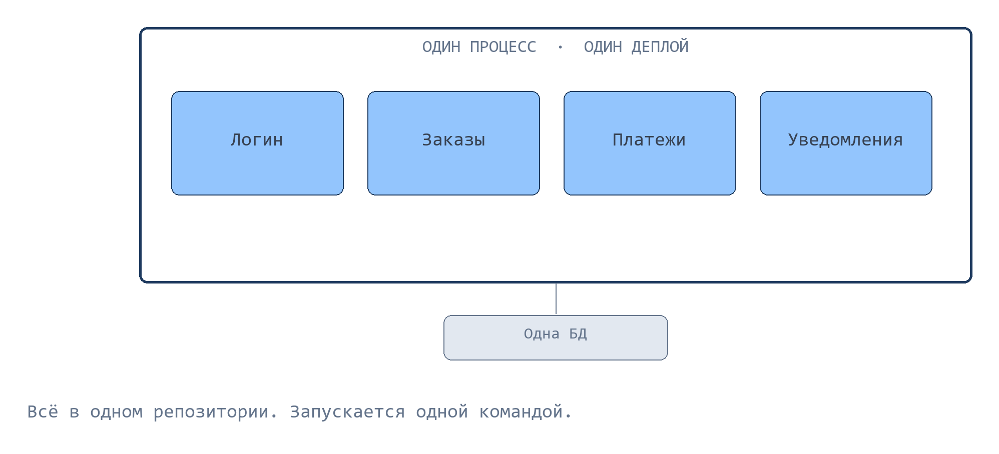
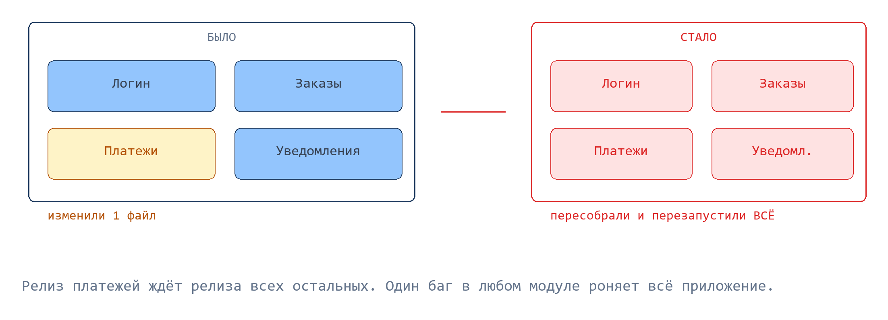
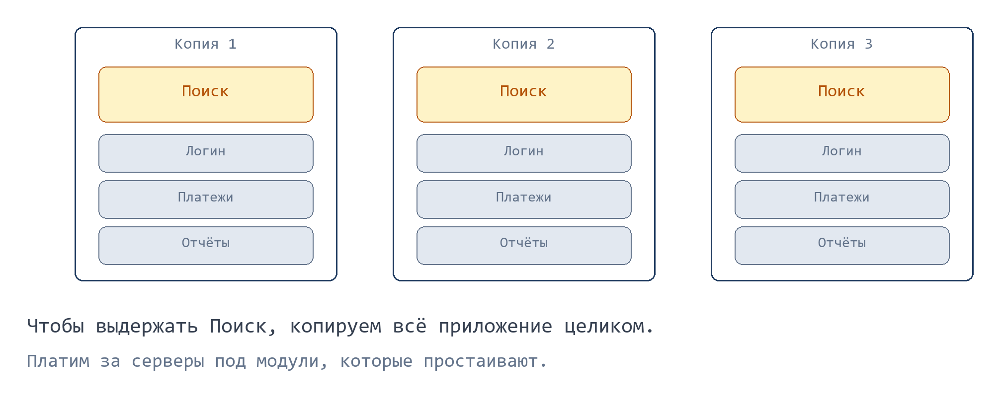
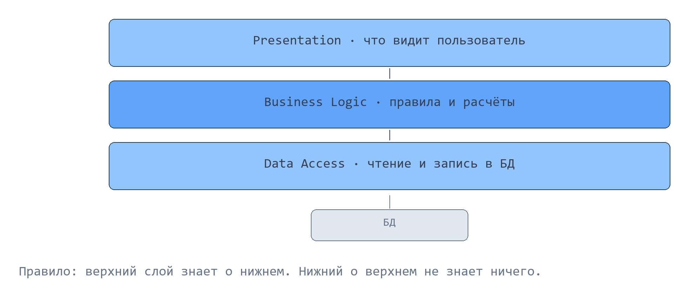
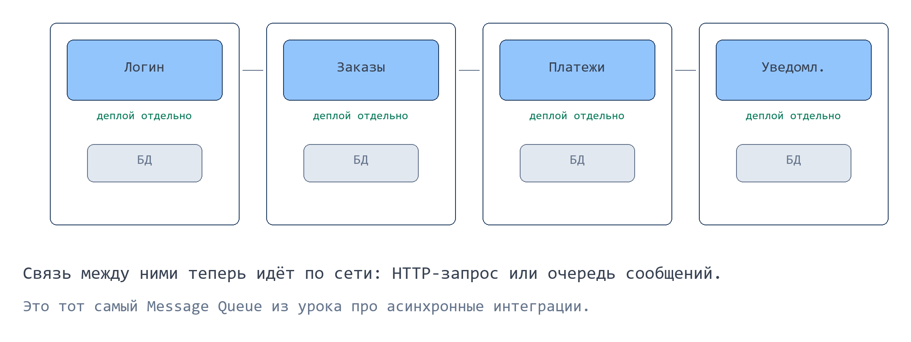
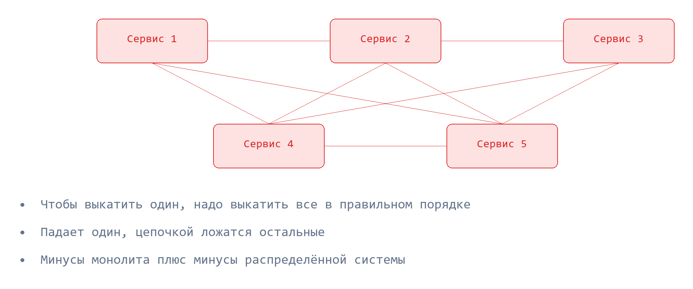
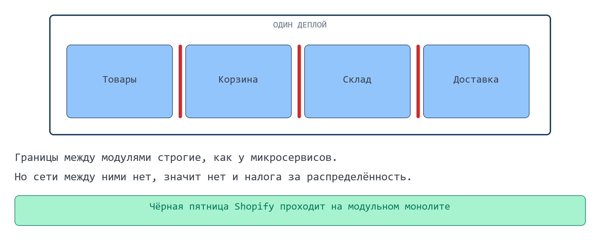
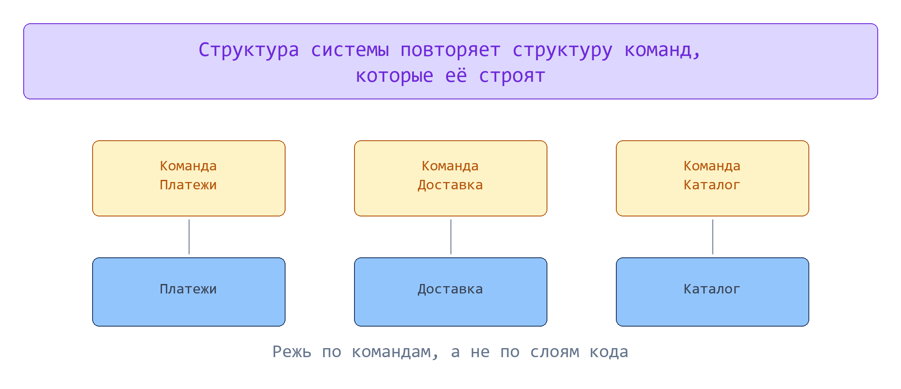

> В 2018 году компания Segment выбросила 140 микросервисов и собрала их обратно в один монолит. Их продуктивность выросла. Как так вышло, если микросервисы считаются правильной архитектурой?

---

## В этом уроке

- **Монолит (Monolith)**: с чего начинаются все системы и почему это нормально
- Три боли, из которых вырос весь остальной урок: деплой, масштабирование, люди
- **Слоёная архитектура (Layered Architecture)**: первая попытка навести порядок
- **Микросервисы (Microservices)**: что они реально решают
- **MicroservicePremium**: цена, которую за них платят
- **Распределённый монолит (Distributed Monolith)**: как получить минусы обоих подходов сразу
- Реальные кейсы: Segment, Amazon Prime Video, Shopify
- Как выбирать и что из этого писать в документации

---

## Проблема

Вы аналитик в компании, где 60 разработчиков пилят один продукт. Команда платежей закончила фичу в понедельник, но выкатить её сможет только в четверг: релиз общий, а в нём ещё не готовы правки от команды каталога.

В четверг релиз откатывают, потому что в отчётах нашли баг. Платежи, к отчётам отношения не имеющие, уезжают обратно на следующую неделю.

Никто не написал плохой код. Проблема в том, как система нарезана на части. Точнее, в том, что она не нарезана.

---

## Монолит: с него начинают все

**Монолит (Monolith)** это приложение, которое собирается в один артефакт, запускается как один процесс и ходит в одну базу данных. Логин, заказы, платежи, уведомления живут в одном репозитории и деплоятся одной командой.



Звучит как приговор, но начинать так правильно. Пока система маленькая, монолит выигрывает по всем статьям: один запуск локально, один лог, обычный вызов функции вместо запроса по сети, честная транзакция в базе.

> [!question] Если монолит удобнее, почему вообще кто-то от него уходит? Попробуйте назвать хотя бы один минус до того, как читать дальше.

---

## Три боли, которые ломают монолит

Монолит ломается не от размера кода, а от трёх конкретных вещей.

### Боль 1: деплой всё или ничего

Вы поменяли одну строчку в расчёте комиссии. Чтобы она доехала до продакшена, надо пересобрать и перезапустить всё приложение целиком, вместе с логином, каталогом и уведомлениями.



Отсюда и ситуация из начала урока: ваш готовый код ждёт чужой неготовый. И наоборот: чужой баг в отчётах откатывает ваши платежи.

### Боль 2: масштабируется только целиком

Чёрная пятница, люди штурмуют поиск по товарам. Поиску не хватает мощности, остальное приложение спит.



Поднять отдельно поиск вы не можете: он не отдельная программа, а часть одного процесса. Значит, поднимаете ещё три копии всего приложения и платите за серверы под модули, которые простаивают.

### Боль 3: люди, а не код

Это главная боль, и она не техническая. Шесть команд работают в одном репозитории и в одной релизной очереди. Каждый день конфликты при слиянии кода, каждую неделю споры о том, чей баг задержал релиз.

Чем больше людей, тем сильнее они мешают друг другу. Код при этом может быть отличным.

> [!question] Какая из трёх болей появится раньше в стартапе из четырёх человек? А в компании из двухсот разработчиков?

---

## Слоёная архитектура: разрез, который не помогает с деплоем

Первая мысль, которая приходит в голову: раз в монолите каша, давайте наведём в нём порядок.

**Слоёная архитектура (Layered Architecture)** режет приложение на горизонтальные слои по типу работы. Классический вариант из трёх слоёв:

```
Presentation   что видит пользователь: экраны, кнопки, ответы API
      ↓
Business Logic правила и расчёты: проверить лимит, посчитать доставку
      ↓
Data Access    чтение и запись в базу
```

Правило одно: верхний слой знает о нижнем и вызывает его. Нижний о верхнем не знает ничего. Слой данных понятия не имеет, что где-то есть экран.



Аналогия: этажи в здании. Вход и ресепшен, рабочие кабинеты, архив в подвале. Порядок есть, ходить между ними понятно.

Теперь честно посчитаем, сколько болей это закрыло:

| Боль | Закрыта? |
|---|---|
| Бардак в коде, команды путаются | Частично |
| Независимый деплой (боль 1) | Нет |
| Масштабирование по модулям (боль 2) | Нет |

Причина в том, что разрез получился **логическим, а не физическим**. Слои живут внутри одного процесса и уезжают на прод одним артефактом. Вы навели порядок в шкафу, но шкаф остался один.

> [!question] Почему разделение на слои не даёт выкатить платежи отдельно от отчётов?

---

## Микросервисы: разрез, который переживает деплой

Если проблема в том, что куски нельзя запустить отдельно, значит надо резать так, чтобы можно было.

**Микросервисы (Microservices)** это набор небольших самостоятельных приложений. У каждого свой репозиторий, свой деплой, своя база данных и своя команда. Общаются они по сети: HTTP-запросом или через очередь сообщений, ту самую Message Queue из урока про асинхронные интеграции.



Аналогия из кухни: раньше все повара толкались у одного стола, теперь есть холодный цех, горячий цех и кондитерский. Каждый работает в своём ритме.

Смотрим, что стало с тремя болями:

| Было в монолите | Стало на микросервисах |
|---|---|
| Перезапуск всего ради одной строчки | Катите только сервис платежей |
| Копируем всё приложение ради поиска | Множите только сервис поиска |
| Одна релизная очередь на шесть команд | Каждая команда владеет своим сервисом |

Все три закрыты. Выглядит как чистая победа, и ровно здесь большинство статей заканчивается.

> [!question] Раньше модуль вызывал другой модуль внутри одной программы. Теперь между ними сеть. Что из-за этого может пойти не так?

---

## Цена: вы купили распределённую систему

Вызов функции внутри процесса не падает. Он либо выполнился, либо программа целиком умерла, и вы это сразу видите.

Запрос по сети падает регулярно, и это первое из классических заблуждений о распределённых системах: «сеть надёжна». Соединение обрывается, ответ приходит через три секунды вместо трёх миллисекунд, сервис на той стороне перезапускается прямо во время вашего запроса.

Разрезав систему, вы получили в нагрузку:

- **Ненадёжную связь.** Каждый вызов между сервисами теперь может не дойти, прийти дважды или прийти с задержкой. Нужны таймауты, повторы и защита от дублей.
- **Потерю честных транзакций.** Списать деньги и создать заказ в одной транзакции больше нельзя: это две разные базы. Нужен паттерн SAGA с компенсирующими действиями (разберём в теме про распределённые системы).
- **Дорогую отладку.** Один пользовательский сценарий проходит через пять сервисов. Чтобы понять, где сломалось, нужны сквозная трассировка и централизованные логи.
- **Эксплуатацию.** На каждый сервис свой CI/CD, свой мониторинг, свои алерты, своё дежурство.
- **Границы, которые надо угадать.** И это самое дорогое.

Мартин Фаулер называет это **MicroservicePremium**: налог, который вы платите за каждую границу между сервисами. Налог фиксированный, а выгода от разреза растёт только вместе с размером команды. На маленькой команде вы платите налог и не получаете ничего.

> [!question] Почему проблема «сервис не ответил» не существовала в монолите? Что там происходило вместо этого?

---

## Распределённый монолит: худший из миров

Границы сервисов почти невозможно угадать с первого раза. Если разрезать не по тем линиям, получается **распределённый монолит (Distributed Monolith)**: сервисы разные, а связанность между ними осталась монолитная.



Как это выглядит на практике:

- чтобы выкатить один сервис, надо выкатить ещё четыре в строго определённом порядке
- падает один, следом цепочкой ложатся остальные
- любое изменение задевает три команды сразу

Вы получили минусы монолита (ничего нельзя выкатить отдельно) плюс минусы распределённой системы (сеть, отладка, эксплуатация). Заплатили налог, выгоду не получили.

> [!warning] Признак, по которому это видно сразу: в релизном чеклисте написано, в каком порядке катить сервисы.

---

## Кейс 1: Segment собрал 140 сервисов обратно в один

Компания Twilio Segment передаёт данные клиентов в сторонние сервисы (аналитика, рассылки, рекламные кабинеты). Каждое такое направление они вынесли в отдельный микросервис.

К 2018 году у них было больше 140 микросервисов и больше 50 репозиториев, и добавлялось примерно три направления в месяц. Что сломалось:

- **Очереди.** У каждого направления своя очередь. Когда одно ломалось, повторные попытки забивали систему и тормозили доставку во все остальные.
- **Общие библиотеки.** Обновлять зависимость в 140 репозиториях никто не хотел, поэтому версии разъехались у всех. Правка в общей библиотеке переставала быть общей.
- **Масштабирование.** У каждого сервиса свой профиль нагрузки по процессору и памяти, и настройка автомасштабирования превратилась в гадание.
- **Люди.** Три инженера занимались только тем, чтобы всё это продолжало работать. На развитие продукта времени не оставалось.

Они собрали всё обратно в один сервис с одним набором тестов. Улучшений в общих библиотеках стало 46 за год против 32 до этого, а деплой из многочасовой процедуры превратился в несколько минут.

Ключевой вывод не «микросервисы плохие». Вывод в том, что 140 сервисов обслуживала команда, которой хватило бы одного.

---

## Кейс 2: Amazon Prime Video и минус 90% на инфраструктуре

У Prime Video есть внутренний сервис, который следит за качеством видео: разбирает поток на кадры и ищет дефекты картинки и звука.

Сначала его собрали из отдельных мелких функций, которые обменивались кадрами через внешнее хранилище S3. Проблемы:

- за каждый шаг обработки платили отдельно, а шаг случался на каждую секунду видео
- кадры постоянно писались в S3 и читались обратно, и счёт за одни только запросы к хранилищу оказался огромным
- система упёрлась в потолок примерно на 5% от ожидаемой нагрузки

Команда сложила все шаги обратно в один процесс. Кадры стали передаваться в памяти, сеть между шагами исчезла. Инфраструктура подешевела примерно на 90%.

> [!warning] Важная деталь, которую теряют почти все пересказы этой истории: переписали **один компонент**. Сам Prime Video как был, так и остался микросервисным. Это точечное решение, а не отказ от микросервисов.

Обе истории про одно и то же: цена разреза оказалась выше пользы от него. Но причины разные, и это стоит различать.

> [!question] Что общего между кейсом Segment и кейсом Prime Video? Чем они отличаются?

---

## Правило: Monolith First

Мартин Фаулер сформулировал наблюдение, которое стоит запомнить дословно.

**Monolith First: начинайте с монолита, даже если уверены, что потом будете резать.**

Обоснование не в удобстве, а в границах:

- почти все успешные микросервисные системы выросли из монолита, который стал слишком большим
- почти все, кто начинал сразу с микросервисов, приходили к серьёзным проблемам
- где проходят настоящие границы предметной области, становится понятно только когда система поработала с живыми пользователями
- передвинуть границу внутри монолита это рефакторинг на день, между сервисами это переезд на квартал

У него же есть более резкая формулировка: «You must be this tall to use microservices». Смысл в том, что микросервисы требуют зрелого CI/CD, мониторинга и дежурства. Без этого вы получите распределённый монолит.

---

## Модульный монолит: третий вариант, о котором забывают

Выбор не сводится к «монолит или микросервисы». Между ними есть **модульный монолит (Modular Monolith)**: приложение деплоится как одно целое, но внутри разрезано на модули с жёсткими границами, как у микросервисов.



Аналогия: хорошо спланированная квартира против посёлка отдельных домов. Границы между комнатами есть, стены настоящие, но водопровод и электрика общие, и ходить между комнатами можно не выходя на улицу.

Что вы получаете: порядок, чёткое владение модулями, возможность позже вынести любой модуль в отдельный сервис по уже проверенной границе.

Чего вы не платите: налог за сеть. Модули вызывают друг друга внутри процесса, поэтому нет ни таймаутов, ни распределённых транзакций, ни сквозной трассировки.

Так работает Shopify: миллионы строк кода, тысячи компонентов, сотни разработчиков одновременно, и всё это на модульном монолите. Отдельными сервисами вынесено только то, что действительно этого требует.

> [!question] Модульный монолит закрывает боль 1 (независимый деплой)? А боль 3 (команды мешают друг другу)?

---

## Как выбирать

Решение принимается не по моде, а по нескольким конкретным признакам.

| Монолит или модульный монолит | Микросервисы |
|---|---|
| Команда меньше 10 человек | Много команд, которые мешают друг другу |
| Продукт ещё ищет свою нишу | Модули нагружены очень по-разному |
| Границы предметной области неясны | Границы уже проверены практикой |
| Нет зрелого CI/CD и мониторинга | Есть CI/CD, трассировка и дежурство |
| Нужны честные транзакции в базе | Разным частям нужен разный стек |

Обратите внимание, что половина строк в правом столбце про людей и процессы, а не про код.

Это **закон Конвея (Conway's Law)**: структура системы повторяет структуру команд, которые её строят. Если разрезать систему по сервисам, не меняя при этом организацию, границы сервисов не совпадут с границами ответственности, и вы получите распределённый монолит.



Практический вывод для аналитика: режьте по командам и зонам ответственности, а не по слоям кода.

---

## Что из этого попадает в вашу документацию

Аналитик не выбирает архитектуру в одиночку, но именно он приносит факты, на которых строится выбор, и именно он описывает последствия.

- **Нагрузка по модулям, а не по системе.** «10 000 запросов в сутки» бесполезно. «Поиск: 8 000 в пиковый час, отчёты: 40 в сутки» это аргумент за отдельный сервис поиска.
- **Границы ответственности.** Какая команда владеет каким процессом. Это будущие границы сервисов.
- **Требования к согласованности данных.** Если списание денег и создание заказа обязаны быть атомарными, разносить их по разным сервисам дорого, и это надо проговорить заранее.
- **Поведение при отказе соседа.** Для каждой интеграции между сервисами: что показываем пользователю, если сервис не ответил за 3 секунды.

---

## Типичная ошибка

Новичок приходит на проект, видит большой монолит и пишет в документе: «предлагаю перейти на микросервисную архитектуру для повышения масштабируемости».

Вопросы, на которые у него нет ответа: сколько команд сейчас мешают друг другу, какие именно модули нагружены, есть ли в компании CI/CD и дежурство, где проходят границы предметной области. Без этих ответов предложение означает «давайте заплатим налог и посмотрим, что будет».

> [!warning] Не делайте так: не предлагайте микросервисы как улучшение по умолчанию. Микросервисы это решение организационной проблемы, и начинать надо с вопроса, есть ли она у вас.

---

## 🧠 Module Check

> [!question]- **1.** Объясните своими словами, почему слоёная архитектура не даёт независимый деплой.
> **Ответ:** Слои это логический разрез внутри одного процесса. Всё приложение по-прежнему собирается в один артефакт и запускается целиком, поэтому выкатить один слой отдельно физически нечего.

> [!question]- **2.** Стартап, 4 разработчика, продукт ещё проверяет гипотезы, CI/CD нет. Команда предлагает сразу нарезать 12 микросервисов. Что вы ответите и почему?
> **Ответ:** Начать с монолита или модульного монолита. Микросервисы решают проблему мешающих друг другу команд, которой на четырёх людях нет. Границы предметной области ещё не проверены, а передвинуть их внутри монолита в разы дешевле. Плюс без CI/CD и мониторинга 12 сервисов превратятся в распределённый монолит.

> [!question]- **3.** Найдите ошибку в описании архитектуры:
> ```
> Система разделена на 8 микросервисов.
> Все сервисы читают и пишут в общую базу данных.
> Релиз выполняется одновременно для всех 8 сервисов
> в порядке, указанном в чеклисте.
> ```
> **Ответ:** Это распределённый монолит, а не микросервисы. Два признака: общая база данных (изменение схемы задевает все сервисы сразу) и релиз всех сервисов вместе в фиксированном порядке (независимого деплоя нет). Команда платит за сеть и эксплуатацию, но не получает ни одной выгоды разреза.

> [!question]- **4.** Чем модульный монолит отличается от микросервисов? Одно предложение на каждый.
> **Ответ:** Модульный монолит: жёсткие границы между модулями внутри одного приложения, один деплой, вызовы внутри процесса. Микросервисы: те же границы, но каждый кусок деплоится отдельно и общается с остальными по сети.

> [!question]- **5.** True или False: «Amazon Prime Video отказались от микросервисов и вернулись к монолиту». Обоснуйте.
> **Ответ:** False. Переписали один компонент (сервис контроля качества видео), и он действительно стал монолитным, сэкономив около 90% инфраструктуры. Сам Prime Video остался микросервисным. Это точечное решение под конкретный профиль нагрузки, а не смена архитектуры продукта.

> [!question]- **6.** Вам дали задачу описать требования к системе, которую планируют резать на сервисы. Какие три вещи вы соберёте в первую очередь?
> **Ответ:** Один из рабочих вариантов: нагрузку в разрезе модулей (а не по системе целиком), карту владения процессами по командам, и требования к согласованности данных (что обязано быть атомарным). Дальше по каждой будущей связи между сервисами: поведение при отказе и таймауте.
