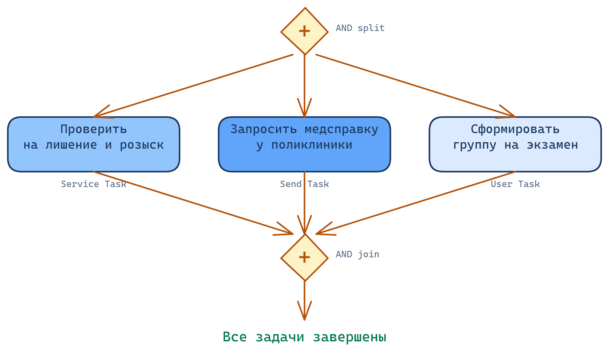

<!-- _class: title -->
<!-- _paginate: skip -->

<div class="course">SYSTEM ANALYST</div>
<div class="author">presented by Ayub</div>

# BPMN: Как показать процесс

---

<!-- _class: lead -->

**Ты — сотрудник Мобильный ЦОН. К тебе пришёл новый стажёр.**

Он спрашивает: «Расскажи, как у нас выдают водительское удостоверение».

Как ты ему это объяснишь?

<!--
Teacher Notes:
- Дай 20-30 секунд подумать. Не спеши.
- Ожидаемые ответы: "словами", "напишу список", "покажу на практике", "нарисую схему"
- Потом спроси: "А если стажёр в другом городе, и процесс на 30 шагов с развилками?"
- Подтолкни к идее: нужен универсальный язык, понятный всем без объяснений
- ~2 мин
-->

---

# Проблема: как передать процесс?

- Словами — теряется в пересказе
- Списком — не видно развилок и параллельных шагов
- Схема в Paint — у каждого свой "язык"
- Word-документ — устаревает быстрее, чем читается

**Нужен единый язык, который все читают одинаково**

> Так появился BPMN — международный стандарт описания бизнес-процессов

<!--
Teacher Notes:
- Аналогия: ноты. Музыкант из Японии и музыкант из Казахстана читают одну партитуру одинаково. BPMN — "ноты" для процессов.
- Predict: спросят "почему не flowchart?" — flowchart самодеятельность, BPMN — стандарт ISO/IEC 19510
- ~2 мин
-->

---

# Где BPMN в работе аналитика?

| Артефакт             | Отвечает на вопрос               |
| -------------------- | -------------------------------- |
| **Discovery**        | Что вообще происходит?           |
| **BRD**              | ЗАЧЕМ меняем? Какая бизнес-цель? |
| **BPMN AS-IS**       | КАК работает процесс СЕЙЧАС?     |
| **BPMN TO-BE**       | КАК должен работать ПОСЛЕ?       |
| **Use Case Diagram** | ЧТО делает система?              |
| **User Stories**     | ЧТО нужно пользователю?          |
| **SRS / UML / FRS**  | КАК технически реализовать?      |

<!--
Teacher Notes:
- BPMN стоит ДО технических артефактов. Сначала понимаем процесс — потом проектируем систему.
- Predict: путают BRD и BPMN — BRD = "зачем меняем", BPMN = "как именно работает"
- ~3 мин
-->

---

<!-- _class: lead -->

**Ты слышал, что у разработчиков есть свои диаграммы — UML.**

У бизнеса — BPMN. У разработчиков — UML.
Зачем два стандарта? Почему не один на всех?

<!--
Teacher Notes:
- Дай 20 секунд подумать
- Ожидаемые ответы: "разные люди", "разный уровень детали", "бизнес не поймёт UML"
- Respond: "правильно, а ещё?" — тяни до следующего слайда
- ~2 мин
-->

---

# BPMN vs UML: кто читает что?

|             | **BPMN**                         | **UML**                   |
| ----------- | -------------------------------- | ------------------------- |
| Читает      | Бизнес + аналитик                | Разработчик + архитектор  |
| Описывает   | Бизнес-процесс (КТО, ЧТО, КОГДА) | Систему (классы, объекты) |
| Детализация | Шаги и участники процесса        | Техническая реализация    |
| Стандарт    | ISO/IEC 19510                    | ISO/IEC 19501             |

> BPMN — язык бизнеса. UML — язык программистов.

<!--
Teacher Notes:
- BPMN — "что происходит в организации". UML — "как это устроено внутри кода".
- Оба нужны — но в разное время и для разных людей
- ~2 мин
-->

---

# Module Check: место BPMN

1. **Назови** три артефакта, которые стоят после BPMN в цепочке
2. **Объясни** разницу между BPMN AS-IS и TO-BE своими словами
3. **Когда** ты выберешь BPMN, а когда UML?

<!--
Teacher Notes:
- Дай 3 минуты, можно в парах
- Ожидаемые ответы:
  1. Use Case, User Stories, SRS/UML
  2. AS-IS = как сейчас, TO-BE = как должно стать
  3. BPMN — для процесса и бизнеса; UML — для устройства системы
- Типичная ошибка: AS-IS/TO-BE = "плохой/хороший" — нет, это до/после
- ~3 мин
-->

---

<!-- _class: lead -->

# Этап 1
## Скелет процесса

**Прежде чем рисовать сложное — научимся рисовать простое.**

Один путь. От начала до конца. Без развилок.

<!--
Teacher Notes:
- Скажи: "сейчас построим скелет процесса выдачи ВУ. На него потом будем навешивать всё остальное"
- Сквозной пример всего урока: получение водительского удостоверения через Мобильный ЦОН
- ~30 сек
-->

---

<!-- _class: lead -->

**Берёшь чистый лист. Рисуешь процесс выдачи ВУ.**

С чего начинаешь?

Что появится на листе самым первым?

<!--
Teacher Notes:
- Дай 30 секунд. Пусть реально возьмут ручку.
- Ожидаемые ответы: "заявитель пришёл", "запись на госуслугах", "первый шаг"
- Все ответы правильные — сейчас покажем, как BPMN это стандартизирует
- ~1 мин
-->

---

# Элемент 1: Start Event

**Start Event** — где процесс начинается

- Тонкий круг: `○`
- Один на процесс (обычно)
- Название — что запускает процесс

**Пример:** `○ Заявитель пришёл в Мобильный ЦОН`

> Без Start Event непонятно — с какого момента считаем, что процесс пошёл?

<!--
Teacher Notes:
- Start Event — это триггер. Что-то произошло, и процесс запустился.
- Триггеры в Мобильный ЦОН: пришёл заявитель, истёк срок ВУ (10 лет), пришёл запрос на замену
- Predict: пишут в кружке длинный текст — напомни: коротко, суть триггера
- ~2 мин
-->

---

# Элемент 2: End Event

**End Event** — где процесс заканчивается

- Жирный круг: `◉`
- Может быть **несколько** — разные исходы
- Название — конкретный исход

**Примеры:** `◉ ВУ выдано`, `◉ Отказ по лишению`

> End Event описывает не "конец листа", а конкретный финал процесса.

<!--
Teacher Notes:
- Несколько End Events — это нормально. Успех, отказ, ошибка — каждый свой.
- Predict: рисуют один "Конец" — это слишком абстрактно
- ~2 мин
-->

---

# Элемент 3: Task

**Task** — одно конкретное действие

- Прямоугольник со скруглёнными углами: `▢`
- Одно действие = один прямоугольник
- Название: глагол + объект

**Примеры:**
- `▢ Получить талон электронной очереди`
- `▢ Подать документы регистратору`
- `▢ Сфотографироваться на бланк`

<!--
Teacher Notes:
- Predict: новички делают слишком крупные Task'и ("Пройти Мобильный ЦОН" — это весь процесс, а не шаг)
- ~3 мин
-->

---

# Правило атомарности Task

> **Task = одно действие, один исполнитель**
> Не "оформить заявителя" — это несколько действий разных людей.

**Тест на атомарность:** можно разбить на "и / или / затем"? → это уже несколько Task'ов

| ❌ Слишком крупно     | ✅ Атомарно                         |
| -------------------- | ---------------------------------- |
| Оформить заявителя   | Проверить паспорт заявителя        |
| Проверить документы  | Проверить форму 083 (здоровье)     |
| Пройти Мобильный ЦОН | Получить талон электронной очереди |

<!--
Teacher Notes:
- Ключевой слайд — возвращайся к нему при разборе ошибок в упражнениях
- Обрати внимание: добавили пример с "Проверить документы" — подготовка к следующему слайду
- ~2 мин
-->

---

<!-- _class: lead -->

**Сравни:**

`▢ Проверить документы`

vs.

`▢ Проверить форму 083 (здоровье)`
`▢ Проверить статус лишения прав`
`▢ Проверить результат экзамена`

Почему второй вариант лучше?

<!--
Teacher Notes:
- Дай 30 секунд на обсуждение
- Ожидаемый ответ: конкретно, понятно кто делает, можно отследить
- Переход к следующему слайду: "давайте разберём почему именно так"
- ~2 мин
-->

---

# А если проверок много?

Пример: заявка на водительские права

**Одна задача "Проверить документы"?**

Зависит от того, **кто** и **что** проверяет:

| Проверка             | Организация                  | Ответственный | API / Сервис                 |
| -------------------- | ---------------------------- | ------------- | ---------------------------- |
| Форма 083 (здоровье) | Министерство здравоохранения | Врач          | `health.gov.kz/api/form083`  |
| Статус лишения прав  | МВД                          | Инспектор     | `mvd.gov.kz/api/deprivation` |
| Результат экзамена   | ЦОН                          | Инспектор     | `con.gov.kz/api/exam-result` |

> Разные организации → разные API → разные Task'и

<!--
Teacher Notes:
- Частая ошибка новичков — свалить всё в одну задачу "Проверить документы"
- Спроси: "если врач не пришёл — весь процесс встал?"
- ~3 мин
-->

---

# Уровни детализации BPMN

BPMN может быть **общим** или **детальным** — зависит от аудитории

| Уровень            | Для кого                | Пример                   |
| ------------------ | ----------------------- | ------------------------ |
| **High-level**     | Руководство             | `Проверить документы`    |
| **Detailed**       | Аналитики, разработчики | Каждая проверка отдельно |
| **Implementation** | Технари                 | + системы, API, таймауты |

**Инструмент:** Collapsed Sub-Process

Снаружи — одна задача. Внутри — полный процесс.

> Начни с high-level, детализируй только там, где решение зависит от деталей

<!--
Teacher Notes:
- Покажи аналогию: карта города vs карта страны — обе правильные, просто разный масштаб
- ~2 мин
-->

---

# Правило именования Task

| ❌ Плохо              | ✓ Хорошо                               | Почему                      |
| -------------------- | -------------------------------------- | --------------------------- |
| Оформить             | Зарегистрировать заявку в ЦОН          | Конкретное действие и место |
| Проверка             | Запросить справку в МВД                | Понятно где и что           |
| Работа с документами | Загрузить форму 083 в Минздрав         | Понятно что именно          |
| Согласование         | Получить подтверждение от руководителя | Понятен исполнитель         |

> Task = глагол + объект. Читая название, исполнитель сразу понимает что делать.

<!--
Teacher Notes:
- При автоматизации: нечёткая задача = неавтоматизируемая задача.
- ~2 мин
-->

---

# Зачем это важно в реальности

В небольших компаниях разработчик часто **сам собирает требования** — помимо кода.

**Проблема:** PM/PO не всегда знает, чего хочет → фокус только на ближайший спринт → постоянные переделки и рефакторинг.

**Два разработчика:**

| 😕 Нечёткая задача  | 😊 Чёткая задача                                      |
| ------------------- | ----------------------------------------------------- |
| "Сделай оформление" | "Проверь паспорт → зарегистрируй в АИС → верни талон" |
| Не понимает scope   | Знает что делать и когда задача готова                |
| Переделывает 3 раза | Делает один раз правильно                             |

> Хорошее именование = уважение к исполнителю.
> Плохое = "разбирайся сам".

**Наша цель после курса:** ты пишешь задачи так, что исполнитель точно знает — что делать и какие критерии пройти.

<!--
Teacher Notes:
- Это мотивационный слайд — связать теорию с реальной болью
- Спроси: "Кто сталкивался с задачей, где непонятно что делать?"
- ~3 мин
-->

---

# Элемент 4: Sequence Flow

**Sequence Flow** — порядок выполнения шагов

- Сплошная стрелка: `→`
- Соединяет события и задачи
- Утверждает: "после этого — вот это"

**Правило:** каждый элемент имеет входящий и исходящий поток (кроме Start и End).

<!--
Teacher Notes:
- Predict: рисуют двусторонние стрелки "на всякий случай" — подчеркни: одна стрелка = одно направление
- ~2 мин
-->

---

# Sequence Flow vs Association

|               | Sequence Flow             | Association                     |
| ------------- | ------------------------- | ------------------------------- |
| **Вид**       | Сплошная стрелка `→`      | Пунктирная линия `···`          |
| **Смысл**     | "после A делай B"         | "это относится к A"             |
| **Соединяет** | Task ↔ Task, Event ↔ Task | Text Annotation ↔ любой элемент |

**Пример:**

```
▢ Принять оплату → ▢ Выдать чек        ← Sequence Flow (порядок)

▢ Принять оплату ··· 📝 "Только наличные"  ← Association (комментарий)
```

> **Text Annotation** — это комментарий к элементу.
> **Association** — пунктирная линия, которой он крепится.
> В bpmn.io они создаются вместе.

<!--
Teacher Notes:
- Покажи в bpmn.io: перетяни Text Annotation на элемент — линия появится сама
- Спроси: "Если убрать Association, изменится ли порядок процесса?" (нет — это просто пометка)
- ~2 мин
-->

---

# Наша диаграмма после Этапа 1

```
○ Заявитель пришёл
        ↓
▢ Получить талон электронной очереди
        ↓
▢ Подать документы регистратору
        ↓
▢ Сдать экзамен
        ↓
▢ Сфотографироваться
        ↓
▢ Получить ВУ под роспись
        ↓
◉ ВУ выдано
```

> Это уже настоящая BPMN-диаграмма. Минимальная — но её прочитает любой аналитик в мире.

<!--
Teacher Notes:
- [VISUAL]: линейная диаграмма слева направо: тонкий круг → 5 прямоугольников → жирный круг
- Подчеркни: на следующих этапах эта же диаграмма будет расти. Не перерисовываем — добавляем.
- ~3 мин
-->

---

# Module Check: скелет

1. **Что показывает** Sequence Flow и чем он отличается от обычной стрелки?
2. **В чём разница** между Start Event и End Event визуально?
3. **Почему** Task `▢ Работа с заявителем` — плохое название?
4. **Сколько** End Event'ов может быть в одном процессе?

<!--
Teacher Notes:
- Дай 3 минуты, обсуждение вслух
- Ответы:
  1. Порядок выполнения; не просто связь, а утверждение "после X идёт Y"
  2. Start — тонкий круг, End — жирный
  3. Слишком общее, непонятно что именно делать
  4. Несколько — каждый исход свой End
- ~3 мин
-->

---

<!-- _class: lead -->

# Микропрактика 1: скелет

**Возьми лист. Карандаш, не ручка — BPMN язык черновиков.**

Выбери ОДИН сюжет и нарисуй линейный процесс (5–7 шагов):

- ☕ **Заказать кофе в кофейне** — от входа до получения напитка
- 📦 **Заказать товар онлайн** — от выбора товара до получения посылки
- 🏥 **Записаться к врачу в поликлинике** — от звонка до приёма

**Обязательно:** Start Event, End Event, минимум 4 Task, Sequence Flow между ними.

**Время:** 4 минуты.

<!--
Teacher Notes:
- Первая в жизни BPMN-диаграмма студента. Пусть реально возьмут карандаш.
- Подчеркни: карандаш, а не ручка — нормально стирать и переделывать.
- Ходи по рядам, НЕ исправляй — отмечай типовые ошибки для разбора после peer review.
- Типичные косяки: Task названы существительными ("Оплата" вместо "Оплатить"), нет End Event, двусторонние стрелки.
- ~4 мин
-->

---

# Code Review — практика из Big Tech

В крупных IT-компаниях (Google, Meta, Amazon) есть правило:

> **Ни одна строчка кода не попадает на сервер, пока Senior-разработчик не проверит и не одобрит твои изменения.**

У нас в курсе нет Senior'ов — но мы введём эту же практику.

**Зачем это нужно:**
- Ошибки дешевле ловить **до** того, как они попали в продукт
- Второй человек видит то, что автор уже "замылил"
- Это **стандарт индустрии**, а не придирки

<!--
Teacher Notes:
- Спроси: "Как думаете, зачем компании тратят время Senior'а на чтение чужого кода?"
- Дай 15 секунд на ответы
- ~2 мин
-->

---

# Почему Review — это обучение

Когда я работал Junior-разработчиком, Senior с 10-летним опытом проверял мой код каждый день. Он не просто говорил "неправильно" — он объяснял **почему** и **как лучше**.

Это ускорило мой рост больше, чем любые курсы.

**Даже без Senior'а в команде:**
- Коллега-разработчик смотрит на твою работу **под другим углом**
- Он замечает то, что ты не видишь — потому что ты слишком близко к своему решению

> Review — это не проверка. Это **обмен знаниями** (Knowledge Sharing).

<!--
Teacher Notes:
- Личный пример важен — покажи что ты сам через это проходил
- ~2 мин
-->

---

# Как принимать обратную связь

Нормально, что критика — неприятна. Это **по умолчанию** у всех людей.

**Правила:**
1. **Слушай до конца** — не перебивай, даже если не согласен
2. **Отдели себя от работы** — критикуют диаграмму, не тебя
3. **Если есть аргумент — озвучь** — это не спор, а дискуссия

> Если ты прав и можешь объяснить почему — **нечего бояться**.
> Если ошибся — ты только что бесплатно научился.

**В нашей аудитории нет места для высокомерия — только знания и командная работа.**

<!--
Teacher Notes:
- Подчеркни: "одна правка и одна похвала" — это формат. Не только ругать, но и отмечать хорошее.
- Этот ритуал будет повторяться после каждой практики — привыкайте.
- ~2 мин
-->

---

<!-- _class: lead -->

# Поменяйтесь листами с соседом

**3 минуты на разбор чужой диаграммы:**

- Что читается сразу, без объяснений автора?
- Все ли Task названы глаголом + объектом?
- Есть ли Start и End?

**Верни лист с одной правкой и одной похвалой.**

<!--
Teacher Notes:
- Первый peer review в курсе. Следи за атмосферой — никаких насмешек.
- НЕ вмешивайся в обсуждения пар — слушай, запоминай типовые ошибки.
- После обмена — 2 минуты у доски: разбери 2-3 самых частых косяка из того, что видел в рядах.
- ~5 мин (3 обмен + 2 разбор)
-->

---

<!-- _class: lead -->

# Этап 2
## Кто и как делает работу

**Смотрим на нашу диаграмму. Все Task'и выглядят одинаково.**

Но ведь это **разная работа**:
- Регистратор вводит данные **в компьютер** 👤
- Курьер доставляет права **до двери** ✋
- SMS-шлюз отправляет уведомление **сам, без человека** ⚙

Как показать эту разницу на диаграмме?

<!--
Teacher Notes:
- Дай 20 секунд подумать
- Ожидаемые ответы: "написать кто делает", "разные цвета", "разные значки"
- Подтолкни: "В BPMN есть значки — для каждого типа работы свой"
- ~2 мин
-->

---

# User Task: человек + система

**User Task** — человек выполняет работу через программу (сайт, приложение, CRM)

- Прямоугольник со значком 👤 в углу
- Убери человека — шаг встал. Убери программу — тоже.

**Примеры:**

| Сфера | User Task |
|---|---|
| ЦОН | 👤 Оператор открывает заявку на водительские права в портале eGov |
| ЦОН | 👤 Оператор переключает гражданина на другую услугу в системе очередей |
| Водительские права | 👤 Инструктор выставляет оценку за экзамен в системе учёта |
| Склад | 👤 Кладовщик обновляет остаток товара после инвентаризации в 1С |
| Банк | 👤 Оператор оформляет заявку на кредит в CRM |

**Как узнать, что это User Task?** Задай два вопроса:
1. Здесь участвует живой человек? → да
2. Он работает через программу или сайт? → да

Оба "да" → это User Task. Убери любого из них — задача не выполнится.

<!--
Teacher Notes:
- Самый частый тип задачи в современных процессах
- Ключевой тест: нужен И человек, И система одновременно? → User Task
- ~2 мин
-->

---

# Service Task: только система

**Service Task** — шаг исполняет система автоматически

- Прямоугольник со значком ⚙
- Человек не вовлечён вообще

**Примеры:**

| Сфера | Service Task |
|---|---|
| Водительские права | ⚙ SMS-шлюз отправляет уведомление о готовности прав |
| Водительские права | ⚙ Система МВД автоматически проверяет статус лишения прав |
| Банк | ⚙ Система проверяет кредитный рейтинг в ПКБ |
| Банк | ⚙ Платёжный шлюз списывает деньги с карты через Kaspi Pay |
| Интернет-магазин | ⚙ Система автоматически резервирует товар после оформления заказа |
| ЦОН | ⚙ Email-сервис отправляет чек на почту гражданина |
| Склад | ⚙ Inventory-сервис обновляет остаток товара после оплаты |

> Service Task = нажали кнопку → сервис ответил. Человек не нужен — система справляется сама.

<!--
Teacher Notes:
- Если на диаграмме много Service Task — процесс хорошо цифровизован
- Тест: убери человека — шаг всё ещё работает? → Service Task
- ~2 мин
-->

---

# Manual Task: человек без системы

**Manual Task** — человек делает руками, без ИТ

- Прямоугольник со значком ✋
- Никакая система в момент действия не нужна

**Примеры:**

| Сфера | Manual Task |
|---|---|
| ЦОН | ✋ Кассир принимает наличные за пошлину |
| Водительские права | ✋ Курьер доставляет готовые права до двери заявителя |
| Интернет-магазин | ✋ Курьер передаёт посылку получателю и забирает подпись |
| Склад | ✋ Кладовщик вручную пересчитывает товар при инвентаризации |
| Ресторан | ✋ Официант подаёт блюдо гостю |
| Медицина | ✋ Врач проводит осмотр пациента |

> Manual Task = чисто физическое действие. Никакая система не участвует.

<!--
Teacher Notes:
- Manual Task встречается реже всего, но честно показывает, где процесс "проваливается" в ручной режим
- Тест: есть ли экран перед исполнителем в момент действия? Нет → Manual Task
- ~2 мин
-->

---

<!-- _class: lead -->

# Угадай тип Task

Для каждого примера скажи: **User Task**, **Service Task** или **Manual Task**?

| #   | Действие                                               | Тип? |
| --- | ------------------------------------------------------ | ---- |
| 1   | Охранник проверяет сумку на входе в ЦОН                | ❓    |
| 2   | Оператор вносит данные клиента в 1С                    | ❓    |
| 3   | Kaspi Pay списывает деньги с карты                     | ❓    |
| 4   | Курьер передаёт посылку получателю                     | ❓    |
| 5   | SMS-шлюз отправляет код подтверждения                  | ❓    |
| 6   | Бухгалтер формирует отчёт в Excel                      | ❓    |
| 7   | Уборщик моет пол в зале ожидания                       | ❓    |
| 8   | АИС автоматически присваивает номер заявке             | ❓    |
| 9   | Врач проводит осмотр пациента                          | ❓    |
| 10  | Инструктор выставляет оценку за экзамен в системе      | ❓    |
| 11  | Inventory-сервис обновляет остаток товара после оплаты | ❓    |
| 12  | Кладовщик пересчитывает товар при инвентаризации       | ❓    |

<!--
Teacher Notes:
- Дай 2 минуты, потом разбирай по одному вслух
- Ответы:
  1. Manual — физический осмотр, без системы
  2. User — человек + система (1С)
  3. Service — полностью автоматическое списание
  4. Manual — физическая передача, без системы
  5. Service — система сама, без человека
  6. User — человек + система (Excel)
  7. Manual — физическое действие
  8. Service — автоматически, без человека
  9. Manual — физический осмотр, без системы
  10. User — человек + система учёта
  11. Service — автоматически, без человека
  12. Manual — вручную, без системы
- Спорные: "а если курьер сканирует QR?" → тогда User Task! Обсуди с группой.
- ~5 мин
-->

---

# Send / Receive Task: отправка и получение сообщений

**Send Task** 📤 — отправить сообщение и **сразу продолжить** процесс, не ожидая ответа
**Receive Task** 📥 — процесс **блокируется** и продолжается только после получения сообщения

Ключевое слово — **сообщение** (Message). Не вызов функции, не клик — а передача данных и **ожидание ответа**.

> Представь: ты отправил письмо и не знаешь, когда придёт ответ — через час или через неделю. Неважно кому — коллеге в соседний отдел или в другой город. Главное: ты **ждёшь**. Это и есть Send → Receive.

<!--
Teacher Notes:
- Подчеркни слово "сообщение" — это не действие, а передача информации
- Спроси: "Чем это отличается от Service Task, где система тоже что-то делает?"
- Дай 15 секунд на ответы
- ~2 мин
-->

---

# Когда Send/Receive, а не Service Task?

**Service Task** ⚙ — вызвал и **сразу получил** ответ (синхронно)
**Send/Receive** 📤📥 — отправил и **процесс встал на паузу**, пока не придёт ответ (асинхронно)

|                  | Service Task              | Send / Receive                 |
| ---------------- | ------------------------- | ------------------------------ |
| **Суть**         | Запрос → мгновенный ответ | Отправил сообщение → ждёшь     |
| **Процесс**      | Не останавливается        | Встаёт на паузу                |
| **Время ответа** | Миллисекунды              | Минуты, часы, дни              |
| **Кому**         | Кому угодно               | Кому угодно                    |
| **Аналогия**     | Позвонил — сразу ответили | Отправил письмо — ждёшь ответа |

> **Правило:** дело **не в том**, кому ты отправляешь (внутренний сервис или внешний). Дело в том, **ждёт ли процесс** ответа. Ждёт → Send/Receive.

<!--
Teacher Notes:
- Важно! Частая ошибка: думают что Send/Receive только для внешних организаций. Нет — даже два своих микросервиса, общающиеся через Kafka, это Send/Receive.
- Для IT-аудитории: Service Task ≈ синхронный HTTP-вызов. Send/Receive ≈ асинхронный обмен (Kafka, RabbitMQ, email). BPMN не указывает технологию — только факт: процесс ждёт или нет.
- ~2 мин
-->

---

# Send / Receive: примеры из жизни

| Кто отправляет 📤         | Кому                  | Что ждём 📥                        | Когда          |
| ------------------------- | --------------------- | ---------------------------------- | -------------- |
| ЦОН → заявка на апостиль  | Министерство юстиции  | Подтверждение апостиля             | 3-5 дней       |
| Налоговая → уведомление   | Компания              | Ответ на проверку                  | до 10 дней     |
| Поликлиника → направление | Диагностический центр | Результаты МРТ                     | 1-3 дня        |
| Лаборатория → образцы     | Генетический центр    | Результаты анализа                 | до 2 недель    |
| Магазин → заявка          | Kaspi Express         | Подтверждение забора груза         | часы           |
| Сервис оплаты → запрос    | Платёжная система     | Webhook о подтверждении транзакции | секунды–минуты |
| Система → договор         | Клиент (email)        | Подписанный документ обратно       | дни            |

> Неважно — внешняя организация или соседний сервис. Важно одно: процесс **заблокирован и продолжится только после ответа**.

<!--
Teacher Notes:
- Спроси: "А чем отличается от Service Task?" Ответ: Service Task — вызвал и сразу получил синхронный ответ. Send/Receive — отправил и ждёшь неизвестно сколько (асинхронно).
- Пример: МВД может ответить через 2 секунды или через 3 рабочих дня — процесс ждёт в любом случае.
- ~3 мин
-->

---

# Этап 2: что добавилось

**Те же шаги — но теперь видно кто что делает:**

```
○ Заявитель пришёл
        ↓
▢ Получить талон
        ↓
👤 Регистратор проверяет документы
        ↓
⚙ Система автоматически присваивает номер заявке
        ↓
📤 Запросить справку у поликлиники → 📥 Получить ответ
        ↓
✋ Кассир принимает пошлину
        ↓
... (продолжение)
```

> Тип задачи — это не украшение. Это явное требование к ресурсам.

<!--
Teacher Notes:
- Подчеркни: благодаря типизации сразу видно, какие шаги можно автоматизировать (User → Service)
- ~2 мин
-->

---

# Module Check: типы задач

1. **В чём разница** между User Task и Service Task?
2. **Когда** правильно использовать Manual Task?
3. **Почему** запрос в поликлинику — это Send/Receive, а не Service Task? Ведь это тоже конечный сервис (Endpoint), который принимает запрос и отвечает — но каждый раз за разное время.
4. **Вспомни** по одному примеру из процесса Мобильный ЦОН для каждого типа Task — User, Service, Manual, Send/Receive

<!--
Teacher Notes:
- Дай 4 минуты
- Ответы:
  1. User — человек через систему; Service — система сама
  2. Когда человек делает физически без ИТ
  3. Потому что процесс останавливается и ждёт ответа. Service Task — вызвал и сразу получил. Send/Receive — отправил и ждёшь, неважно внешний это сервис или внутренний.
  4. User: регистратор проверяет документы; Service: система присваивает номер; Manual: кассир принимает наличные; Send/Receive: запрос справки у поликлиники
- ~4 мин
-->

---

<!-- _class: lead -->

# Микропрактика 2: типы задач

**Карандаш, 5 минут. Выбери ОДИН сюжет и нарисуй процесс со всеми 4 типами задач:**

- 🪪 **Оформление водительских прав в ЦОН**
  User: оператор открывает заявку в портале eGov · Send: ЦОН отправляет запрос в МВД · Receive: ждём ответ от МВД (1-3 дня) · Service: SMS-шлюз отправляет уведомление о готовности · Manual: курьер доставляет права до двери

- 🏥 **Направление пациента на МРТ**
  User: врач оформляет направление в системе · Send: поликлиника отправляет запрос в диагностический центр · Receive: ждём результаты МРТ (1-3 дня) · Service: система уведомляет врача по email · Manual: врач проводит повторный осмотр

- 📦 **Доставка заказа из интернет-магазина**
  User: менеджер подтверждает заказ в панели · Send: магазин отправляет заявку в Kaspi Express · Receive: ждём подтверждение забора груза · Service: Inventory-сервис обновляет остаток товара · Manual: курьер передаёт посылку получателю

- 🧑‍💼 **Онбординг нового сотрудника**
  User: HR заводит профиль сотрудника в системе · Send: HR отправляет запрос на доступ в IT-отдел · Receive: ждём подтверждение создания аккаунтов (до 1 дня) · Service: система автоматически генерирует корпоративную почту · Manual: охрана выдаёт пропуск

**Обязательно:** минимум один Task каждого типа (User, Service, Manual, Send или Receive).

<!--
Teacher Notes:
- Первое упражнение, где студент реально выбирает между типами — а не копирует слайд.
- Подсказка-триггер: "если убрать человека — шаг всё ещё работает?" → Service.
- Типовые ошибки: всё User Task, Manual путают с Service, забывают Send/Receive там, где процесс реально ждёт ответа.
- ~5 мин
-->

---

<!-- _class: lead -->

# Поменяйтесь листами с соседом

**3 минуты на разбор:**

- Правильно ли выбран тип для каждой задачи?
- Есть ли шаг, который можно было автоматизировать (User → Service)?
- Где автор «честно провалился в ручной режим» (Manual)?

**Верни лист с одной правкой и одной похвалой.**

<!--
Teacher Notes:
- Задай вопрос вслух группе: "у кого в диаграмме больше всего Service Task?" — это индикатор "оцифрованности" процесса.
- ~5 мин
-->

---

<!-- _class: lead -->

# Этап 3
## Развилки — Gateways

**Наша диаграмма — одна прямая линия.**

Но реальность ветвится: справка может быть просрочена, экзамен может быть провален, заявитель может быть лишён прав.

Как показать «если…»?

<!--
Teacher Notes:
- Подведи: "До сих пор всё было идеальным сценарием. Сейчас добавим реальность"
- ~30 сек
-->

---

<!-- _class: lead -->

**Регистратор смотрит медсправку.**

Что если она просрочена?

Куда тогда идёт стрелка?

<!--
Teacher Notes:
- Дай 20 секунд
- Ожидаемые ответы: "на медкомиссию", "отказ", "две стрелки"
- Подведи: "значит, нам нужна точка, где поток разветвляется по условию"
- ~1 мин
-->

---

# Exclusive Gateway (XOR)

**Exclusive Gateway** — выбираем ровно ОДНУ ветку

- Ромб с символом `×`: `◇×`
- Условия — взаимоисключающие
- На выходе всегда сработает только одна стрелка

**Пример:**
```
👤 Проверить медсправку
        ↓
     ◇× «Действительна?»
       /        \
     да          нет
      ↓           ↓
  продолжаем  ✋ На медкомиссию
```

> XOR — это "или-или". Никогда не "и то, и другое".

<!--
Teacher Notes:
- Самый частый шлюз. На любой реальной диаграмме их десятки.
- Правило: на каждую стрелку из XOR должно быть условие (label)
- ~3 мин
-->

---

<!-- _class: lead -->

**Заявитель сдал документы и сидит ждёт начала теории.**

Пока он ждёт, в фоне происходит:
- система проверяет, не лишён ли водитель прав и не в розыске ли он
- запрос медицинской справки у поликлиники
- формирование группы на экзамен

Эти три проверки идут **одновременно**.

Как это нарисовать?

<!--
Teacher Notes:
- Дай 30 секунд
- Ожидаемые ответы: "три параллельные стрелки", "отдельная диаграмма"
- Подведи: "BPMN даёт ровно один значок для этого"
- ~1 мин
-->

---

# Parallel Gateway (AND)

**Parallel Gateway** — запускаем ВСЕ ветки одновременно

- Ромб с символом `+`: `◇+`
- Используется парой: split (разветвление) + join (схождение)
- Join ждёт, пока завершатся ВСЕ ветки

**Пример: пока заявитель ждёт, параллельно идут три задачи:**



> AND = "и то, и то, и третье — все обязательно".

⚠️ **А что если одна ветка упала?** AND Gateway сам не знает об ошибках — процесс зависнет и будет ждать вечно. Для обработки сбоев используют **Boundary Error Event** и **Timeout Event** — разберём это на следующем уроке.

<!--
Teacher Notes:
- Ключ: AND-join всегда ждёт ВСЕ ветки. Если хоть одна не пришла — процесс стоит.
- Predict: путают с XOR — XOR выбирает одну, AND запускает все
- Если спросят про сбои — скажи что это Boundary Events, тема BPMN B
- ~3 мин
-->

---

<!-- _class: lead -->

**Заявитель ждёт в зале вызова на табло.**

Может случиться одно из двух:
- его номер вызовут
- или истечёт 1 час ожидания → перенос на завтра

Что произойдёт раньше — мы не знаем. Это решает не "если", а "что наступит первым".

Какой это шлюз?

<!--
Teacher Notes:
- Это самое сложное место урока. Дай 30 секунд.
- Если молчат — намекни: "Это и не XOR (нет условия на данных), и не AND (только одна сторона сработает)"
- ~1 мин
-->

---

# Event-based Gateway

**Event-based Gateway** — выбор по тому, что случилось первым

- Ромб с пятиугольником и кружком внутри
- Каждая ветка начинается с **события**, а не с задачи
- Сработает ветка того события, которое произошло раньше

**Пример 1 — ЦОН:**
```
  📤 Отправить талон    ◇⌖ Event-based
     в систему очередей /         \
                   📩 Вызов       ⏱ Таймаут 1 час
                    на табло
                        ↓             ↓
                   Идти к окну   Перенос на завтра
```

**Пример 2 — Glovo/Wolt:**
```
  📤 Отправить заказ    ◇⌖ Event-based
     курьеру            /         \
                  📩 Курьер      ⏱ Прошло
                   доставил       90 минут
                        ↓             ↓
                   Оценить        Автоматический
                   заказ          возврат денег
```

> Event-based — "кто первый встал, того и тапки".

<!--
Teacher Notes:
- Пример с Glovo ближе студентам — все заказывали еду
- Отличие от XOR: XOR смотрит данные ("если справка просрочена"), Event-based смотрит события ("что прилетит первым")
- Часто используется с Timer для реализации SLA и таймаутов
- ~3 мин
-->

---

<!-- _class: lead -->

**Заявитель подаёт документы на водительские права.**

Как его уведомить о готовности?

- Только SMS
- Только Telegram
- SMS + Email
- SMS + Telegram + Email

Зависит от того, какие контакты он указал. Может сработать один канал, может несколько.

XOR даёт «ровно один». AND даёт «все всегда». А нам нужно «все подходящие».

<!--
Teacher Notes:
- Дай 20 секунд подумать
- Подтолкни: "XOR — это или/или. AND — это и то и то. А здесь?"
- Переход к OR Gateway — следующий слайд объяснит как именно
- ~1 мин
-->

---

# Inclusive Gateway (OR)

**Inclusive Gateway** — выбираем одну ИЛИ несколько веток

- Ромб с символом `O`: `◇○`
- Срабатывают все ветки, чьи условия истинны
- Join ждёт только реально запущенные ветки

**Пример: уведомление о готовности водительских прав**

```
◇○ Как уведомить заявителя?
   ├─ [есть email]     → ⚙ Email-сервис отправляет письмо
   ├─ [есть телефон]   → ⚙ SMS-шлюз отправляет SMS
   ├─ [есть Telegram]  → ⚙ Telegram-бот отправляет сообщение
   └─ [нет контактов]  → ✋ Оператор звонит вручную
```

Указал email + Telegram → сработают две ветки. Только телефон → одна. Ничего → Manual.

> OR — "все подходящие варианты, минимум один".

<!--
Teacher Notes:
- Сложный шлюз. На практике встречается реже XOR/AND, но в нужный момент незаменим.
- Predict: студенты предлагают заменить OR на каскад XOR'ов — можно, но получится месиво из 8 веток (2³ комбинаций)
- ~3 мин
-->

---

# Шлюзы рядом: коротко

| Шлюз                | Символ | Сколько веток сработает           |
| ------------------- | ------ | --------------------------------- |
| **XOR** (Exclusive) | `◇×`   | Ровно одна (по условию на данных) |
| **AND** (Parallel)  | `◇+`   | Все (всегда)                      |
| **OR** (Inclusive)  | `◇○`   | Одна или несколько (по условиям)  |
| **Event-based**     | `◇⌖`   | Та, чьё событие случилось первым  |

> Выбор шлюза = выбор того, как именно ветвится реальность.

<!--
Teacher Notes:
- Это слайд-шпаргалка. Скажи: "если запутаетесь — возвращайтесь к этой таблице"
- ~2 мин
-->

---

# Module Check: шлюзы

1. **В чём разница** между XOR и Event-based Gateway?
2. **Когда** AND-join "застрянет"?
3. **Почему** для пересдачи экзаменов нужен OR, а не XOR?
4. **Нарисуй** на листе: «если медсправка просрочена → на медкомиссию, иначе → к инспектору». Какой шлюз?

<!--
Teacher Notes:
- Дай 5 минут. Четвёртый вопрос — реально пусть рисуют.
- Ответы:
  1. XOR — условие на данных; Event-based — что случилось первым
  2. Если хоть одна параллельная ветка не дошла до join
  3. XOR даёт одну ветку, а пересдач может быть несколько одновременно
  4. XOR
- ~5 мин
-->

---

<!-- _class: lead -->

# Микропрактика 3: шлюзы

**Карандаш, 6 минут. Выбери ОДИН сюжет:**

- 🛒 **Оформление заказа в интернет-магазине** — товар в наличии → оплата → доставка; нет в наличии → предложить аналог или отменить; оплата не прошла → повтор или отмена (**XOR**)
- 🍕 **Заказ еды в Glovo** — параллельно: ресторан готовит еду + система ищет курьера + списание оплаты. Join = курьер забирает заказ (**AND**)
- 📦 **Ожидание посылки с AliExpress** — курьер доставил / пришло SMS из пункта выдачи / прошло 60 дней → автовозврат денег (**Event-based**)
- 🏠 **Подача документов на аренду квартиры** — справка о доходах / рекомендация от прошлого арендодателя / выписка из банка — зависит от требований владельца, может быть одно или несколько (**OR**)

**Обязательно:** хотя бы один Gateway, все ветки XOR подписаны условиями, join там где нужен.

<!--
Teacher Notes:
- 4 сюжета — 4 разных шлюза. Пусть по аудитории разойдутся разные, на разборе сравним.
- Glovo самый понятный для AND — подчеркни что все три процесса идут одновременно.
- AliExpress хорош для Event-based — никто не знает что случится первым.
- Типовые ошибки: XOR без условий на ветках, AND-split без join, Event-based с задачами вместо событий на ветках.
- ~6 мин
-->

---

<!-- _class: lead -->

# Поменяйтесь листами с соседом

**3 минуты на разбор:**

- Правильно ли выбран тип шлюза под ситуацию?
- Подписаны ли условия на ветках XOR?
- Есть ли join там, где он нужен?

**Верни лист с одной правкой и одной похвалой.**

<!--
Teacher Notes:
- После peer review — 3 минуты у доски: разбери по одному примеру каждого типа шлюза из того, что видел в рядах.
- Подчеркни сравнение XOR vs Event-based — одно из самых путающих мест.
- ~6 мин (3 обмен + 3 разбор)
-->

---

# Итоги первой сессии

**Сегодня мы прошли:**
- Скелет процесса: Start Event, End Event, Task, Sequence Flow
- Типы задач: User, Service, Manual, Send/Receive
- Шлюзы: XOR, AND, OR, Event-based

**В следующей сессии:**
- События: Timer, Message, Boundary Error, Signal, Terminate
- Большая практика: процесс выдачи ВУ целиком

> Мы уже умеем читать и рисовать BPMN-диаграммы. Дальше — добавим реалистичности.

<!--
Teacher Notes:
- Подведи итог, похвали группу
- Напомни: карандашные диаграммы не выбрасывайте — пригодятся в следующей сессии
- ~2 мин
-->

