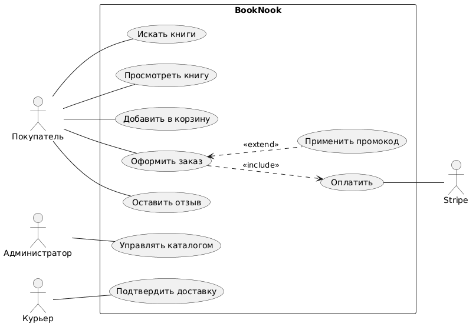
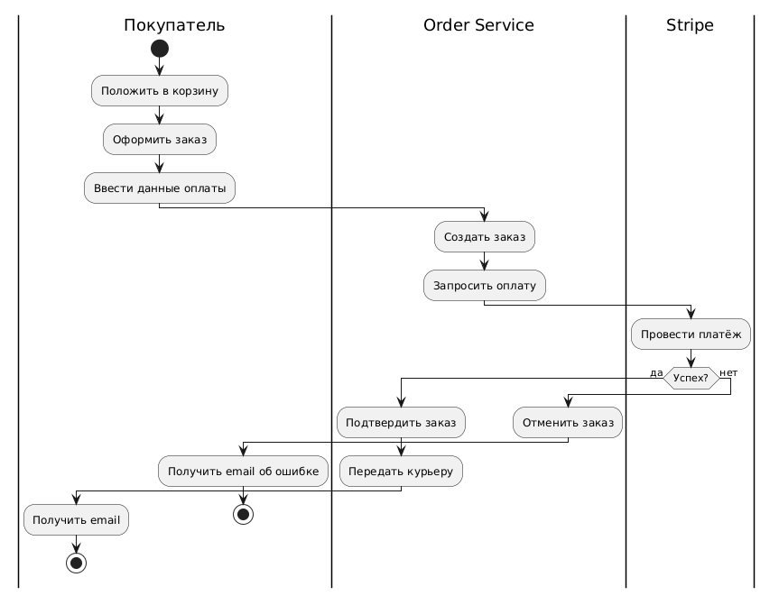
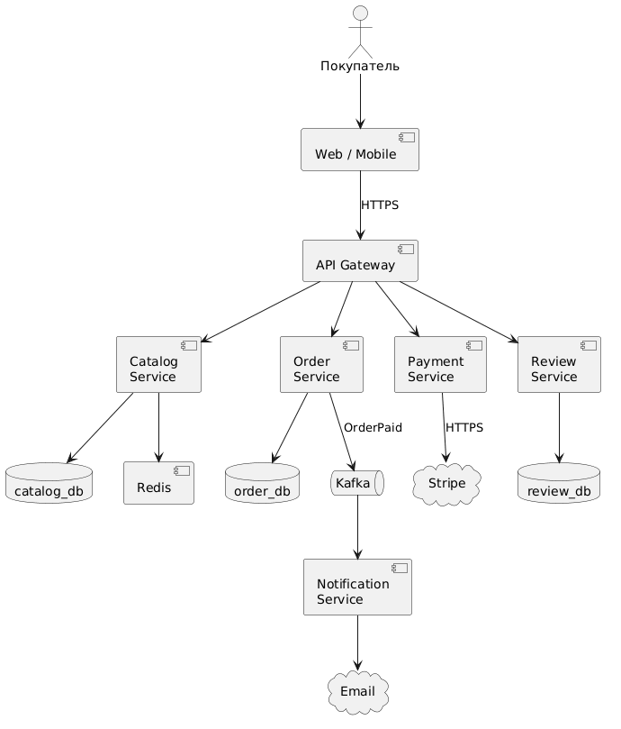
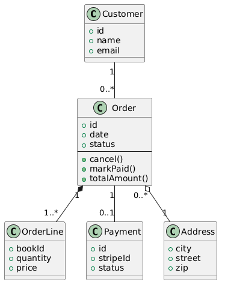
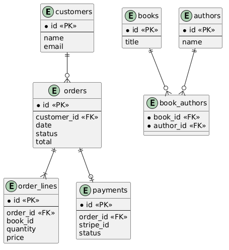
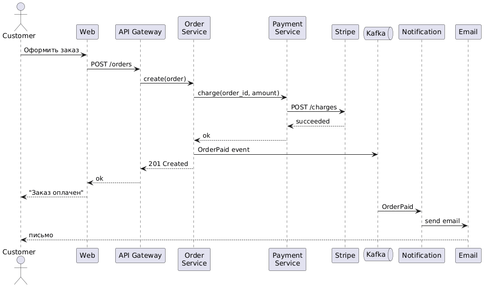

<!-- _class: title -->
<!-- _paginate: skip -->

<div class="course">CAPSTONE PROJECT</div>
<div class="author">presented by Ayub</div>

# BookNook
## Онлайн-магазин книг

---

# Зачем нам этот проект

Раньше мы учили нотации **по одной**. Сейчас — соберём всё вместе.

**Цель:** на одном домене (книжный магазин) показать, как **одна и та же система** выглядит в **разных диаграммах**.

| Диаграмма | Что покажет |
|---|---|
| Use Case | Кто и что делает в системе |
| BPMN | Как идёт процесс заказа |
| Component | Сервисы и их связи |
| Class | Структура кода |
| ERD | Структура БД |
| Sequence | Поток сообщений при покупке |

> Это не разные системы. Это **разные взгляды** на одну.

---

# Постановка задачи

**BookNook** — онлайн-магазин книг.

**Что должна делать система:**
- Покупатель ищет книги по названию / автору / жанру
- Видит описание, обложку, отзывы
- Добавляет в корзину, оформляет заказ
- Платит картой (через Stripe)
- Получает email о статусе заказа
- Может оставить отзыв после доставки

**Роли:** Покупатель, Администратор (управляет каталогом), Курьер (отмечает доставку).

---

# Артефакты SA: цепочка

```
Требования  →  Use Case  →  BPMN
                  ↓
              Component
                  ↓
         Class  →  ERD
                  ↓
              Sequence
                  ↓
              API contracts
```

> Каждый артефакт **дополняет**, а не заменяет предыдущий.

---

# Этап 1: Use Case Diagram

---

# Use Case — кто и что делает



**Акторы:** Покупатель, Администратор, Курьер, Stripe (внешний).

**Use Cases:**
- Искать книги, Просмотреть книгу, Добавить в корзину
- Оформить заказ → `<<include>>` Оплатить
- Применить промокод → `<<extend>>` к "Оформить заказ"
- Оставить отзыв
- Управлять каталогом (Admin)
- Подтвердить доставку (Курьер)

---

# Что мы извлекли из Use Case

- **3 пользовательских роли** + 1 внешний сервис
- **8 ключевых функций** системы
- Видим, что "Оплата" — обязательная часть оформления
- "Промокод" — необязательная фича (extend)

> Use Case — словарь, на котором SA говорит с заказчиком.

---

# Этап 2: BPMN — процесс заказа

---

# Процесс "Оформить заказ"



**Pool: BookNook**

- **Lane Покупатель**: Положить в корзину → Оформить → Оплатить
- **Lane Order Service**: Создать заказ → Запросить оплату → Подтвердить → Передать курьеру
- **Lane Stripe**: Провести платёж

XOR-шлюз: Оплата прошла? → да / нет.

---

# Что мы извлекли из BPMN

- **Где границы зон ответственности** (Lanes)
- Где **внешние взаимодействия** (Stripe — отдельный pool)
- Где **точки отказа** (оплата может не пройти → отмена)
- Где **асинхронные** шаги (передача курьеру — не сразу)

> BPMN — для разговоров с **бизнесом** и **процесс-оунерами**.

---

# Этап 3: Component Diagram

---

# Архитектура BookNook



**Компоненты:**
- Web / Mobile → API Gateway
- Catalog Service (+ Redis cache + PostgreSQL)
- Order Service (+ PostgreSQL)
- Payment Service → Stripe
- Notification Service (через Kafka)
- Review Service

---

# Что мы извлекли из Component

- **Каждый бизнес-домен** → отдельный сервис
- **Своя БД** у каждого сервиса
- **Kafka** — асинхронная связь Order → Notification
- **Stripe** — внешняя зависимость (риск + цена)
- **Redis** — кэш каталога (NFR: время ответа)

> Component — для разговоров с **архитектором и DevOps**.

---

# Этап 4: Class Diagram

---

# Class Diagram — Order Service



Внутри сервиса заказов:

- `Order` — заказ
- `OrderLine` — строка заказа (Composition к Order)
- `Customer` — покупатель
- `Book` — товар (через ID, отдельный сервис каталога)
- `Payment` — запись о платеже
- `Address` — адрес доставки

---

# Что мы извлекли из Class Diagram

- **Composition**: `Order` ◆── `OrderLine` (удалили заказ → строки исчезли)
- **Aggregation**: `Order` ◇── `Address` (адрес может быть переиспользован)
- **Methods**: `Order.cancel()`, `Order.markPaid()`, `Order.totalAmount()`

> Class Diagram — для разговоров с **разработчиками**.

---

# Этап 5: ERD — структура БД

---

# ERD — order_db и catalog_db



**order_db:**
- `customers` (id, name, email)
- `orders` (id, customer_id FK, date, status, total)
- `order_lines` (id, order_id FK, book_id, quantity, price)
- `payments` (id, order_id FK, stripe_id, status)

**catalog_db:**
- `books`, `authors`, `genres`, `book_authors`, `book_genres`

---

# M:N в каталоге

```
Book (1) ──< book_authors >── (1) Author
Book (1) ──< book_genres  >── (1) Genre
```

- `book_authors` — bridge для соавторства
- `book_genres` — bridge: одна книга в нескольких жанрах

> Те же концепции из Class Diagram — но в форме **таблиц с FK**.

---

# Этап 6: Sequence — оформление заказа

---

# Поток сообщений "Оплатить заказ"



1. Customer → Web: "Оформить заказ"
2. Web → API Gateway → Order Service: `POST /orders`
3. Order Service → Payment Service: `charge(order_id, amount)`
4. Payment Service → Stripe: HTTPS API
5. Stripe → Payment Service: `succeeded`
6. Order Service → Kafka: `OrderPaid` event
7. Notification Service ← Kafka: → Email Provider
8. Customer ← Email: "Заказ оплачен"

---

# Что мы извлекли из Sequence

- **Точные API-вызовы** между сервисами
- **Синхронные** (HTTP) vs **асинхронные** (Kafka) шаги
- **Тайминг**: что блокирует пользователя (оплата), что нет (email)
- Основа для **API contracts** (OpenAPI / Swagger)

> Sequence — для разговоров с **разработчиками и интеграторами**.

---

# Этап 7: Связь между диаграммами

---

# Один объект — в каждой диаграмме

| Диаграмма | "Заказ" выглядит как |
|---|---|
| Use Case | "Оформить заказ" |
| BPMN | Цепочка задач от корзины до оплаты |
| Component | Внутренний state в Order Service |
| Class | Класс `Order` с методами |
| ERD | Таблица `orders` со связями |
| Sequence | Сообщение `POST /orders` |

> Один и тот же объект — **6 разных описаний** для **6 разных собеседников**.

---

# Когда какую диаграмму использовать

| Собеседник | Что показать |
|---|---|
| Заказчик / PO | Use Case + BPMN |
| Архитектор | Component |
| Разработчик | Class + Sequence |
| DBA | ERD |
| QA / Тестер | Sequence + Use Case |
| DevOps | Component + Deployment |

---

<!-- _class: lead -->

# Финальная микропрактика — 30 минут

Возьми **другой домен**: онлайн-кинотеатр / доставка еды / онлайн-курсы.

Нарисуй **минимум 4 из 6 диаграмм** для одного и того же домена:

1. Use Case (минимум 5 use cases)
2. ERD (минимум 5 entity, минимум 1 M:N)
3. Component (минимум 4 сервиса)
4. Sequence (один ключевой поток)

**Защита:** объясни решения за 5 минут.

<!--
Teacher Notes:
- Это домашнее или групповое задание.
- Подсказки давать только по запросу.
- Главное в защите: не "что нарисовано", а "почему именно так".
-->

---

# Чек-лист хорошей капстон-работы

- [ ] **Один домен** проходит через все диаграммы
- [ ] Имена сущностей **совпадают** между Class и ERD
- [ ] В Component указаны **протоколы** на стрелках
- [ ] У ERD есть **PK + FK + кардинальность**
- [ ] В Sequence участники = компоненты из Component Diagram
- [ ] Use Case и BPMN **не дублируют**, а дополняют друг друга

---

# Что мы получили

> Один домен × 6 диаграмм = полная документация системы.

- [ ] Use Case — **функции** для бизнеса
- [ ] BPMN — **процесс** для процесс-оунера
- [ ] Component — **архитектура** для архитектора
- [ ] Class — **код** для разработчика
- [ ] ERD — **БД** для DBA
- [ ] Sequence — **API** для интегратора

**Это и есть работа SA: переводить одну систему на 6 разных языков.**

---

# Что дальше — Capstone 2

Через несколько недель — **Capstone 2: SkillSpot** (онлайн-курсы).

Тогда добавим:
- Activity Diagram (поток обучения студента)
- State Diagram (состояния курса)
- API Spec (Swagger / OpenAPI)
- NFR (Performance, Security)

> Каждый capstone — на новый домен, чтобы навык переноса работал в любой задаче.
