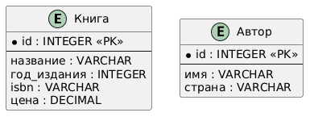
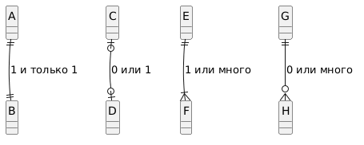
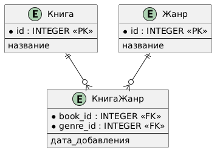
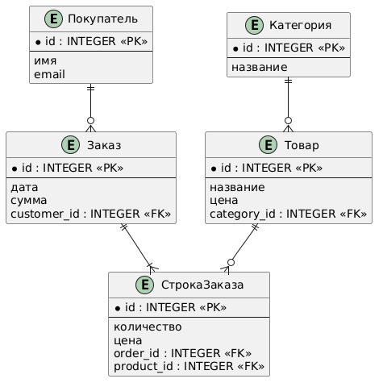

<!-- _class: title -->
<!-- _paginate: skip -->

<div class="course">SYSTEM ANALYST</div>
<div class="author">presented by Ayub</div>

# Entity-Relationship Diagram

---

# От Class Diagram — к базе данных

В прошлом уроке: классы, атрибуты, методы, связи.

| Class Diagram | ERD |
|---|---|
| Класс | Сущность (Entity) |
| Атрибут | Атрибут / Колонка |
| Объект | Строка в таблице |
| Association | Foreign Key |
| Multiplicity | Кардинальность |
| Метод | — *(в ERD нет, только данные)* |

> ERD — это Class Diagram, у которой убрали поведение и оставили только данные.

<!--
Teacher Notes:
- Recap-мост от Class Diagram. Не учим заново концепции.
- Подчеркни: метод исчез — БД хранит данные, не код.
- ~2 мин
-->

---

<!-- _class: lead -->

**Ты проектируешь интернет-магазин.**

Разработчик спрашивает: "Какие таблицы нужны? Какие колонки? Что с чем связано?"

Скажешь словами — он поймёт по-своему.

**Нужен стандарт, который видят аналитик, разработчик и DBA одинаково.**

<!--
Teacher Notes:
- Дай 15 сек.
- Ожидаемые ответы: "схема", "таблица связей", "ER-диаграмма"
- Подведи: ERD — это и есть стандарт.
- ~2 мин
-->

---

# Зачем SA рисует ERD

- **Договариваемся о данных** до написания кода
- **Видим связи**: какие сущности зависят друг от друга
- **Проверяем требования**: всё ли можно сохранить в системе?
- **Передаём DBA**: основа для физической схемы БД
- **Оцениваем объём**: сколько таблиц, сколько связей

> ERD читает: бизнес (отчасти), аналитик, разработчик, DBA.

---

# Этап 1: Сущность и Атрибуты

---

# Entity (Сущность) = таблица

**Entity** — это объект реального мира, о котором мы храним данные.

- `Книга`, `Автор`, `Заказ`, `Клиент`
- В БД → одна таблица
- Имя — единственное число, существительное (PascalCase или snake_case)



<!--
Teacher Notes:
- Сразу укажи на разные стили нотации — UML-style box, Chen oval, Crow's Foot box.
- Мы будем использовать **Crow's Foot** — самая популярная сегодня.
- ~2 мин
-->

---

# Атрибут = колонка

Каждая сущность имеет атрибуты — свойства, которые мы хотим хранить.

```
Книга
─────────────────
🔑 id
   название
   год_издания
   isbn
   цена
```

- Каждый атрибут имеет **тип** (String, Integer, Date, Decimal)
- Один атрибут — **первичный ключ** (Primary Key)

---

# Primary Key (Первичный ключ)

**PK** — атрибут, который **уникально** идентифицирует строку.

| Тип | Что это | Пример |
|---|---|---|
| **Natural Key** | Реальный атрибут | `isbn` у книги |
| **Surrogate Key** | Искусственный `id` | `id` SERIAL |

**На практике почти всегда — Surrogate Key (`id`).**

> Естественный ключ может измениться (email, телефон). Suррogate `id` — никогда.

<!--
Teacher Notes:
- Спроси: "Если человек поменял email, что произойдёт со связями, где email — PK?"
- Ответ: придётся обновить везде. С id такой проблемы нет.
- ~3 мин
-->

---

# Этап 2: Связи (Relationships)

---

<!-- _class: lead -->

**У книги есть автор. У автора — много книг.**

Как нарисовать эту связь? Какая запись говорит "одна-ко-многим", а какая "многие-ко-многим"?

<!--
Teacher Notes:
- 15 сек.
- Веди к: нужны символы, обозначающие количество с обеих сторон.
- ~1 мин
-->

---

# Cardinality (Кардинальность)

Сколько строк одной сущности связано со строками другой.

| Тип | Запись | Пример |
|---|---|---|
| **1:1** | Один к одному | Пользователь ↔ Профиль |
| **1:N** | Один ко многим | Автор → Книги |
| **M:N** | Многие ко многим | Книга ↔ Жанр |

> Большинство связей в реальных системах — **1:N**.

---

# Crow's Foot — нотация



| Символ | Значение |
|---|---|
| `─||─` | Ровно один (one and only one) |
| `─o|─` | Ноль или один (zero or one) |
| `─|<` | Один или много (one or many) |
| `─o<` | Ноль или много (zero or many) |

**Читается у каждого конца линии отдельно.**

<!--
Teacher Notes:
- Покажи на картинке справа все 4 варианта.
- Главное: ближний символ к сущности — кардинальность для НЕЁ.
- ~3 мин
-->

---

# Foreign Key (Внешний ключ)

**FK** — атрибут одной таблицы, который ссылается на PK другой.

**Правило 1:N:** FK всегда находится в таблице "many".

```
Автор (1) ──< (∞) Книга

Книга
─────────────────
🔑 id
   название
   🔗 автор_id  ← FK на Автор.id
```

> Связь между таблицами в БД физически реализуется именно через FK.

---

# 1:1 — один к одному

**Пользователь имеет ровно один Профиль.**

```
Пользователь (1) ── (1) Профиль
```

- Можно объединить в одну таблицу — но иногда разделяют
- Причины разделения: разные права доступа, размер данных, частота изменений

**Пример:** `users` (login, hash) + `user_profiles` (фото, био, настройки уведомлений)

---

# 1:N — один ко многим

**Один Автор пишет много Книг.**

```
Автор (1) ──< (∞) Книга
```

- FK `автор_id` лежит в таблице `Книга`
- Самая частая связь в реальных системах

**Примеры 1:N в интернет-магазине:**
- 1 Категория → много Товаров
- 1 Покупатель → много Заказов
- 1 Заказ → много СтрокЗаказа

---

# M:N — многие ко многим

**Книга может быть в нескольких Жанрах. Жанр содержит много Книг.**

```
Книга (∞) ── (∞) Жанр
```

**В БД нельзя напрямую — нужна промежуточная таблица:**

```
Книга (1) ──< (∞) КнигаЖанр (∞) >── (1) Жанр
```



> Промежуточная таблица превращает одну M:N в две 1:N.

<!--
Teacher Notes:
- Главное правило: M:N всегда раскладывается через bridge-таблицу.
- В bridge: PK = композитный (book_id + genre_id) или surrogate id.
- ~3 мин
-->

---

<!-- _class: lead -->

# Module Check 1

1. Что такое **Entity**? Приведи 3 примера для интернет-магазина.
2. Чем **Surrogate Key** лучше **Natural Key**?
3. Где находится **FK** в связи 1:N?
4. Как реализуется **M:N** в базе данных?
5. Прочитай вслух: `Покупатель (1) ──< (∞) Заказ`

<!--
Teacher Notes:
- Ответы:
  1. Entity = объект реального мира. Магазин: Товар, Заказ, Категория, Покупатель.
  2. id не меняется, нет проблем с обновлением FK.
  3. В таблице "many" (со стороны ∞).
  4. Через промежуточную таблицу с двумя FK.
  5. "Один Покупатель оформляет ноль или много Заказов".
- ~5 мин
-->

---

# Этап 3: Полная картина — интернет-магазин

---

# ERD интернет-магазина



**Сущности:**
- Покупатель, Заказ, СтрокаЗаказа, Товар, Категория

**Связи:**
- Покупатель `1` ──< `0..*` Заказ
- Заказ `1` ──< `1..*` СтрокаЗаказа
- СтрокаЗаказа `*` >── `1` Товар
- Товар `*` >── `1` Категория

---

# Что мы видим из диаграммы

- В таблице `orders` будет колонка `customer_id` (FK)
- В `order_lines` — две FK: `order_id` и `product_id`
- `order_lines` фактически — **bridge** между Заказом и Товаром (M:N)
- Удалили Заказ → СтрокиЗаказа исчезли (cascade)
- Удалили Покупателя → Заказы можно сохранить (для истории)

> ERD — это план таблиц, который читает каждый член команды одинаково.

---

<!-- _class: lead -->

## Микропрактика — 10 минут

Спроектируй ERD для **онлайн-библиотеки**.

**Сущности (минимум):** Книга, Автор, Читатель, Выдача (Loan)

**Задача:**
- Минимум **4 Entity** с атрибутами и PK
- Минимум **одна 1:N**
- Минимум **одна M:N** через bridge
- Укажи кардинальность с обоих концов
- Укажи где находятся **FK**

<!--
Teacher Notes:
- Подсказки:
  - Книга M:N Автор (книгу могут писать соавторы)
  - Книга 1:N Выдача (одна книга выдавалась много раз)
  - Читатель 1:N Выдача
- 7 мин рисуем, 3 мин обсуждаем
-->

---

# Peer Review — проверь диаграмму соседа

Обменяйтесь диаграммами. Чек-лист:

- [ ] У каждой Entity есть **PK**?
- [ ] Кардинальность указана **с обоих концов** линии?
- [ ] **FK** на стороне "many"?
- [ ] **M:N** реализована через **bridge**-таблицу?
- [ ] Имена сущностей — существительные в **единственном** числе?

**Дай конструктивный фидбек.**

---

# Этап 4: Типичные ошибки

---

# Ошибка 1: M:N без bridge

```
❌  Книга (∞) ── (∞) Жанр
```

Так нарисовать **можно концептуально**, но в БД **невозможно реализовать**.

```
✅  Книга (1) ──< (∞) КнигаЖанр (∞) >── (1) Жанр
```

В bridge-таблице — две FK + опционально дополнительные атрибуты (например, `дата_добавления`).

---

# Ошибка 2: FK на стороне "one"

```
❌  В таблице Автор: book_id
```

У автора одна `book_id` колонка → автор может написать только одну книгу.

```
✅  В таблице Книга: author_id
```

> Правило: **FK всегда на стороне "many"**.

---

# Ошибка 3: множественные значения в одном поле

```
❌  Книга
   ────────────
   id
   название
   жанры : "Фэнтези, Детектив, Приключения"
```

Это **не атомарный атрибут** — нарушает 1NF (первая нормальная форма).

```
✅  Bridge-таблица КнигаЖанр
```

> Правило: одна ячейка = одно значение. Список → отдельная таблица.

---

# Этап 5: ERD vs Class Diagram

---

# Когда использовать что

| Ситуация | Что рисуем |
|---|---|
| Объясняем DBA структуру БД | **ERD** |
| Объясняем разработчику классы и поведение | **Class Diagram** |
| Документируем доменную модель | **Class Diagram** |
| Готовим миграцию БД | **ERD** |
| Согласуем с архитектором сущности | Оба |

> Class Diagram — про **поведение и структуру кода**. ERD — про **хранение данных**.

---

# Совет: рисуй сначала ERD, потом Class Diagram

1. **ERD** — какие данные храним (с DBA / разработчиком)
2. **Class Diagram** — как код их обрабатывает (с разработчиком)
3. **API / Sequence** — как данные двигаются (с интеграторами)

> ERD — фундамент. Без него остальные диаграммы рассыпаются.

---

<!-- _class: lead -->

# Финальный Module Check

1. Что такое **PK** и зачем нужен **Surrogate**?
2. На какой стороне 1:N лежит **FK**?
3. Как из M:N сделать модель в БД?
4. В чём разница между **ERD** и **Class Diagram**?
5. Назови 3 типичные ошибки в ERD.

<!--
Teacher Notes:
- Ответы:
  1. PK = уникальный идентификатор; Surrogate id не меняется.
  2. На стороне "many".
  3. Bridge-таблица с двумя FK.
  4. ERD = данные, Class = поведение + структура.
  5. M:N без bridge, FK на "one", не-атомарные атрибуты.
- ~5 мин
-->

---

# Что мы разобрали

> ERD — это карта данных вашей системы.

- [ ] **Entity** = таблица, **Attribute** = колонка
- [ ] **PK** уникален, **FK** ссылается на PK другой сущности
- [ ] Связи: **1:1**, **1:N**, **M:N** (через bridge)
- [ ] Cardinality нотация **Crow's Foot**
- [ ] FK всегда на стороне "many"
- [ ] M:N → две 1:N через промежуточную таблицу

---

# Что дальше

Следующий урок — **Database Normalization**.

Ты уже знаешь, что хранить и как связывать.

Нормализация отвечает на вопрос: **"Хранить ли это в одной таблице или разбить?"**

- 1NF — атомарность атрибутов
- 2NF — зависимость от **полного** PK
- 3NF — нет транзитивных зависимостей

> Каждый "норм" — это правило, защищающее от типичной ошибки.
