<!-- _class: title -->
<!-- _paginate: skip -->

SYSTEM ANALYST

presented by Ayub

# ООП: основы для аналитика

---

## Важный контекст: это НЕ урок программирования

ООП — это **способ думать о системе**.

Ты не будешь писать код. Но ты будешь:

- Строить **Class Diagrams** — стандартный артефакт аналитика
- Проектировать **базы данных** (ERD) — классы → таблицы
- Говорить с разработчиками **на одном языке**

> Когда разработчик говорит "класс", "объект", "наследование" — ты должен понимать, о чём речь.

---

<!-- _class: lead -->

## Этап 1: Class и Object

Представь: архитектор нарисовал **чертёж квартиры**.

По этому чертежу построили **50 квартир**.

Чертёж — это одно. Квартиры — другое.

**В чём разница?**

<!--
Teacher Notes:
- Дай 7-10 секунд подумать
- Ожидаемые ответы: "чертёж — это план", "квартиры реальные, а чертёж нет"
- Веди к: чертёж один, квартир много; чертёж — описание, квартира — реализация
-->

---

## Class (Класс) = чертёж

**Class** — это шаблон, описание, схема.

Класс определяет:
- Какие **свойства** будут у объекта (имя, email, дата)
- Что объект **умеет делать** (войти, выйти, изменить профиль)

Сам по себе класс **не занимает места** в системе — это просто описание.

Пока нет ни одного пользователя — класс `Пользователь` уже есть.

---

## Object (Объект) = конкретный экземпляр

**Object** — это реальная "квартира" по чертежу.

- В системе может быть **миллион объектов** одного класса
- Каждый объект — **своя копия** данных
- Все объекты сделаны **по одному шаблону** (классу)

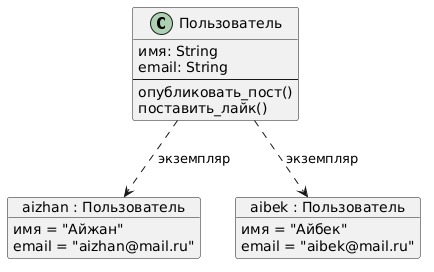

<!--
Teacher Notes:
- Указать на диаграмму: слева класс (шаблон), справа два объекта (конкретные пользователи)
- Подчеркнуть: структура одна, данные разные
-->

---

## Примеры: Class и Objects в реальных системах

| Класс          | Объекты (экземпляры)                     |
| -------------- | ---------------------------------------- |
| `Пользователь` | Айжан, Айбек, Марьям                     |
| `Товар`        | iPhone 15, Наушники Sony, Кроссовки Nike |
| `Заказ`        | Заказ #1001, Заказ #1002, Заказ #1003    |
| `Сообщение`    | "Привет!", "Ты дома?", "Окей"            |

Один класс → неограниченное количество объектов.

---

<!-- _class: lead -->

## Этап 2: Атрибуты и Методы

Возьмём класс `Пользователь` в Instagram.

**Что ЕСТЬ у пользователя?** (данные)

**Что он УМЕЕТ делать?** (действия)

<!--
Teacher Notes:
- Дай 7-10 секунд
- Данные: имя, фото, количество подписчиков, биография
- Действия: опубликовать пост, поставить лайк, подписаться, написать комментарий
- Два типа вещей — это и есть атрибуты и методы
-->

---

## Атрибуты (Attributes) = данные объекта

**Атрибуты** — это свойства, характеристики. Что **ЕСТЬ** у объекта.

Примеры для класса `Пользователь` в Instagram:

- `имя` — "Айжан Сейткали"
- `email` — "aizhan@mail.ru"
- `аватар` — ссылка на фото
- `дата_регистрации` — "2024-01-15"
- `количество_подписчиков` — 1 240

---

## Методы (Methods) = действия объекта

**Методы** — это операции, поведение. Что объект **УМЕЕТ делать**.

Примеры для класса `Пользователь` в Instagram:

- `опубликовать_пост()` — создать новую публикацию
- `поставить_лайк()` — лайкнуть пост
- `подписаться()` — подписаться на другого пользователя
- `выйти_из_аккаунта()` — завершить сессию

---

## Структура класса: атрибуты + методы

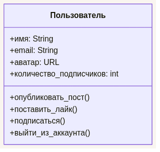

Класс в UML — прямоугольник с двумя секциями:

- **Верхняя** — атрибуты (данные): имя, тип
- **Нижняя** — методы (действия): имя + `()`
- `+` = public, `-` = private

Именно так выглядит Class Diagram.

---

<!-- _class: lead -->

## Этап 3: Инкапсуляция

Ты пользуешься приложением доставки еды.

Нажимаешь **«Заказать»**.

За кулисами: маршрут считается, курьер назначается, оплата проходит.

**Ты видишь, как это работает?**

<!--
Teacher Notes:
- Пауза 7-10 сек
- Ответ: нет — ты видишь только кнопку и результат
- Ожидаемый неправильный ответ: "ну можно посмотреть в код" → "да, разработчик может. А пользователь? А другая система через API?"
- Веди к: это сделано специально — снаружи виден только интерфейс. Детали скрыты
- Переход: "Это и называется Инкапсуляция — и это напрямую про твою работу как аналитика"
-->

---

## Инкапсуляция (Encapsulation) = скрытие деталей

**Инкапсуляция** — это принцип "снаружи видно только то, что нужно".

- **`+` public** — видно снаружи: кнопки, действия, API
- **`-` private** — скрыто внутри: алгоритмы, внутренняя логика

Аналогия: кофемашина — ты нажимаешь кнопку, не видишь температуру воды и давление пара.

---

## Зачем аналитику знать про Инкапсуляцию

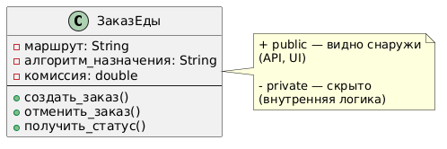

Когда пишешь **API-спецификацию** — ты описываешь public интерфейс:

- `POST /payments` — запрос, ответ, коды ошибок ✅
- Как внутри работает SDK платёжной системы — ❌ не твоя зона

**SA описывает интерфейс, не реализацию.**

<!--
Teacher Notes:
- Спроси: "Нужно ли SA описывать, как именно банк проверяет карту?"
- Ответ: нет — SA описывает вход/выход (public). Что внутри — дело разработчика (private)
- Это и есть инкапсуляция в работе аналитика: граница между "что система делает" и "как она это делает"
- Ожидаемое непонимание: "а вдруг мне нужно знать детали для документации?" → объясни: документируем контракт, не алгоритм
-->

---

<!-- _class: lead -->

## Module Check 1

- **Вопрос 1:** Ты SA на маркетплейсе (вроде Wildberries).
  - Назови 1 класс и 3 его объекта
  - Перечисли 3 атрибута этого класса
  - Назови 2 метода

- **Вопрос 2:** Ты проектируешь систему для библиотеки.
  - Назови 4 класса, которые точно нужны

- **Вопрос 3:** Возьми класс `Книга` или любой из предыдущего ответа.
  - Нарисуй UML-блок: верхняя секция — 3 атрибута, нижняя — 2 метода

- **Вопрос 4:** Разработчик говорит: "`calculateDiscount()` — приватный метод."
  - Что это значит для твоей API-спецификации?

- **Вопрос 5:** Два клиента просят класс `Книга`:
  - Первый — библиотека, второй — книжный магазин
  - Назови по 2 атрибута каждому — почему они не совпадают?

<!--
Teacher Notes:
- Вопрос 1: ожидаем Заказ / Товар / Пользователь. Если называют абстрактное — попроси конкретнее. Подсказка: "что бы ты написал в таблицу БД?"
- Вопрос 2: ожидаем Книга, Читатель, Автор, Абонемент/Карточка. Если 1-2 — спроси "что ещё происходит в библиотеке?"
- Вопрос 3: проверяем, что секции не перепутаны. Атрибуты — существительные (название, год_издания, ISBN). Методы — глаголы с `()` (выдать(), списать()). Если путают — верни к слайду с UML-блоком
- Вопрос 4: приватный метод → SA его НЕ документирует в API spec. Это внутренняя логика разработчика
- Вопрос 5: библиотека — срок_возврата, номер_стеллажа; магазин — цена, скидка. Не говори слово "Абстракция" — это следующий раздел. Веди к: "атрибуты зависят от того, что система делает с объектом"
- ~7 мин. Вопросы 2 и 3 хорошо делать парно: один называет классы, другой рисует UML-блок на доске
-->

---

<!-- _class: lead -->

## Этап 4: Наследование

Ты проектируешь маркетплейс. Три типа пользователей:
**Покупатель**, **Продавец**, **Администратор**.

У всех троих одно и то же:
`имя`, `email`, `пароль`, `дата_регистрации`

**Ты скопируешь эти поля в каждый класс отдельно?**

<!--
Teacher Notes:
- Пауза 7-10 сек, дай студентам почувствовать боль
- Ожидаемые ответы: "нет, это дублирование", "можно вынести в общий класс"
- Неправильный ответ: "ну и ладно, скопирую" → "если надо добавить поле `телефон` — в скольких местах правишь?"
- Следующий слайд показывает, как это выглядит — не объясняй заранее, просто переключи
-->

---

## Вот как это выглядит без наследования

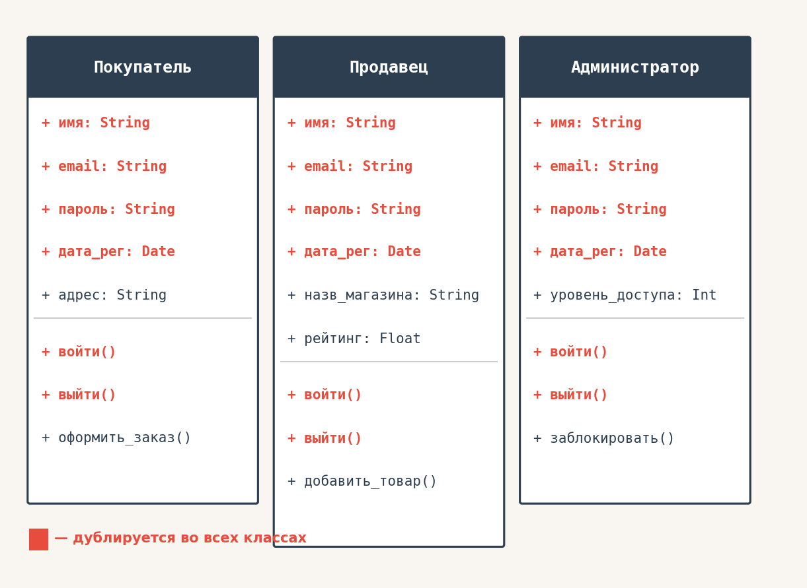

<!--
Teacher Notes:
- Пауза. Дай студентам посмотреть и почувствовать
- Спроси: "Сколько раз написали `+ email: String`?" → три
- Следующий слайд — что конкретно пойдёт не так
-->

---

## Почему это проблема

**1. Хочешь добавить одно поле — правишь везде**

Бизнес просит добавить `телефон`. Открываешь Покупатель → добавил. Продавец → добавил. Администратор → добавил. Завтра появится Менеджер и Модератор — снова 2 места.

**2. Один раз забыл — система сломалась**

Разработчик добавил `телефон` в Покупатель, забыл про Продавец. Поле есть у одного типа, нет у другого. Баг в продакшене — найти сложно.

**3. Представь, что таких полей не 4, а 15**

`имя`, `фамилия`, `email`, `пароль`, `телефон`, `аватар`, `дата_рег`, `последний_вход`, `статус_аккаунта`, `язык`, `часовой_пояс`...

Скопировать в 5 классов — это **75 строк** одного и того же.

> **Как бы ты решил это?** Есть идеи?

<!--
Teacher Notes:
- Дай 10-15 сек — студенты должны сами прийти к "вынести общее в один класс"
- Ожидаемые ответы: "создать общий класс", "вынести в одно место", "сделать базовый"
- Если молчат: "Что общего у всех трёх? Что если это общее описать один раз?"
- Как только кто-то говорит "один общий класс" — переходи на следующий слайд
-->

---

## Наследование (Inheritance) = "является разновидностью"

**Наследование** — дочерний класс получает всё от родительского + добавляет своё.

`Продавец` — это **Пользователь**, но с `название_магазина` и `рейтингом`.

Не нужно повторять: `имя`, `email`, `пароль`, `дата_регистрации` — всё это уже есть в родителе `Пользователь`.

Стрелка с треугольником в диаграмме = **"является разновидностью"**.

---

## Дерево наследования

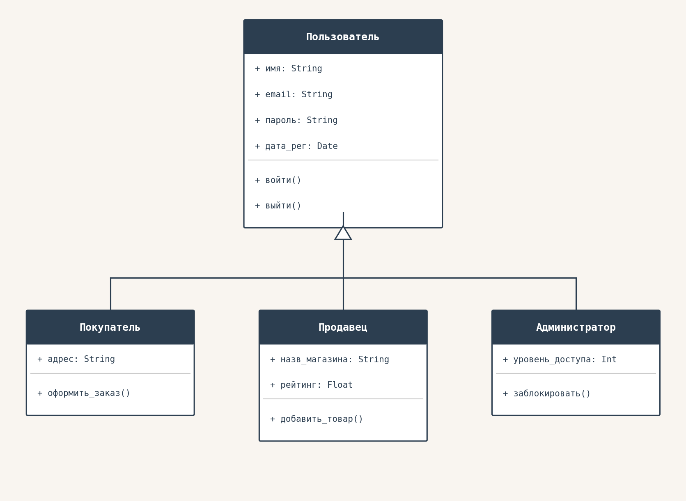

- `Пользователь` → `Покупатель`
- `Пользователь` → `Продавец`
- `Пользователь` → `Администратор`

Ребёнок **наследует ВСЁ** от родителя.

Добавляет только то, что уникально для него.

Чем выше по дереву — тем более общая концепция.

---

## Реальный пример наследования для SA

| Родитель | Наследник | Что добавляет |
|---------|----------|---------------|
| `Пользователь` | `Покупатель` | `адрес_доставки`, `история_заказов()` |
| `Пользователь` | `Продавец` | `название_магазина`, `добавить_товар()` |
| `Пользователь` | `Администратор` | `заблокировать_пользователя()` |
| `Уведомление` | `EmailNotification` | `адрес_получателя` |
| `Уведомление` | `PushNotification` | `токен_устройства` |

---

<!-- _class: lead -->

## Этап 5: Связи между классами

Три ситуации:

**Врач** лечит **Пациента** — если удалить Врача из системы, что станет с Пациентом?

**Плейлист** содержит **Треки** — что будет с треками, если удалить плейлист?

**Заказ** содержит **Позиции заказа** — что будет с позициями, если удалить заказ?

<!--
Teacher Notes:
- Пауза 7-10 сек, дай студентам подумать по каждому пункту
- Врач/Пациент: оба выживают независимо — нет никакой вложенности
- Плейлист/Трек: трек остаётся в сервисе, плейлист просто группировал
- Заказ/Позиция: позиции теряют смысл, удаляются вместе
- Веди к: три уровня зависимости — нет связи владения (Association), есть группировка (Aggregation), есть исключительное владение (Composition)
- Уточни: это напрямую влияет на то, как мы проектируем БД
-->

---

## Association (Ассоциация) — просто взаимодействие

Объекты **взаимодействуют**, но **ни один не хранит список другого**.

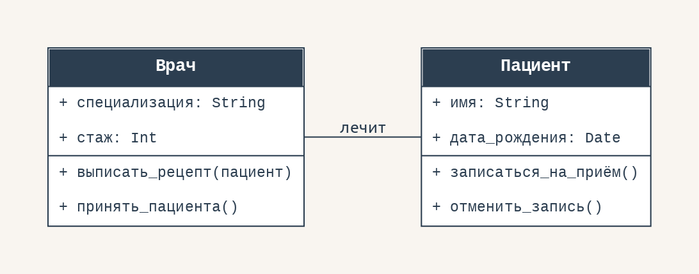

`Пациент` передаётся как **параметр метода** — не хранится внутри `Врача`.

> **Тест:** "Класс A хранит `список B` как атрибут?" → **Нет** → Association

<!--
Teacher Notes:
- Главный сигнал: в классе Врач нет атрибута "пациенты: List<Пациент>"
- Они просто взаимодействуют через методы — это и есть Association
- Спроси: "Где в классе Врач живёт Пациент?" → нигде → Association
- Другие примеры: Студент ↔ Преподаватель, Покупатель ↔ Товар (просмотр)
-->

---

## Aggregation (Агрегация) — хранит список, но не владеет

Класс A **хранит список** объектов B, но B **может существовать без** A.

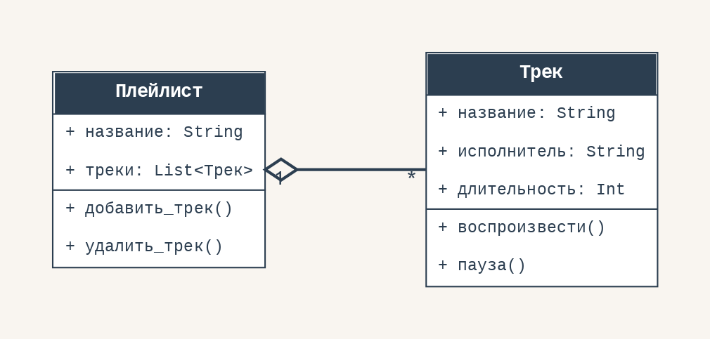

- Плейлист удалён → Трек **остался** в сервисе (он в других плейлистах)
- Один трек может быть **в нескольких** плейлистах одновременно

> **Тест:** "Список есть? → Да. Часть живёт без целого? → Да" → Aggregation

> В БД: `ON DELETE RESTRICT`

<!--
Teacher Notes:
- Главный сигнал: в классе Плейлист ЕСТЬ атрибут "треки: List<Трек>"
- Отличие от Association: здесь список хранится внутри объекта
- Отличие от Composition: треки выживают после удаления плейлиста
- Спроси: "Может ли трек 'Bohemian Rhapsody' существовать без какого-либо плейлиста?" → Да → Aggregation
- Другие примеры: Отдел ◇— Сотрудник, Корзина ◇— Товары из каталога
-->

---

## Composition (Композиция) — владеет эксклюзивно

Класс A **хранит список** B, и B **не существует без** A.

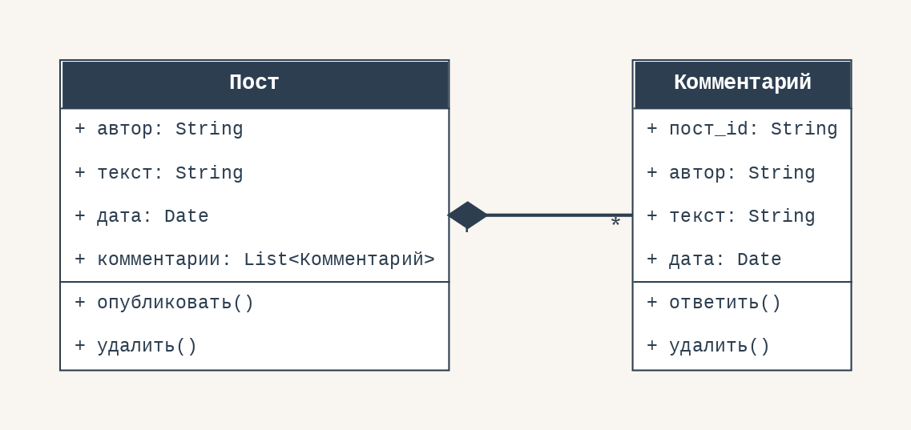

- Пост удалён → все комментарии **исчезают вместе** с ним
- `Комментарий` без `Поста` — не имеет смысла

> **Тест:** "Список есть? → Да. Часть живёт без целого? → **Нет**" → Composition

> В БД: `ON DELETE CASCADE` — удалить пост → все комментарии удалятся автоматически

---

## Как определить тип связи

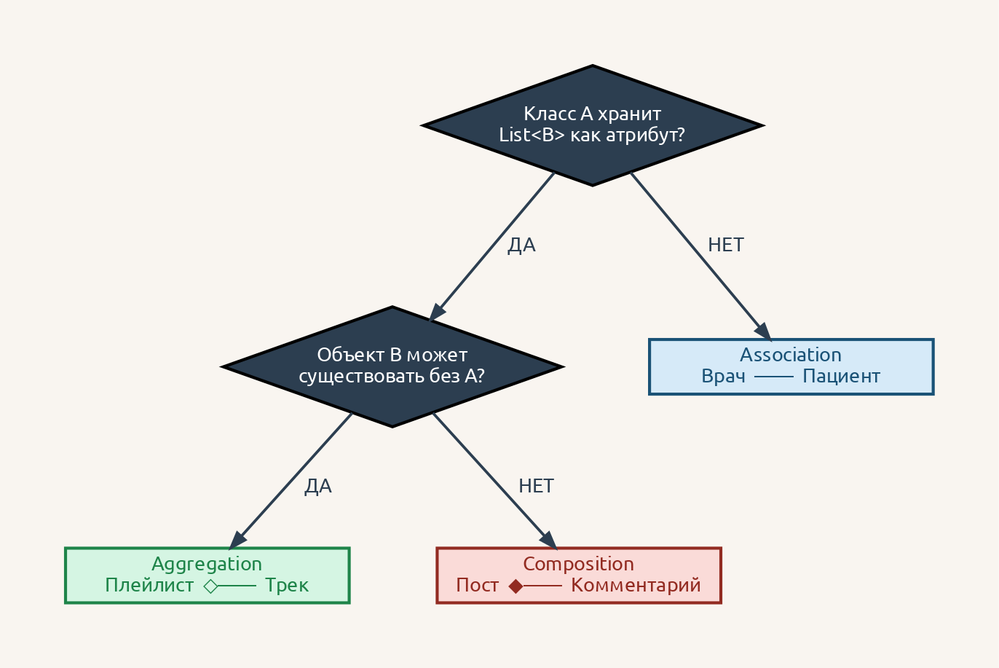

<!--
Teacher Notes:
- Главный слайд — дай студентам зарисовать дерево в тетрадь
- Проверь вслух на примерах с прошлых слайдов:
  - Врач/Пациент → список? нет → Association ✓
  - Плейлист/Трек → список? да → выживает? да → Aggregation ✓
  - Пост/Комментарий → список? да → выживает? нет → Composition ✓
- Дай новый пример и попроси студентов пройти по дереву самостоятельно
-->

---

## Сравнение трёх типов связей

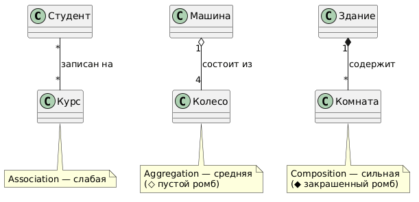

| Тип | Вложенность | Часть выживает? | Пример | БД |
|----|------------|--------|--------|-----|
| Association | Нет | — | Врач ↔ Пациент | FK |
| Aggregation | Да | ✅ Да | Плейлист ◇— Трек | ON DELETE RESTRICT |
| Composition | Да | ❌ Нет | Пост ◆— Комментарий | ON DELETE CASCADE |

Эти же три типа — в **Class Diagram** и **ERD**.

---

<!-- _class: lead -->

## Этап 6: Абстракция

Ты проектируешь систему для **интернет-магазина**.

Класс `Пользователь`.

Нужно ли хранить: `имя` ✓, `email` ✓, **рост пользователя**... ? **Любимый цвет**...?

**Почему?**

<!--
Teacher Notes:
- Ответ: не нужно — магазину это не нужно для работы
- Веди к: мы моделируем только то, что НУЖНО для нашей системы
- Тот же "Пользователь" в медицинской системе — совсем другой набор атрибутов
-->

---

## Абстракция (Abstraction) = только нужное

**Абстракция** — это осознанный выбор: что моделируем, что отбрасываем.

Один и тот же "Пользователь" — разный в разных системах:

- **Интернет-магазин:** имя, email, адрес доставки, история заказов
- **Медицинская система:** ФИО, дата рождения, группа крови, диагнозы
- **HR-система:** должность, отдел, зарплата, дата найма

Контекст **определяет** что важно.

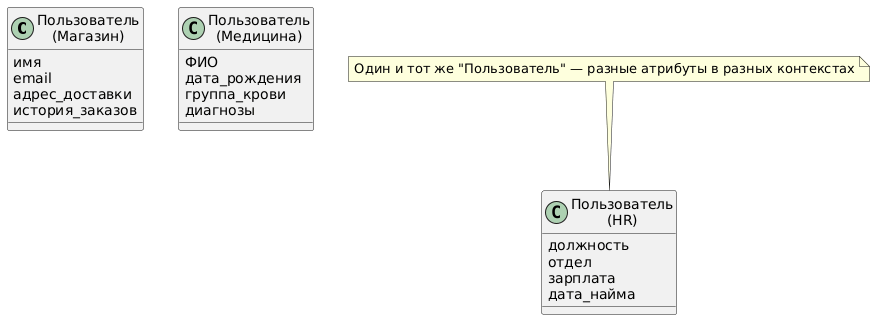

---

<!-- _class: lead -->

## Module Check 2

- Ты добавляешь в систему тип уведомления `WhatsApp`. Какие поля уже есть "бесплатно" — и откуда?
- Тебе надо удалить курс из системы. Что должно случиться со студентами, которые на него записаны? Какой тип связи — и как это прописать в БД?
- Клиент говорит: "В нашей CRM поле `Клиент.адрес` не нужно — мы работаем только онлайн." Как это называется в ООП?

<!--
Teacher Notes:
- Вопрос 1: поля recipient, message, sent_at, status — наследуются от Notification. Добавить только phone_number или аккаунт WhatsApp
- Вопрос 2: Aggregation — студенты независимы. В БД: ON DELETE RESTRICT (нельзя удалить курс, пока есть записанные). Или переназначить
- Вопрос 3: Абстракция — отбрасываем то, что не нужно в нашем контексте
- Если на вопрос 2 говорят "ON DELETE CASCADE" — объясни: CASCADE удалит СТУДЕНТОВ, а они не должны исчезнуть
- ~5 мин
-->

---

## Этап 7: Мост ООП → ERD и SQL

Вот почему аналитику важно понимать ООП — напрямую связано с базами данных:

| ООП             | База данных                       |
| --------------- | --------------------------------- |
| **Class**       | Таблица                           |
| **Атрибут**     | Колонка                           |
| **Object**      | Строка (запись)                   |
| **Association** | Foreign Key                       |
| **Inheritance** | Отдельная таблица или поле `type` |

---

## Пример: Класс → SQL таблица

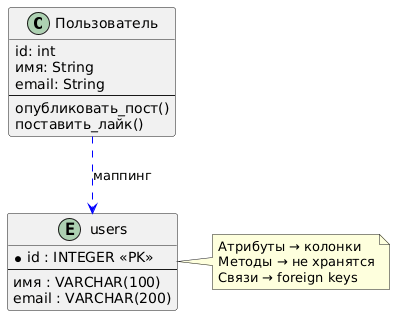

- Атрибуты → **колонки** с типами данных
- Методы → в SQL **не хранятся** (логика в коде)
- Связи между классами → **foreign keys**

Когда будем изучать ERD — ты уже будешь знать все концепции.

---

## Итог: что мы разобрали

> ООП — это способ думать о системе как о наборе объектов с данными и поведением

- [ ] **Class** = шаблон, **Object** = конкретный экземпляр
- [ ] **Атрибуты** = данные объекта, **Методы** = действия объекта
- [ ] **Инкапсуляция** = прячем детали реализации, показываем интерфейс
- [ ] **Наследование** = "является разновидностью", не дублируем общее
- [ ] **Association / Aggregation / Composition** = разная сила связи
- [ ] **Абстракция** = моделируем только то, что нужно для системы

---

## Что дальше

На следующем уроке — **Class Diagram**.

Ты уже знаешь все концепции.

Class Diagram — это просто **стандартная UML нотация** для тех же идей:

- Классы с атрибутами и методами → прямоугольники с секциями
- Наследование → стрелка с треугольником
- Association / Aggregation / Composition → разные виды линий

**Всё, что ты узнал сегодня — будет там.**

---

<!-- _class: lead -->

## Практика: ты — System Analyst

Три реальных системы. Твоя задача — спроектировать классы.

Для каждой системы:
1. Назови **3–4 класса**
2. Для каждого — **3 атрибута** и **1–2 метода**
3. Определи **тип связи** между классами

---

## Задание 1 — Книжный магазин

Интернет-магазин по продаже книг. Покупатели заказывают книги онлайн.

**Начни с этих классов:**

| Класс | Что делает в системе |
|-------|----------------------|
| `Книга` | товар в каталоге |
| `Покупатель` | человек, который делает заказы |
| `Заказ` | оформленная покупка |
| `Автор` | автор одной или нескольких книг |

> Какой тип связи между `Заказ` и `Книга`? А между `Книга` и `Автор`?

<!--
Teacher Notes:
Ожидаемый результат:

Книга: название, ISBN, цена, количество_в_наличии / зарезервировать(), получить_описание()
Покупатель: имя, email, телефон / оформить_заказ(), посмотреть_историю()
Заказ: номер, дата, статус, книги: List<Книга> / подтвердить(), отменить()
Автор: имя, биография / получить_книги()

Связи:
- Покупатель ——— Книга: Association (просматривает, но не хранит список)
- Заказ ◆—— Книга (через позицию): Composition — удали заказ, позиции исчезают
- Книга ◇—— Автор: Aggregation — автор может существовать без конкретной книги в системе

Частая ошибка: "Заказ содержит Книги" — уточни: Заказ содержит ПОЗИЦИИ заказа, каждая ссылается на Книгу. Книга при этом остаётся в каталоге (Aggregation).
-->

---

## Задание 2 — Клиника

Система записи к врачу. Пациенты записываются онлайн, врачи ведут приём.

**Начни с этих классов:**

| Класс | Что делает в системе |
|-------|----------------------|
| `Врач` | ведёт приём пациентов |
| `Пациент` | записывается к врачу |
| `Приём` | конкретная встреча врача и пациента |
| `Медкарта` | история болезней пациента |

> Что случится с `Приём`, если удалить `Врача`? А с `Медкартой`, если удалить `Пациента`?

<!--
Teacher Notes:
Ожидаемый результат:

Врач: специализация, стаж, кабинет / вести_приём(), выписать_рецепт()
Пациент: имя, дата_рождения, полис, медкарта: Медкарта / записаться(), отменить_запись()
Приём: дата, время, статус, диагноз / подтвердить(), отменить()
Медкарта: диагнозы: List<String>, аллергии, группа_крови / добавить_запись()

Связи:
- Врач ——— Пациент: Association — они взаимодействуют через Приём, но не хранят друг друга
- Врач ◇—— Приём: Aggregation — приём мог быть записан к врачу, которого уволили (переназначается)
- Пациент ◆—— Медкарта: Composition — медкарта существует только внутри пациента, удали пациента — карта исчезает

Хороший вопрос студентам: "Если врач уволился, что делать с его записями на приём?" → переназначить → Aggregation, не Composition
-->

---

## Задание 3 — Кофейня

Приложение для заказа кофе. Клиенты делают заказы, бариста их готовит.

**Начни с этих классов:**

| Класс | Что делает в системе |
|-------|----------------------|
| `Клиент` | делает заказы |
| `Напиток` | позиция в меню |
| `Заказ` | оформленный заказ клиента |
| `Ингредиент` | то, из чего готовится напиток |

> `Напиток` содержит `Ингредиенты` — какой это тип связи? А `Заказ` и `Напиток`?

<!--
Teacher Notes:
Ожидаемый результат:

Клиент: имя, телефон, бонусные_баллы / сделать_заказ(), оплатить()
Напиток: название, цена, размер, ингредиенты: List<Ингредиент> / добавить_в_заказ()
Заказ: номер, статус, напитки: List<Напиток> / принять(), выдать(), отменить()
Ингредиент: название, количество, единица_измерения / списать()

Связи:
- Клиент ——— Напиток: Association — клиент просматривает меню, не хранит список напитков
- Заказ ◇—— Напиток: Aggregation — напиток (позиция меню) существует без заказа
- Напиток ◇—— Ингредиент: Aggregation — ингредиент (сахар, молоко) используется в разных напитках, существует независимо

Сложный вопрос: "А если убрать напиток из меню — что с заказами, где он был?" → исторические заказы должны сохраниться → это влияет на проектирование: нужна отдельная таблица OrderItem, которая хранит snapshot цены и названия на момент заказа. Это уже более продвинутая тема для ERD.
-->
