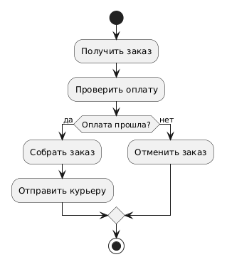
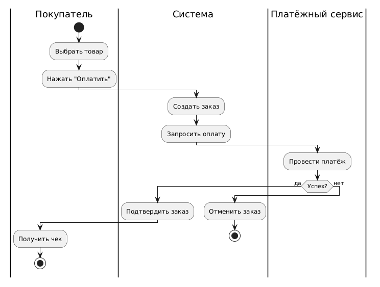

<!-- _class: title -->
<!-- _paginate: skip -->

<div class="course">SYSTEM ANALYST</div>
<div class="author">presented by Ayub</div>

# UML: Activity Diagram

---

<!-- _class: lead -->

**Вы уже умеете рисовать бизнес-процессы в BPMN.**

Как думаете — зачем ещё одна похожая диаграмма в UML?

<!--
Teacher Notes:
- Подожди 7-10 сек, дай ответить
- Типичные ответы: "другой стандарт", "для разработчиков", "не знаю"
- Любой ответ — хорошо, главное активировать мышление перед объяснением
-->

---

# Activity Diagram — это BPMN для разработчиков

Те же идеи: поток действий, решения, параллельность.

**Разница** — не в смысле, а в аудитории и акцентах:

- BPMN → бизнес-аналитики, менеджеры, заказчики
- Activity Diagram → разработчики, UML-документация

> Activity Diagram появилась **раньше BPMN** и стала частью UML 2.0.
> Когда проект уже использует UML — Activity Diagram естественный выбор.

---

# Ты уже знаешь 90%



Посмотри на диаграмму справа. Что узнаёшь?

- ● закрашенный круг — начало
- Прямоугольники — действия
- Ромб — решение
- Стрелки — переходы
- ⊙ круг в круге — конец

<!--
Teacher Notes:
- Дай 30 сек посмотреть молча
- Спроси: "Что здесь происходит?" — пусть прочитают процесс сами
- Это тот же процесс обработки заказа что в BPMN
-->

---

# Элементы Activity Diagram

| Элемент | Символ | Аналог в BPMN |
|---------|--------|---------------|
| **Initial Node** | ● (закрашенный круг) | Start Event (зелёный) |
| **Action** | ▭ (закруглённый прямоугольник) | Task |
| **Decision** | ◇ (ромб) | XOR Gateway |
| **Fork / Join** | ━━━ (жирная полоска) | AND Gateway |
| **Final Node** | ⊙ (круг в круге) | End Event (красный) |
| **Swimlane** | вертикальная полоса | Lane в Pool |

> Знаешь BPMN — таблица читается за 30 секунд.

---

# Swimlanes — кто что делает



**Swimlane** в Activity = Lane в BPMN:

- Разделяет, кто выполняет действие
- Полосы вертикальные или горизонтальные
- Пересечение линии = передача ответственности

Термин тот же — `Swimlane` — в обеих нотациях.

<!--
Teacher Notes:
- Вопрос: "Чем это отличается от Pool/Lane в BPMN?"
- Ответ: почти ничем — нет Message Flow между пулами, один процесс
- Обрати внимание на переходы: Покупатель → Система → Платёжный сервис
-->

---

<!-- _class: lead -->

**Когда ты выберешь BPMN, а когда Activity Diagram?**

Два сценария:
1. Показать бизнесу, как работает процесс согласования заявки
2. Показать разработчику алгоритм обработки заказа в коде

<!--
Teacher Notes:
- Подожди ответов, не торопись
- Правильно: 1) BPMN — бизнес-аудитория, 2) Activity — технический контекст
- Нет "правильного" без контекста — важно объяснить почему, а не просто угадать
-->

---

# Когда что использовать

| Ситуация | Инструмент |
|----------|-----------|
| Процесс для заказчика / менеджера | **BPMN** |
| Таймеры, сообщения, компенсации | **BPMN** |
| Алгоритм в системе для разработчиков | **Activity** |
| Описание поведения Use Case | **Activity** |
| Проект уже использует UML-нотацию | **Activity** |

> Правило: **кто читает** — тот определяет нотацию.

---

# BPMN vs Activity Diagram

| | **BPMN** | **Activity Diagram** |
|--|---------|---------------------|
| Аудитория | Бизнес + разработчики | Разработчики |
| Фокус | Бизнес-процесс | Алгоритм / поведение |
| События | Богатые (Timer, Message, Signal…) | Минимальные |
| Параллельность | AND Gateway | Fork / Join |
| Межпроцессное взаимодействие | Message Flow между Pools | Нет |
| Стандарт | OMG BPMN 2.0 | UML 2.x |

---

# Fork и Join — параллельность

**Fork** — разделение на параллельные потоки:

```
━━━━━━━━━━━━━━━━━  ← Fork (жирная полоска)
     ↓        ↓
[Уведомить]  [Создать счёт]   ← одновременно
     ↓        ↓
━━━━━━━━━━━━━━━━━  ← Join — ждёт ВСЕ ветки
```

- **Fork** = AND Gateway (split) в BPMN
- **Join** = AND Gateway (merge) в BPMN
- Join ждёт **все** параллельные ветки перед продолжением

---

# PlantUML — Activity за 2 минуты

```
@startuml
start
:Получить заявку;
if (Заявка полная?) then (Да)
  fork
    :Уведомить менеджера;
  fork again
    :Создать задачу в Jira;
  end fork
  :Обработать заявку;
else (Нет)
  :Запросить доп. данные;
endif
stop
@enduml
```

`start` · `:Action;` · `if/else/endif` · `fork/fork again/end fork`

<!--
Teacher Notes:
- Показать live на plantuml.com
- Синтаксис проще чем BPMN XML — это плюс для документации в коде (GitLab, Confluence)
-->

---

# Инструменты

| Инструмент | Как использовать |
|-----------|-----------------|
| **draw.io** | Shapes → UML → Activity |
| **PlantUML** | Текстовый синтаксис, встраивается в Confluence/GitLab |
| **Lucidchart** | Визуальный редактор, шаблоны UML |
| **StarUML** | Десктоп, полный UML-набор |

> draw.io + PlantUML — самая частая комбинация в реальных SA-проектах.

---

<!-- _class: lead -->

# Module Check

1. Назови **3 отличия** Activity Diagram от BPMN
2. Когда ты как SA выберешь Activity вместо BPMN?
3. Что такое **Fork** в Activity Diagram?
4. Как называется аналог BPMN Lane в Activity Diagram?

<!--
Teacher Notes:
- Отличия: аудитория (разработчики vs бизнес), события (богатые в BPMN vs минимальные), нет Message Flow между пулами
- Activity: документация для разработчиков, описание алгоритма, уже UML-проект
- Fork = разделение на параллельные ветки (AND Gateway split)
- Swimlane
- ~4 мин
-->

---

# Чек-лист: Activity Diagram

> Знаешь BPMN — Activity знаешь на 90%. Остальное — детали нотации.

- [ ] **Initial Node** (●) — начало процесса
- [ ] **Action** — прямоугольник с закруглёнными углами
- [ ] **Decision** (◇) — ветвление, условие на стрелке
- [ ] **Fork / Join** (━━━) — параллельность
- [ ] **Swimlane** — кто выполняет действие
- [ ] **Final Node** (⊙) — конец процесса

---

# Что дальше

Следующий блок: **Data Modeling**

- **ERD** (Entity-Relationship Diagram) — проектирование структуры базы данных
- **SQL** — пишем запросы к спроектированным таблицам
- **Нормализация** — убираем дублирование данных

> Всё что изучили в UML — поможет понять структуру данных:
> умение читать потоки и условия напрямую переносится на понимание того, как данные меняются в системе.
