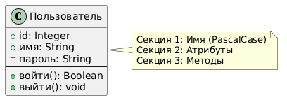
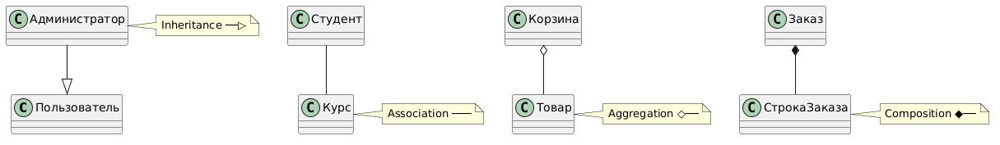
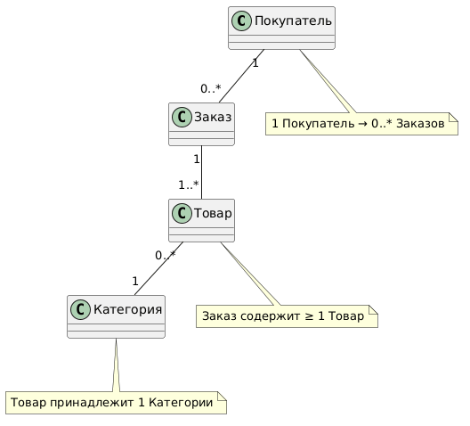
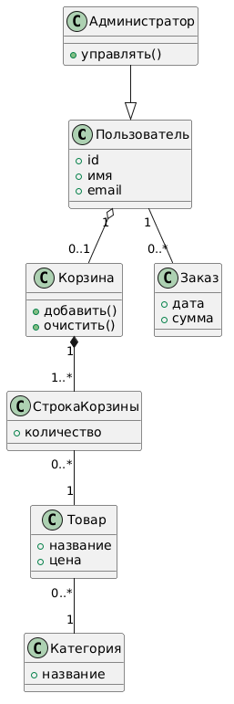
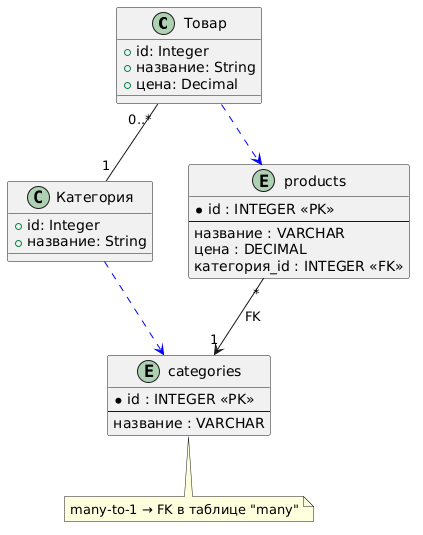

<!-- _class: title -->
<!-- _paginate: skip -->

<div class="course">SYSTEM ANALYST</div>
<div class="author">presented by Ayub</div>

# Class Diagram

---

# Мы знаем ООП — теперь научимся его рисовать

В прошлом уроке мы разобрали концепции:

| ООП-концепция | Что это |
|---|---|
| Класс | Шаблон объекта |
| Атрибуты | Данные класса |
| Методы | Поведение класса |
| Наследование | Передача свойств |

**Class Diagram** — стандартный язык (нотация) для изображения этих концепций.

> Как музыкальные ноты: все музыканты мира читают одинаково. Разработчики читают Class Diagram так же — в любой стране.

<!--
Teacher Notes:
- Это recap-мост. Не объясняй ООП заново — студенты уже знают концепции.
- Акцентируй: "знаем концепции, сегодня учимся нотации — стандартному языку их изображения".
- ~2 мин
-->

---

<!-- _class: lead -->

**Ты — аналитик. Объясняешь разработчику структуру системы.**

Говоришь: "Есть класс Пользователь, у него есть имя и пароль, он умеет войти в систему."

Разработчик записывает по-своему. Аналитик в другой команде записывает иначе.

**Как нарисовать класс так, чтобы любой разработчик в любой стране понял структуру без объяснений?**

<!--
Teacher Notes:
- Дай 15-20 секунд тишины.
- Ожидаемые ответы: "таблица", "схема", "блок-схема", "стандартный формат"
- Подведи: "именно — нужен стандарт. Class Diagram — это и есть тот стандарт. Придумал UML-комитет в 1997 году."
- ~2 мин
-->

---

# Структура класса: три секции

**Прямоугольник, разделённый на три части:**

```
┌──────────────────────┐
│     Пользователь     │  ← Имя (PascalCase)
├──────────────────────┤
│  +id: Integer        │  ← Атрибуты
│  +имя: String        │
│  -пароль: String     │
├──────────────────────┤
│  +войти(): Boolean   │  ← Методы
│  +выйти(): void      │
└──────────────────────┘
```

- Секция 1: **имя** — всегда PascalCase (`Пользователь`, `OrderItem`)
- Секция 2: **атрибуты** — данные (поля)
- Секция 3: **методы** — поведение (функции, со скобками `()`)



<!--
Teacher Notes:
- Укажи: PascalCase = каждое слово с заглавной буквы. Атрибуты = camelCase.
- Покажи на картинке все три секции.
- Спроси: "Где в нашей диаграмме слово void? Что это значит?" → метод ничего не возвращает.
- ~3 мин
-->

---

# Visibility: кто видит атрибут или метод

| Символ | Название | Кто имеет доступ |
|---|---|---|
| `+` | **public** | Все снаружи |
| `-` | **private** | Только сам класс |
| `#` | **protected** | Класс + наследники |

**Для SA на практике:**
- `+` — входит в API-документацию, виден клиенту
- `-` — внутренняя реализация, скрыта от других
- `#` — виден дочерним классам, но не всем

> `-пароль: String` — пароль не возвращается через API. Только сам класс умеет с ним работать.

<!--
Teacher Notes:
- Студенты иногда путают # и +. Тест: "# как для семьи — передаёшь детям, но не чужим."
- Подчеркни практику: SA смотрит на + и понимает — это войдёт в API-контракт.
- ~3 мин
-->

---

# Типы данных в атрибутах

| Тип | Что хранит | Пример |
|---|---|---|
| `String` | Текст | `+имя: String` |
| `Integer` | Целое число | `+количество: Integer` |
| `Decimal` | Число с дробью | `+цена: Decimal` |
| `Boolean` | Да / Нет | `+активен: Boolean` |
| `Date` | Дата | `+датаРегистрации: Date` |

**Зачем SA это знать?**
- Тип данных → тип поля в базе данных
- `String` → `VARCHAR`, `Decimal` → `DECIMAL(10,2)`, `Boolean` → `BOOLEAN`

> Class Diagram — мост между требованиями и реализацией. Тип данных задаёт разработчику конкретику.

<!--
Teacher Notes:
- Не углубляйся в SQL — это будет позже на слайде про маппинг.
- Главная мысль: SA указывает тип, разработчик уже знает что делать.
- ~2 мин
-->

---

<!-- _class: lead -->

**Мы знаем из ООП: есть Наследование, Ассоциация, Агрегация, Композиция.**

На словах легко. Но как их отличить на диаграмме?

**У каждого типа связи — свой символ. Как дорожные знаки: увидел форму — знаешь смысл.**

<!--
Teacher Notes:
- Дай 15 секунд.
- Ожидаемые ответы: "стрелки разные", "цвета", "подписи"
- Подведи: "именно — каждый тип связи имеет уникальный символ. Выучишь раз — читаешь любую диаграмму."
- ~1 мин
-->

---

# 4 типа связей: символы

| Связь | Символ | Читается как |
|---|---|---|
| **Inheritance** | `──▷` (полая стрелка) | "является подтипом" |
| **Association** | `───` (простая линия) | "связан с" |
| **Aggregation** | `◇──` (полый ромб) | "содержит, но живёт отдельно" |
| **Composition** | `◆──` (закрашенный ромб) | "содержит и владеет" |

- Ромб всегда у **владельца** (того, кто содержит)
- Стрелка Inheritance направлена к **родительскому** классу



<!--
Teacher Notes:
- Разбери каждый символ медленно. Пусть студенты нарисуют в тетради.
- Главное различие Aggregation vs Composition: при удалении Корзины товары остаются (Aggregation). При удалении Заказа строки заказа исчезают (Composition).
- ~4 мин
-->

---

# Multiplicity: сколько объектов участвует

**Записывается у ОБОИХ концов линии:**

| Запись | Читается |
|---|---|
| `1` | Ровно один |
| `0..1` | Ноль или один (необязательный) |
| `0..*` | Ноль или много |
| `1..*` | Один или много (минимум один) |

- `*` — сокращение для `0..*`
- Числа пишутся рядом с классом, к которому они относятся



<!--
Teacher Notes:
- Типичная ошибка: указывают только с одной стороны. Напомни: всегда у ОБОИХ концов.
- Спроси: "Что означает 0..1? Пример из реальной жизни." → У пользователя может не быть корзины, но максимум одна.
- ~3 мин
-->

---

# Читаем Multiplicity вслух

**Разберём пошагово:**

```
Покупатель "1" ─── "0..*" Заказ
```

1. Берём левый класс: **Покупатель**
2. Смотрим на правую кратность (`0..*`): **ноль или много Заказов**
3. Берём правый класс: **Заказ**
4. Смотрим на левую кратность (`1`): **ровно один Покупатель**

**Итого:** "1 Покупатель оформляет 0..* Заказов"

```
Заказ "1" ─── "1..*" Товар
```
→ "В 1 Заказе есть минимум 1 Товар"

<!--
Teacher Notes:
- Пусть студенты прочитают вслух: Товар "0..*" -- "1" Категория
- Ожидаемый ответ: "Товар относится к одной Категории, в Категории может быть много Товаров"
- ~3 мин
-->

---

<!-- _class: lead -->

# Module Check 1

1. Нарисуй (мысленно или на листе) класс **Товар** с 3 атрибутами и 1 методом
2. Что значит запись `-цена: Decimal`?
3. Какой символ обозначает **Composition**?
4. Как записать связь "один-ко-многим" между Курсом и Студентами?
5. Чем отличается `0..*` от `1..*`?

<!--
Teacher Notes:
- Дай 4 минуты на ответы вслух.
- Ответы:
  1. Любой класс с именем Товар, 3 атрибутами (тип!), 1 методом (скобки!)
  2. Приватный атрибут типа Decimal (видим только внутри класса)
  3. Закрашенный ромб ◆ у владельца
  4. Курс "1" -- "0..*" Студент
  5. 0..* — может быть ноль; 1..* — минимум один обязателен
- ~5 мин
-->

---

# Полная диаграмма интернет-магазина

Все концепции вместе: Inheritance, Association, Aggregation, Composition + Multiplicity

- **Администратор** наследует **Пользователь** (Inheritance `──▷`)
- **Пользователь** агрегирует **Корзину** — корзина необязательна (`1` to `0..1`)
- **Корзина** компонует **СтрокиКорзины** — строки исчезают вместе с корзиной
- **СтрокаКорзины** связана с **Товаром** (Association)
- **Товар** принадлежит **Категории** (many-to-1)



<!--
Teacher Notes:
- Попроси студентов называть кратность каждой связи по картинке.
- Подчеркни: Aggregation у Корзины — если удалить пользователя, корзина технически может существовать. Composition у строк — удалили корзину, строки тоже ушли.
- ~3 мин
-->

---

# Читаем диаграмму магазина вслух

**Пройдёмся по каждой связи:**

- `1 Пользователь` имеет `0..1 Корзину` — агрегация, корзина необязательна
- `1 Корзина` содержит `1..* СтрокиКорзины` — композиция, минимум одна строка
- `0..* СтрокиКорзины` ссылаются на `1 Товар` — один товар в разных строках
- `1 Пользователь` оформляет `0..* Заказов` — заказов может не быть
- `0..* Товаров` относятся к `1 Категории` — каждый товар в одной категории

> Каждая связь отвечает на вопрос: "сколько?" и "как крепко привязаны?"

<!--
Teacher Notes:
- Пусть студенты читают по очереди вслух. Это тренировка навыка чтения диаграммы.
- ~3 мин
-->

---

# Inheritance в деталях

**Администратор наследует Пользователь:**

```
Администратор ──▷ Пользователь
```

**Стрелка направлена вверх — к родителю.**

- Администратор **автоматически получает:** `+id`, `+имя`, `+email`, `+войти()`, `+выйти()`
- Администратор **добавляет своё:** `+уровеньДоступа`, `+удалитьПользователя()`
- В диаграмме у Администратора пишем **только новые атрибуты** — унаследованные не дублируем

> SA использует Inheritance, когда классы разделяют общие данные, но имеют разное поведение. Администратор "является" Пользователем — но с расширенными правами.

<!--
Teacher Notes:
- Частая ошибка: дублируют все атрибуты родителя в дочернем классе. Объясни: наследование передаёт автоматически.
- Вопрос: "Что будет, если добавить атрибут +телефон к классу Пользователь — у Администратора он тоже появится?" → Да, автоматически.
- ~3 мин
-->

---

<!-- _class: lead -->

# Микропрактика: 8 минут

**Нарисуй Class Diagram для онлайн-курсов (как Coursera)**

Минимум 4 класса: **Студент**, **Курс**, **Урок**, **Сертификат**

**Требования:**
- Visibility символы (`+` / `-` / `#`) у каждого атрибута
- Тип данных у каждого атрибута (`String`, `Integer`, `Date`...)
- Минимум 1 метод в каждом классе (со скобками)
- Связи между классами с кратностью с обеих сторон

<!--
Teacher Notes:
- Это первая самостоятельная работа с Class Diagram. Не подсказывай структуру.
- Ожидаемые связи: Студент "1"--"0..*" Курс; Курс "1"*--"1..*" Урок; Студент "1"--"0..*" Сертификат
- Типичные ошибки: нет кратности, нет типов данных, методы без скобок ()
- ~8 мин
-->

---

# Peer Review: проверяем диаграмму соседа

**Чек-лист (3 минуты):**

- У каждого класса **3 секции**: имя / атрибуты / методы?
- Имя класса в **PascalCase**?
- У каждого атрибута есть **Visibility** символ?
- У каждого атрибута указан **тип данных**?
- Методы записаны со **скобками** `()`?
- Кратность **с обеих сторон** каждой связи?
- Символы связей правильные: `◆` vs `◇` vs `──▷`?

**Верни лист с одной конкретной правкой и одной похвалой.**

<!--
Teacher Notes:
- 3 минуты на обмен и проверку.
- После peer review — спроси вслух: "Кто нашёл ошибку с visibility?" / "Кто забыл тип данных?"
- ~5 мин
-->

---

<!-- _class: lead -->

**У тебя есть класс Товар с атрибутами: id, название, цена, описание, категорияId.**

Эти данные нужно хранить в базе данных PostgreSQL.

**Как бы выглядела таблица для хранения этих товаров?**

<!--
Teacher Notes:
- Дай 20 секунд.
- Ожидаемые ответы: "CREATE TABLE", "колонки как атрибуты", "типы данных как в классе"
- Подведи: именно! Класс и таблица — почти одно и то же. Но есть нюансы.
- ~1 мин
-->

---

# Class → SQL: маппинг

| Class Diagram | SQL |
|---|---|
| Класс | `CREATE TABLE` |
| Атрибут | Колонка |
| `String` | `VARCHAR(255)` |
| `Integer` | `INT` |
| `Decimal` | `DECIMAL(10,2)` |
| `Boolean` | `BOOLEAN` |
| `Date` | `DATE` / `TIMESTAMP` |
| `<<PK>>` | `PRIMARY KEY` |
| `<<FK>>` | `REFERENCES` |

> SA понимает маппинг → разработчики меньше переспрашивают.

<!--
Teacher Notes:
- Стереотипы <<PK>> и <<FK>> — это аннотации в UML, уточняющие роль атрибута. Пишутся в угловых скобках рядом с атрибутом.
- ~3 мин
-->

---

# Association → Foreign Key

**"Товар принадлежит Категории" → в SQL: `categoria_id INT REFERENCES categories(id)`**

**Правило:** кратность many-to-1 → Foreign Key находится в таблице "many"

```
Товар "0..*" ── "1" Категория
```
→ В таблице `products` появляется колонка `категория_id`

**Many-to-many** → промежуточная таблица:
```sql
-- СтрокаКорзины = промежуточная таблица
-- между Корзиной и Товаром
```



<!--
Teacher Notes:
- Это практически важный момент. SA видит связь → сразу понимает, где будет FK.
- Спроси: "Где будет FK в связи Пользователь (1) -- Заказ (0..*)?" → В таблице заказов: user_id
- ~3 мин
-->

---

# Class Diagram → ERD: шпаргалка

| Class Diagram | ERD (Entity-Relationship) |
|---|---|
| Класс | Сущность (Entity) |
| Атрибут | Атрибут |
| `<<PK>>` | Первичный ключ |
| Multiplicity | Кардинальность (1:N, M:N) |
| Inheritance | Паттерн подтипов |
| Composition | Cascade delete |

**Главное отличие:** ERD — про данные и хранение. Class Diagram — про поведение тоже (методы).

> SA использует Class Diagram при работе с командой разработки, ERD — при работе с DBA.

<!--
Teacher Notes:
- Не углубляйся в ERD — это отдельная тема. Цель: студент понимает, что эти нотации родственны.
- ~2 мин
-->

---

# Типичные ошибки 1 и 2

**Ошибка 1: методы в секции атрибутов**

```
❌  -пароль: String
    -войти(): Boolean   ← метод в секции атрибутов!
```
```
✓   Атрибуты: -пароль: String
    Методы:   +войти(): Boolean
```

**Ошибка 2: кратность не указана**

```
❌  Покупатель ── Заказ    (сколько заказов? непонятно)
✓   Покупатель "1" ── "0..*" Заказ
```

> Нет кратности → разработчик будет гадать. Это баг в документации.

<!--
Teacher Notes:
- Ошибка 1 встречается у всех новичков. Тест: "есть скобки () — метод. Нет скобок — атрибут."
- Ошибка 2: по умолчанию нотация считает "1 к 1", что часто неверно.
- ~3 мин
-->

---

# Типичные ошибки 3 и 4

**Ошибка 3: перепутали ◇ и ◆**

```
❌  Заказ ◇── СтрокаЗаказа   (Aggregation: строки живут без заказа?)
✓   Заказ ◆── СтрокаЗаказа   (Composition: строки принадлежат заказу)
```

Тест: "Если удалить владельца — что будет с содержимым?"
- Исчезает → **Composition** ◆
- Остаётся → **Aggregation** ◇

**Ошибка 4: слишком много деталей методов**

```
❌  +оформитьЗаказ(userId: Integer, items: List): OrderDTO
✓   +оформитьЗаказ(): Order
```

> SA не пишет параметры методов — это зона разработчика. Достаточно имени и типа возврата.

<!--
Teacher Notes:
- Ошибка 3 — самая частая. Заучи тест с удалением.
- Ошибка 4: SA работает на уровне контракта, не реализации.
- ~3 мин
-->

---

<!-- _class: lead -->

# Module Check 2

1. Что такое **Multiplicity** и где она записывается?
2. Какой символ обозначает **Inheritance**?
3. Как класс с атрибутом `+id: Integer <<PK>>` превращается в SQL?
4. В чём разница между `+` и `-` visibility?
5. Как показать связь **many-to-many** между Студентом и Курсом?

<!--
Teacher Notes:
- Дай 4-5 минут.
- Ответы:
  1. Кратность: сколько объектов с каждой стороны связи. Записывается у обоих концов.
  2. Полая стрелка ──▷ направленная к родительскому классу.
  3. id SERIAL PRIMARY KEY (или id INT PRIMARY KEY)
  4. + доступен снаружи (API), - только внутри класса
  5. Промежуточный класс (ассоциативный), например СтудентКурс с FK на оба
- ~5 мин
-->

---

# Когда SA рисует Class Diagram

| Ситуация | Инструмент |
|---|---|
| Описать структуру данных системы | **Class Diagram** |
| Описать роли и действия пользователей | Use Case Diagram |
| Описать бизнес-процесс (шаги, ответственные) | BPMN |
| Показать взаимодействие во времени | Sequence Diagram |
| Показать структуру базы данных | ERD |

> Class Diagram — лучший выбор, когда нужно договориться о структуре объектов до начала разработки.

<!--
Teacher Notes:
- Контекст важен: студенты должны понимать, что разные задачи = разные инструменты.
- Типичный вопрос: "А можно всегда использовать Class Diagram?" → Технически да, но другие нотации читаются проще для своих задач.
- ~2 мин
-->

---

# Инструменты для Class Diagram

| Инструмент | Тип | Особенность |
|---|---|---|
| **draw.io** | Визуальный | Бесплатный, в браузере, drag-and-drop |
| **PlantUML** | Текстовый | Диаграмма из кода — версионируется в Git |
| **Lucidchart** | Визуальный | Платный, коллаборация в реальном времени |
| **Enterprise Architect** | Профессиональный | Полный UML, дорогой |
| **dbdiagram.io** | Специализированный | Только ERD, не Class Diagram |

**Рекомендация SA:**
- Для команды → **draw.io** (бесплатно, все умеют)
- Для документации рядом с кодом → **PlantUML** (текст в Git)

<!--
Teacher Notes:
- Покажи PlantUML-синтаксис: `class Пользователь { +id: Integer }` — это уже рабочая диаграмма.
- dbdiagram.io выделен отдельно — студенты часто путают ERD и Class Diagram.
- ~2 мин
-->

---

# Чек-лист хорошей Class Diagram

**Проверь свою диаграмму:**

- У каждого класса **3 секции**: имя / атрибуты / методы
- Имена классов в **PascalCase**, атрибуты в **camelCase**
- Каждый атрибут имеет **Visibility** символ (`+` / `-` / `#`)
- Каждый атрибут имеет **тип данных**
- Методы записаны со **скобками** `()`
- Кратность **у обоих концов** каждой связи
- Символы связей правильные: `◆` vs `◇` vs `──▷`
- Нет лишних параметров методов (SA пишет только имя и тип возврата)

<!--
Teacher Notes:
- Этот чек-лист можно раздать студентам как карточку.
- Пройдитесь по каждому пункту на диаграмме интернет-магазина.
- ~2 мин
-->

---

<!-- _class: lead -->

# Module Check финальный

1. Чем **Class Diagram** отличается от **Use Case Diagram**?
2. Мысленно нарисуй основные классы **Telegram**: какие классы? какие связи?
3. Какую связь ставишь между **Заказ** и **Товар** в интернет-магазине?
4. Что такое `<<PK>>` и `<<FK>>`?
5. Почему `-пароль: String` правильно, а `+пароль: String` — ошибка дизайна?

<!--
Teacher Notes:
- Дай 5 минут на обсуждение.
- Ответы:
  1. Class Diagram — структура данных и классов; Use Case — что пользователь делает (акторы + сценарии).
  2. Ожидаемо: Пользователь, Чат, Сообщение, Медиафайл, Группа. Связи: Пользователь "0..*"--"0..*" Чат; Чат "1"*--"0..*" Сообщение.
  3. Many-to-many через промежуточный класс СтрокаЗаказа (Composition)
  4. <<PK>> — Primary Key, <<FK>> — Foreign Key (стереотипы UML)
  5. Пароль с + доступен из других классов → security-уязвимость
- ~5 мин
-->

---

# Итого

> **Class Diagram — стандартный язык описания структуры системы.** Разработчики пишут по ней код, SA договаривается с командой о структуре данных до начала реализации.

**Что мы умеем:**
- Рисовать класс с 3 секциями и Visibility символами
- Указывать типы данных и кратность связей
- Различать 4 типа связей по символам
- Маппить Class Diagram в SQL-таблицы
- Читать чужую диаграмму и находить ошибки

> Диаграмма ценна тогда, когда её читают. Рисуй так, чтобы разработчик не переспрашивал.

<!--
Teacher Notes:
- Финальный аккорд. Не растягивай.
- ~1 мин
-->

---

# Что дальше

**Следующие темы:**

- **Activity Diagram** — диаграмма активностей (похожа на BPMN, но для одного актора)
- **Data Modeling** — ER-диаграммы, нормализация
- **ERD → SQL** — от концептуальной модели к реальной схеме

> Ты уже знаешь Sequence Diagram — теперь сможешь читать её с пониманием того, из каких классов состоят участники.

> Class Diagram и ERD — два кита документации структуры. Дальше научимся рисовать поведение системы.

<!--
Teacher Notes:
- Дай студентам ссылку на draw.io и попроси нарисовать свой первый Class Diagram дома (например, Instagram или Spotify).
- ~1 мин
-->
