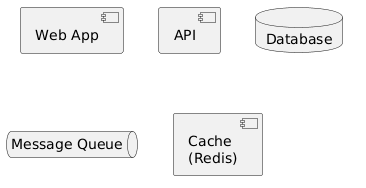
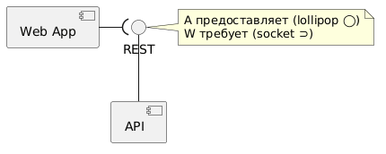
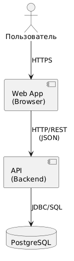
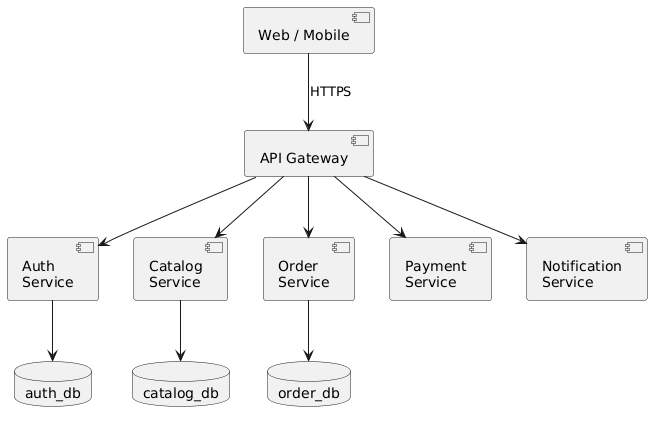
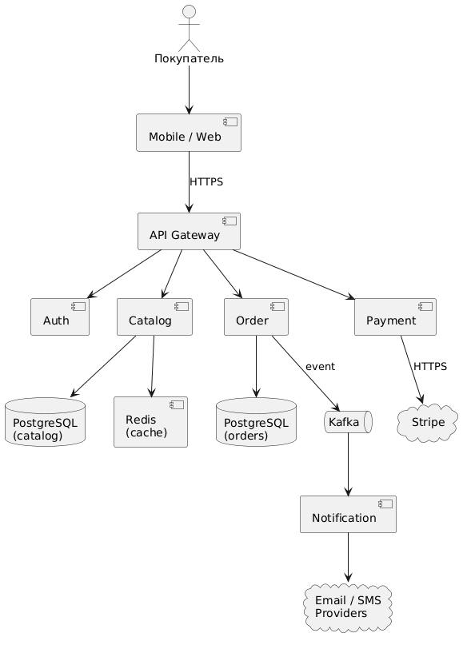

<!-- _class: title -->
<!-- _paginate: skip -->

<div class="course">SYSTEM ANALYST</div>
<div class="author">presented by Ayub</div>

# Component Diagram

---

# До этого мы рисовали "что внутри"

| Диаграмма | Что показывает |
|---|---|
| Class Diagram | Структуру кода (классы, методы) |
| ERD | Структуру данных (таблицы, FK) |
| Sequence | Последовательность сообщений |
| **Component** | **Архитектуру системы — крупные блоки и их связи** |

> Component Diagram — взгляд "сверху": система как набор сервисов, баз, очередей.

<!--
Teacher Notes:
- Recap-мост. Class и ERD — это "ниже". Component — "выше".
- ~2 мин
-->

---

<!-- _class: lead -->

**Ты открываешь Wolt. Что за этим стоит?**

Мобильное приложение, сервер, база данных, платёжный шлюз, push-уведомления, карты Google.

**Как нарисовать всё это и стрелки между ними так, чтобы за 30 секунд было понятно, что с чем общается?**

<!--
Teacher Notes:
- 15 сек, пусть назовут компоненты.
- Подведи: Component Diagram — стандартный способ показать систему "сверху".
- ~2 мин
-->

---

# Зачем SA рисует Component Diagram

- **На старте проекта** — обсудить архитектуру с командой и заказчиком
- **Перед интеграцией** — увидеть, какие сервисы нужно связать
- **Для NFR** — где нужен load balancer, кэш, очередь
- **Для онбординга** — новый разработчик за 10 минут понимает структуру

> Это **не код**. Это карта системы — для разговоров о ней.

---

# Этап 1: Компонент

---

# Component (Компонент) = автономный блок

**Component** — это часть системы, которую можно запустить, обновить и заменить отдельно.

Примеры:
- **Web App** (фронтенд)
- **API** (бэкенд-сервис)
- **Database** (PostgreSQL)
- **Message Queue** (Kafka, RabbitMQ)
- **Cache** (Redis)
- **External Service** (Stripe, Google Maps)



<!--
Teacher Notes:
- Главная мысль: компонент — это то, что развёртывается отдельно.
- ~2 мин
-->

---

# Нотация компонента

```
  ┌──────────────┐
  │  ▭▭ Service  │   ← квадратик с двумя выступами слева
  └──────────────┘
```

В UML:
- Прямоугольник + стереотип `<<component>>` или иконка с двумя выступами
- Имя компонента — сверху

> На практике все рисуют просто прямоугольник с подписью. Главное — понятность.

---

# Этап 2: Связи между компонентами

---

# Что показывают стрелки

**Стрелка между компонентами = зависимость / взаимодействие.**

| Стрелка | Что значит |
|---|---|
| `A ──> B` | A вызывает B (зависит от B) |
| `A <──> B` | Двусторонний обмен сообщениями |
| `A ──◯ B` | A предоставляет интерфейс, B использует |

**Подпись на стрелке:** протокол или формат
- `HTTP/REST`, `WebSocket`, `gRPC`, `JDBC`, `AMQP`, `Kafka`

---

# Provided / Required Interface



- **◯─ Provided Interface** — компонент **предоставляет** интерфейс (lollipop)
- **─⊃ Required Interface** — компонент **требует** интерфейс (socket)

**Чтение:** "API предоставляет REST, который требует Web App".

> На практике в простых диаграммах — просто стрелка с подписью протокола.

<!--
Teacher Notes:
- В академическом UML — lollipop/socket.
- В индустрии — обычно стрелка + подпись.
- ~3 мин
-->

---

# Этап 3: Простая 3-tier архитектура

---

# Web App + API + Database



Самая частая структура:

- **Web** — что видит пользователь (браузер, мобилка)
- **API** — бизнес-логика (сервер)
- **DB** — где хранятся данные

**Стрелки:**
- Web → API через **HTTP/REST**
- API → DB через **JDBC/SQL**

> 90% небольших проектов выглядят именно так.

---

<!-- _class: lead -->

# Module Check 1

1. Что такое **Component** одной фразой?
2. Назови 4 типа компонентов.
3. Что обозначает стрелка между компонентами?
4. Что подписывают на стрелке?
5. Что такое **Provided Interface**?

<!--
Teacher Notes:
- Ответы:
  1. Часть системы, которую можно развернуть отдельно.
  2. Web/API/DB/Queue/Cache/External.
  3. Зависимость или взаимодействие.
  4. Протокол: HTTP, WebSocket, gRPC, AMQP.
  5. Что компонент предлагает другим (lollipop).
- ~4 мин
-->

---

# Этап 4: Микросервисная архитектура

---

# Microservices — много мелких сервисов



Один большой бэкенд → много маленьких:

- **Auth Service** — логин, токены
- **Catalog Service** — товары, категории
- **Order Service** — заказы
- **Payment Service** — оплата (часто внешняя)
- **Notification Service** — email, push

**API Gateway** — единая точка входа для клиента.

<!--
Teacher Notes:
- Покажи на картинке: gateway → разные сервисы → каждый со своей DB.
- Главное правило: один сервис = одна БД.
- ~3 мин
-->

---

# Полезные компоненты в архитектуре

| Компонент | Зачем |
|---|---|
| **API Gateway** | Единая точка входа, аутентификация |
| **Load Balancer** | Распределение нагрузки между копиями |
| **Cache (Redis)** | Снизить нагрузку на БД |
| **Message Queue** | Асинхронная связь между сервисами |
| **CDN** | Раздача статики ближе к пользователю |

> SA должен **видеть**, где эти компоненты нужны, читая NFR.

---

# Этап 5: Полный пример — интернет-магазин

---

# Полная архитектура магазина



- **Mobile / Web** → API Gateway
- Gateway → Auth, Catalog, Order, Payment
- Order → Notification (через Queue)
- Payment → внешний Stripe
- Catalog → Redis (кэш) → PostgreSQL
- Notification → Email/SMS провайдеры

> Каждая стрелка — потенциальный пункт интеграции, который SA должен описать.

---

<!-- _class: lead -->

## Микропрактика — 12 минут

Нарисуй Component Diagram для **онлайн-кинотеатра** (типа Кинопоиск, Netflix).

**Минимум должно быть:**
- Клиент (Web + Mobile)
- API Gateway
- 3 микросервиса (например: Catalog, Streaming, Subscription)
- БД для каждого сервиса
- Кэш или CDN для видео
- Внешний платёжный сервис

**Подпиши протокол** на каждой стрелке.

<!--
Teacher Notes:
- 8 мин рисуют, 4 мин обсуждают в парах.
- Подсказки: видео — через CDN; рекомендации — отдельный сервис; платежи — внешний Stripe.
-->

---

# Peer Review — чек-лист

- [ ] Каждый компонент **подписан** (имя + тип)?
- [ ] У каждой стрелки указан **протокол**?
- [ ] У микросервисов **отдельные** БД?
- [ ] Указан **API Gateway** между клиентом и сервисами?
- [ ] **Внешние** сервисы (Stripe, Google) выделены отдельно?

---

# Этап 6: Типичные ошибки

---

# Ошибка 1: один компонент = один класс

```
❌  компонент "OrderService" имеет 1 класс
```

Component — это **группа классов / модулей**, разворачиваемых вместе. Один класс — слишком мелко.

```
✅  компонент = сервис с десятками классов внутри
```

---

# Ошибка 2: стрелки без протокола

```
❌  Web ───> API
```

Не понятно, что за связь — HTTP? WebSocket? Файловый обмен?

```
✅  Web ──HTTPS/REST──> API
```

> Подписи на стрелках = валюта документации.

---

# Ошибка 3: общая БД у микросервисов

```
❌  OrderService ──┐
                  ├──> PostgreSQL
    CatalogService ──┘
```

Сервисы становятся связанными через схему. Изменения ломают всех сразу.

```
✅  каждый сервис → своя БД
```

> Главное правило микросервисов: одна БД на сервис.

---

# Этап 7: Component vs другие диаграммы

---

# Сравнение

| Что показывает | Диаграмма |
|---|---|
| **Структура кода** (классы) | Class |
| **Структура данных** (таблицы) | ERD |
| **Структура развёртывания** (сервисы, БД) | **Component** |
| **Физические машины** (сервер 1, сервер 2) | Deployment |
| **Поток сообщений** | Sequence |

> Component — это "кто с кем общается". Deployment — "на каких машинах что стоит".

---

<!-- _class: lead -->

# Финальный Module Check

1. Что такое **Component**?
2. Что подписывают на **стрелке**?
3. Зачем **API Gateway**?
4. Почему у каждого микросервиса **своя БД**?
5. Чем **Component** отличается от **Class** Diagram?

<!--
Teacher Notes:
- Ответы:
  1. Развёртываемая часть системы (сервис, БД, очередь).
  2. Протокол (HTTP, WS, gRPC, AMQP, JDBC).
  3. Единая точка входа, аутентификация, маршрутизация.
  4. Чтобы сервисы не были связаны через схему БД.
  5. Component — про сервисы и развёртывание; Class — про код внутри одного сервиса.
- ~5 мин
-->

---

# Что мы разобрали

> Component Diagram — карта твоей системы для разговоров о архитектуре.

- [ ] **Component** = развёртываемая часть системы
- [ ] Стрелка = зависимость / вызов, **подпись = протокол**
- [ ] **API Gateway** + **микросервисы** + **очереди** + **кэш** — типовые блоки
- [ ] Каждый микросервис — со **своей БД**
- [ ] Component ≠ Class: один компонент = группа классов

---

# Что дальше

- Sequence Diagram — как **сообщения двигаются** между этими компонентами во времени
- Deployment Diagram — на **каких машинах** компоненты живут (опционально)
- API Design — детальные **контракты** между компонентами

> Component — это рамка. Внутри — Class, ERD, API.
