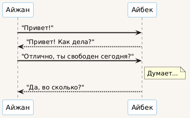
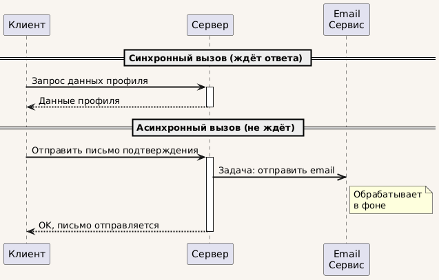
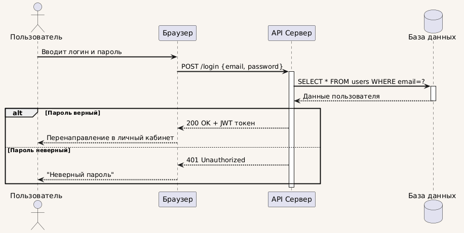
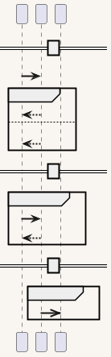
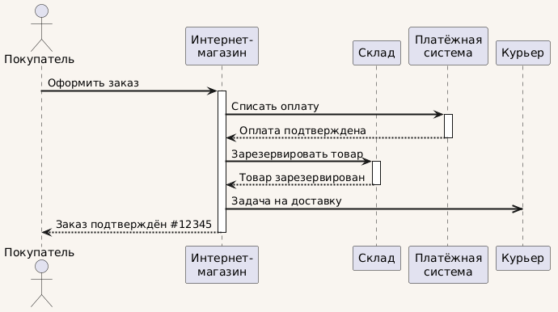

<!-- _class: title -->
<!-- _paginate: skip -->

<div class="course">SYSTEM ANALYST</div>
<div class="author">presented by Ayub</div>

# Sequence Diagram

---

# Где мы в карте диаграмм

| Диаграмма | Отвечает на вопрос |
|---|---|
| Use Case | **ЧТО** система делает для пользователя |
| **Sequence** | **КАК** участники общаются между собой |
| Class | **ИЗ ЧЕГО** состоит система изнутри |

**Sequence Diagram** — главный язык SA в разговоре с разработчиками.

> Use Case — это договор с бизнесом. Sequence — это техзадание для команды.

<!--
Teacher Notes:
- Покажи цепочку: Use Case → Sequence → Class. Каждая диаграмма отвечает на свой вопрос.
- Подчеркни: SA рисует Sequence → разработчик читает → API готов. Это главный мост.
- ~2 мин
-->

---

<!-- _class: lead -->

**Ты отправил другу сообщение в WhatsApp.**

**За 0.3 секунды — что происходит между твоим телефоном и телефоном друга?**

Просто назови участников и шаги. Не нужно знать технику.

<!--
Teacher Notes:
- Жди 7-10 секунд. Не подсказывай сразу.
- Ожидаемые ответы: "телефон отправляет", "через интернет", "сервер WhatsApp", "приходит уведомление"
- Принимай все ответы. Потом скажи: "Вы только что описали Sequence Diagram словами. Сейчас нарисуем это."
- ~2 мин
-->

---

# Sequence Diagram = порядок сообщений во времени

Ось **Y** — это время. Сверху вниз.

Каждое сообщение — стрелка между участниками.



**Сообщение в WhatsApp:**
1. Телефон → WhatsApp Server: отправить сообщение
2. WhatsApp Server: сохранить в базу
3. WhatsApp Server → Телефон друга: push-уведомление
4. Телефон друга → WhatsApp Server: доставлено ✓

> Sequence Diagram — это та же история, но нарисованная строго и однозначно.

<!--
Teacher Notes:
- Указывай на диаграмму справа: "Вот как это выглядит формально."
- Акцент: ось Y = время. Чем ниже — тем позже произошло.
- ~2 мин
-->

---

# Зачем SA рисует Sequence Diagram

- **Проектирование API** — какие эндпоинты нужны, в каком порядке вызываются
- **Описание сложных сценариев** — авторизация, оплата, уведомления
- **Передача разработчикам** — конкретный контракт: кто кому что говорит
- **Поиск узких мест** — кто ждёт дольше всех, где может быть задержка
- **Документация** — часть SRS и API-спецификации

> Если Use Case описывает ЧТО система делает, Sequence отвечает на вопрос КАК именно.

<!--
Teacher Notes:
- Спроси: "Как ты думаешь, зачем разработчику нужна эта диаграмма, а не просто текстовое описание?" → Диаграмма не допускает двусмысленности, разработчик видит порядок и контракт.
- ~2 мин
-->

---

<!-- _class: lead -->

**Ты заказываешь еду в Wolt.**

**Кто участвует в процессе — от нажатия кнопки "Оформить заказ" до звонка курьера в дверь?**

Назови всех: людей, приложения, системы.

<!--
Teacher Notes:
- Жди 7-10 секунд. Записывай ответы студентов на доске/экране.
- Ожидаемые ответы: "пользователь", "приложение Wolt", "ресторан", "курьер", "банк / оплата"
- Подведи: "Все, кого вы назвали — это Participants в Sequence Diagram."
- ~2 мин
-->

---

# Participant — участник диаграммы

**Participant** — любой, кто отправляет или получает сообщение.

- Отображается как **прямоугольник** сверху
- Типы: **Actor** (человек), **System** (сервис), **Database** (хранилище)
- Максимум **5-7 Participant** на одной диаграмме — иначе нечитаемо

**Пример для Wolt:**

```
Пользователь   Wolt App   Order Service   Ресторан   Курьер
     |              |            |             |         |
```

> Если участников больше 7 — разбей на несколько диаграмм по сценариям.

<!--
Teacher Notes:
- Покажи: Participant живёт сверху. От него вниз идёт линия — это Lifeline.
- Про типы: Actor — человечек, System — прямоугольник, Database — цилиндр. В простых диаграммах все изображаются прямоугольниками.
- ~2 мин
-->

---

# Lifeline — "жизнь" участника

**Lifeline** — пунктирная вертикальная линия, которая идёт вниз от каждого Participant.

- Показывает, что участник **существует** в процессе
- Сверху вниз = ход времени
- Сообщения "висят" на этой линии

```
Пользователь        Wolt App
     |                  |
     |--- нажал "заказ" →|
     |                  |
     |← подтверждение --|
     |                  |
```

> Lifeline — это просто "ось времени" конкретного участника.

<!--
Teacher Notes:
- Простой слайд — не затягивай. Lifeline — фундамент, но интуитивно понятен.
- Акцентируй: пунктир, вертикально, вниз = время.
- ~1 мин
-->

---

# Activation Box — участник занят

**Activation Box** — прямоугольник на Lifeline. Показывает: участник сейчас **обрабатывает запрос**.

- Узкий прямоугольник поверх пунктира
- Начинается, когда получено сообщение
- Заканчивается, когда отправлен ответ
- Показывает **КОГДА** участник работает, а когда просто ждёт

```
Wolt App
   |
   ████  ← Activation Box (обрабатывает запрос)
   |
```

> Без Activation Box непонятно, сколько времени система тратит на обработку.

<!--
Teacher Notes:
- Спроси: "Как думаешь, почему важно показывать, когда система занята?" → Видно, кто тормозит, где ждёт ответа.
- ~2 мин
-->

---

# Типы сообщений

| Тип | Стрелка | Смысл |
|---|---|---|
| **Синхронный вызов** | → (сплошная) | Отправил и **жду** ответа |
| **Асинхронный вызов** | -->> (пунктир) | Отправил и **не жду** |
| **Ответ** | -- (пунктир назад) | Вернул результат |
| **Self-call** | петля на себя | Сам себе вызвал метод |



**Пример:**
- Wolt App → Order Service: создать заказ *(sync, жду ответа)*
- Order Service -->> Ресторан: уведомить о заказе *(async, не жду)*

<!--
Teacher Notes:
- Самое важное: sync vs async. Sync — ты стоишь у кассы и ждёшь сдачу. Async — ты заказал пиццу и пошёл заниматься своим делом.
- Ответ всегда пунктиром — это правило, которое часто нарушают.
- ~3 мин
-->

---

<!-- _class: lead -->

# Module Check 1

1. Что показывает **ось Y** в Sequence Diagram?
2. Что такое **Activation Box** и зачем он нужен?
3. Чем **синхронный** вызов отличается от **асинхронного**?

<!--
Teacher Notes:
- Дай 3-4 минуты на ответы.
- Ответы:
  1. Ось Y — время. Чем ниже, тем позже произошло.
  2. Activation Box — прямоугольник на Lifeline, показывает что участник занят обработкой. Без него непонятно, когда система работает.
  3. Sync — отправил и жду ответа (блокирует). Async — отправил и пошёл дальше (не блокирует).
- ~4 мин
-->

---

<!-- _class: lead -->

**На диаграмме авторизации нужно показать:**

- Если пароль верный — пустить пользователя
- Если неверный — вернуть ошибку
- Если ввёл неверно 3 раза — заблокировать

**Как показать условие и повторение на Sequence Diagram?**

<!--
Teacher Notes:
- Жди 10 секунд. Ожидаемые ответы: "два варианта стрелок", "если... то...", "не знаю"
- Подведи: "Для этого BPMN даёт шлюзы, а Sequence Diagram — Combined Fragments."
- ~2 мин
-->

---

# Combined Fragments — управляющие блоки

| Fragment | Аналог в коде | Смысл |
|---|---|---|
| **alt** | `if / else` | Условие — один из вариантов |
| **loop** | `for / while` | Повторение пока условие верно |
| **opt** | `if` (без else) | Необязательный блок |
| **ref** | вызов функции | Ссылка на другую диаграмму |

Рамка с именем Fragment оборачивает группу сообщений.

> Fragment = блок кода, но на диаграмме.

<!--
Teacher Notes:
- Не перегружай — покажи на примере. Таблица для справки, примеры на следующих слайдах.
- ref особенно полезен: вместо copy-paste диаграммы — ссылка. Как Sub-process в BPMN.
- ~2 мин
-->

---

# alt — условие (если / иначе)

Авторизация: верный пароль → токен, неверный → ошибка.



```
alt [пароль верный]
  Auth Service → Client: токен
else [пароль неверный]
  Auth Service → Client: 401 Ошибка
end
```

- Рамка `alt` делит сценарий на варианты
- Каждый вариант в квадратных скобках `[ ]`
- Выполняется **только один** из них

> alt — это развилка. Как XOR в BPMN, только для сообщений.

<!--
Teacher Notes:
- Покажи диаграмму справа. Разбери вслух: "Вот Guard condition в скобках. Система проверяет условие и идёт по одной из веток."
- Студенты часто спрашивают "а можно три ветки?" — да, можно несколько else.
- ~3 мин
-->

---

# loop и opt — повтор и необязательный блок



**loop** — повторение пока условие верно:
```
loop [попытки < 3]
  Client → Auth Service: ввести пароль
  Auth Service → Client: ошибка
end
```

**opt** — необязательный блок:
```
opt [пользователь выбрал "запомнить меня"]
  Auth Service → Client: сохранить cookie
end
```

> loop = while. opt = if без else.

<!--
Teacher Notes:
- Реальный пример loop: повторный запрос к API если таймаут. Реальный пример opt: показать уведомление только если пользователь подписан.
- ~2 мин
-->

---

# Полный пример: заказ в интернет-магазине



**Участники:** Пользователь, Магазин, Payment Service, Courier Service

- Пользователь → Магазин: оформить заказ *(sync)*
- Магазин → Payment Service: списать деньги *(sync, ждём)*
- Payment Service → Магазин: успех *(ответ)*
- Магазин -->> Courier Service: передать в доставку *(async, не ждём)*
- Магазин → Пользователь: заказ принят *(ответ)*

> Sync к оплате — нельзя идти дальше без подтверждения. Async к курьеру — не нужно ждать.

<!--
Teacher Notes:
- Это ключевой пример — разбери каждую стрелку. Почему sync, почему async.
- Спроси: "Что будет если оплата async? Магазин отдаст заказ не зная, прошла ли оплата."
- ~3 мин
-->

---

<!-- _class: lead -->

# Микропрактика — 7 минут

**Нарисуй Sequence Diagram для регистрации нового пользователя.**

Участники: **Пользователь**, **Браузер**, **API**, **БД**, **Email-сервис**

Покажи:
- ввод данных формы
- проверка email на уникальность
- сохранение в базу
- отправка письма подтверждения

<!--
Teacher Notes:
- Карандаш и бумага. Дай 7 минут.
- Ходи между рядами. Смотри: правильны ли типы стрелок, есть ли Activation Box хотя бы на API.
- Типичные ошибки: ответные стрелки сплошные (должны быть пунктир), нет Activation Box, пропустили Participant.
- ~7 мин
-->

---

# Peer Review — проверь соседа

Поменяйся листом. 3 минуты на разбор:

- Все ли **Participant** подписаны?
- Ответные стрелки — **пунктиром** или сплошной? *(должны быть пунктир)*
- Есть ли хотя бы один **Activation Box** на API?
- Виден ли **порядок** событий сверху вниз?
- Сохранение в БД происходит **до или после** отправки письма?

**Верни лист с одной правкой и одной похвалой.**

<!--
Teacher Notes:
- После peer review — разбери один лист у доски. Спроси автора: "Почему ты выбрал sync для отправки письма?"
- ~5 мин
-->

---

# Типичные ошибки — часть 1

**Ошибка 1: ответ нарисован сплошной стрелкой**

```
Auth Service → Client: токен   ← НЕВЕРНО (сплошная)
Auth Service --> Client: токен ← ВЕРНО (пунктир)
```

**Ошибка 2: нет Activation Box**

Без него непонятно, когда система обрабатывает запрос, а когда просто ждёт.
Теряется информация о времени обработки.

> Ответ — всегда пунктиром. Activation Box — всегда при обработке.

<!--
Teacher Notes:
- Эти две ошибки встречаются в 80% работ. Проговори их два раза.
- ~2 мин
-->

---

# Типичные ошибки — часть 2

**Ошибка 3: слишком детально**

На диаграмме видны SQL-запросы, имена колонок, внутренние методы БД.
Sequence Diagram — про взаимодействие систем, не про реализацию внутри.

**Ошибка 4: только happy path**

Нет `alt` с ошибкой, нет сценария "что если платёж не прошёл". Бизнес и разработчики не поймут, как система ведёт себя при сбоях.

> Хорошая Sequence Diagram показывает и нормальный, и альтернативный сценарии.

<!--
Teacher Notes:
- Ошибка 3 особенно частая у тех, кто знает программирование. Объясни: SA рисует для бизнеса и команды, не для компилятора.
- ~2 мин
-->

---

<!-- _class: lead -->

# Module Check 2

1. Чем **alt** отличается от **opt**?
2. Когда использовать **async** стрелку, а когда **sync**?
3. Почему нельзя рисовать SQL-запросы на Sequence Diagram?
4. Что покажет диаграмма без **alt** для ошибок?

<!--
Teacher Notes:
- Дай 4 минуты.
- Ответы:
  1. alt — один из нескольких вариантов (как if/else). opt — необязательный блок (как if без else).
  2. Sync — когда нельзя продолжить без ответа. Async — когда можно продолжить не дожидаясь.
  3. Sequence — про взаимодействие между системами, не про внутреннюю реализацию.
  4. Только happy path. Непонятно что делать при ошибке — разработчик додумает сам, скорее всего неправильно.
- ~4 мин
-->

---

# Sequence Diagram в документации SA

| Документ | Где используется |
|---|---|
| **API Specification** | Описание порядка вызовов эндпоинтов |
| **SRS** | Раздел "Описание взаимодействий" |
| **Tech Brief** | Передача разработчикам перед спринтом |
| **Architecture Decision** | Обоснование sync vs async |

**Что пишет SA:**
- Sequence для каждого ключевого сценария из Use Case
- Отдельная диаграмма для happy path и error path

<!--
Teacher Notes:
- Спроси: "Как думаешь, кто читает эту диаграмму — бизнес или разработчики?" → В основном разработчики и архитекторы. Бизнесу нужен Use Case.
- ~2 мин
-->

---

# Связь с другими диаграммами

```
Use Case Diagram
      ↓
 "Пользователь оформляет заказ"
      ↓
Sequence Diagram
      ↓
 Кто кому что говорит — конкретные сообщения
      ↓
Class Diagram
      ↓
 Что нужно создать — классы, методы, атрибуты
```

> Use Case → Sequence → Class: каждая диаграмма отвечает на следующий вопрос.

<!--
Teacher Notes:
- Это важный момент понимания цепочки. SA идёт по этой цепочке в процессе проектирования.
- Sequence живёт посередине: берёт сценарий из Use Case и питает Class Diagram.
- ~2 мин
-->

---

# Инструменты для Sequence Diagram

| Инструмент | Тип | Особенность |
|---|---|---|
| **draw.io** | Визуальный | Бесплатный, работает в браузере |
| **PlantUML** | Текстовый | Диаграмма = код, можно в git |
| **Mermaid** | Текстовый | Работает в Confluence / GitHub / Notion |
| **Lucidchart** | Визуальный | Популярен в корпорациях |

**PlantUML пример:**
```
Client -> Server: запрос
Server --> Client: ответ
```

> В большинстве команд используют Mermaid в Confluence или draw.io.

<!--
Teacher Notes:
- PlantUML = диаграмма как текст. Можно хранить в git, делать code review. Это сильно.
- Mermaid поддерживается прямо в Notion и GitHub README — без дополнительных инструментов.
- ~2 мин
-->

---

# Чек-лист хорошей Sequence Diagram

- Не более **5-7 Participant** — иначе нечитаемо
- Все **ответные стрелки** — пунктиром
- Есть **Activation Box** у активных участников
- Есть **alt** для error case — не только happy path
- Каждое сообщение **названо** — не просто стрелка
- Уровень детализации — **между системами**, не внутри них
- Диаграмма **соответствует Use Case** — один сценарий, одна диаграмма

> Если коллега-разработчик понял диаграмму без объяснений — она хорошая.

<!--
Teacher Notes:
- Распечатать или оставить на слайде как референс. Студенты будут возвращаться к нему.
- ~2 мин
-->

---

<!-- _class: lead -->

# Module Check — финальный

**Мысленно нарисуй Sequence Diagram для сценария "Войти в Instagram".**

- Какие **Participant**? (назови минимум 4)
- Что происходит когда логин **верный**?
- Что происходит когда **неверный**?
- Какой **Fragment** использовать для условия?
- Какое сообщение будет **async**?

<!--
Teacher Notes:
- Дай 3-4 минуты на обдумывание. Потом собери ответы устно.
- Ожидаемые Participants: Пользователь, Instagram App, Auth Service, БД (Users), Push Service
- alt для верный/неверный пароль. loop для ограничения попыток.
- async: push-уведомление "новый вход с устройства"
- ~5 мин
-->

---

# Итого

> **Sequence Diagram** — язык взаимодействия между системами.

- SA рисует → разработчик читает → они говорят на одном языке
- Ось Y = время. Сверху вниз.
- **Participant** → **Lifeline** → **Activation Box** → **Messages**
- `alt` / `loop` / `opt` — управляющие блоки для условий и повторений
- Всегда показывай и happy path, и error case

> Хорошая Sequence Diagram не требует объяснений. Она читается как история.

<!--
Teacher Notes:
- Финальный аккорд. Не затягивай.
- ~1 мин
-->

---

# Что дальше

**Следующая тема: OOP Basics**

Sequence Diagram показывает **кто с кем общается**.

Class Diagram покажет **что внутри каждого участника** — методы, атрибуты, связи.

Для этого нужно понять ООП: объекты, классы, наследование, инкапсуляция.

> OOP — фундамент для Class Diagram. Sequence → Class: логичный следующий шаг.

<!--
Teacher Notes:
- ~1 мин
-->
