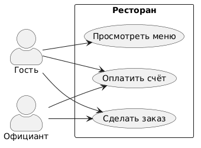
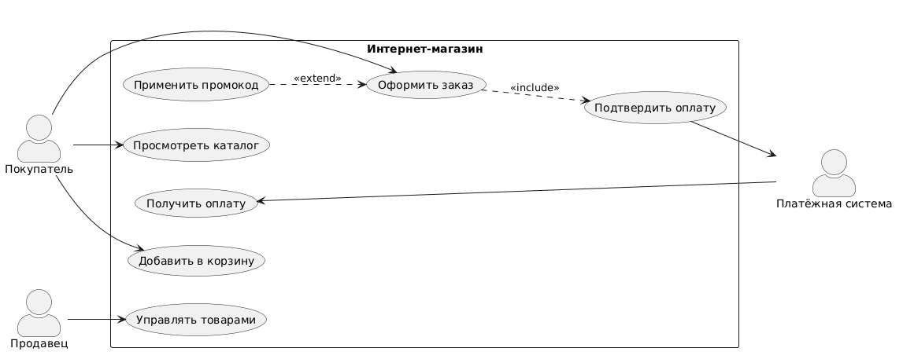
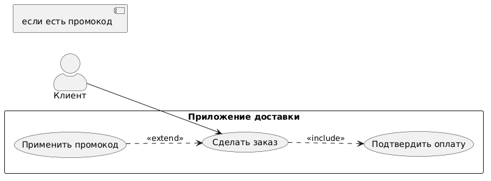
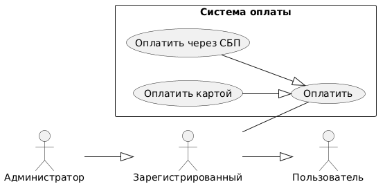
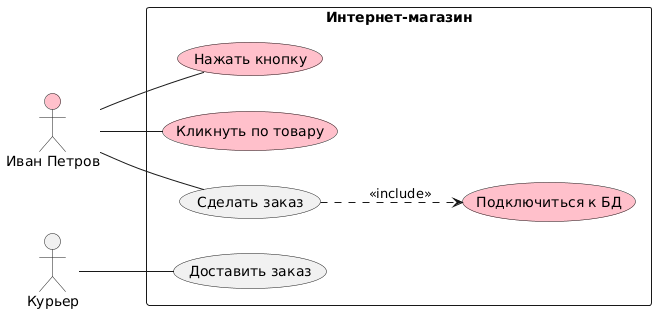

<!-- _class: title -->
<!-- _paginate: skip -->

<div class="course">SYSTEM ANALYST</div>
<div class="author">presented by Ayub</div>

# UML: Use Case Diagram

---

# Где мы сейчас

SA строит несколько типов диаграмм — каждая отвечает на свой вопрос:

| Диаграмма            | Вопрос                                      |
| -------------------- | ------------------------------------------- |
| **BPMN**             | КАК работает бизнес-процесс?                |
| **Use Case**         | ЧТО умеет система? Кто ей пользуется?       |
| **Sequence Diagram** | В каком порядке система выполняет сценарий? |
| **ERD**              | Какие данные хранит система?                |

Сегодня — **Use Case Diagram**: первый инструмент SA на старте любого проекта.

---

<!-- _class: lead -->

# Этап 1: Зачем нужна Use Case диаграмма?

---

<!-- _class: lead -->

## Представь: ты пришёл в новый ресторан

Ты ещё не был здесь ни разу.

**Ты не знаешь — что вообще тут можно делать.**

Можно ли здесь заказать суши? Или только пицца?
Можно оплатить картой? Есть доставка?

> Как ты быстро узнаешь — **ЧТО умеет этот ресторан**?

<!--
Teacher Notes:
- Подожди 7-10 секунд. Пусть студенты скажут: "посмотрю меню", "спрошу официанта"
- Веди к аналогии: меню = список того, что система умеет делать
- Не давай ответ сразу — пусть группа придёт сама
-->

---

# Use Case = меню системы



**Use Case diagram** показывает:
- **ЧТО** умеет система (варианты использования)
- **КТО** этим пользуется (акторы)

Не КАК система это делает — это Sequence Diagram.
Не КОГДА это происходит — это BPMN.

> Use Case = список возможностей системы с точки зрения пользователя

<!--
Teacher Notes:
- Меню ресторана = Use Case diagram. Ты видишь "Паста Карбонара" — это Use Case "Заказать пасту". Ты не видишь рецепт приготовления — это детали реализации.
- Акцент: Use Case описывает ЦЕЛЬ пользователя, не шаги системы
-->

---

# Когда SA рисует Use Case

**В начале проекта:**
- "Что вообще должна уметь система?" → определяем scope
- Нет риска упустить важный функционал

**При работе с заказчиком:**
- Заказчик видит диаграмму → "Да, система должна это уметь"
- Общий язык без технического жаргона

**Как основа для других артефактов:**
- Каждый Use Case → User Story в Backlog
- Каждый Use Case → тест-кейс в QA
- Каждый Use Case → спецификация в SRS

---

<!-- _class: lead -->

# Этап 2: Элементы диаграммы

---

<!-- _class: lead -->

## В ресторане есть: гость, официант, повар, кассовый аппарат

**Кто из них ИСПОЛЬЗУЕТ ресторан как систему?**

А кто — **часть** системы?

Подумай 10 секунд...

<!--
Teacher Notes:
- Гость — использует ресторан (пришёл снаружи, инициирует действия)
- Официант — тоже использует систему (принимает заказ, взаимодействует)
- Повар — ВНУТРИ системы, его не видит гость как участника интерфейса
- Кассовый аппарат — внешняя система, secondary actor
- Цель: подвести к концепции Actor = кто снаружи взаимодействует с системой
-->

---

# Actor (Актор)

**Actor** — тот, кто взаимодействует с системой **извне**.

- Изображается как стик-фигура
- **Не человек — это РОЛЬ**
- "Покупатель" ≠ "Иван Петров"
- Один человек может играть несколько ролей

**Примеры акторов:**
- Покупатель, Администратор, Курьер — люди в ролях
- Платёжная система, SMS-сервис — внешние системы
- Таймер, Планировщик — автоматические триггеры

> Ключевой вопрос: **кто инициирует или участвует в Use Case?**

---

# Primary vs Secondary Actors

| Тип           | Кто это                                 | Пример            | Где на диаграмме |
| ------------- | --------------------------------------- | ----------------- | ---------------- |
| **Primary**   | Инициирует Use Case, главный бенефициар | Покупатель        | Слева            |
| **Secondary** | Поддерживает выполнение, реагирует      | Платёжная система | Справа           |

**Primary** — ради него система и существует.

**Secondary** — без него Use Case не выполнится, но он не инициатор.

---

# Use Case (Вариант использования)

**Use Case** — действие, которое система выполняет для Актора.

- Изображается как **овал**
- Формат: **Глагол + существительное**
  - ✅ "Оформить заказ"
  - ✅ "Просмотреть каталог"
  - ✅ "Отследить доставку"

**Use Case = ЦЕЛЬ пользователя**, не шаг UI:
- ❌ "Нажать кнопку Купить"
- ❌ "Заполнить форму"
- ✅ "Оформить заказ"

> Use Case описывает ЧТО нужно пользователю, а не КАК это технически работает

---

# System Boundary (Граница системы)



**System Boundary** — прямоугольник вокруг системы.

- **Внутри** — Use Cases (что умеет система)
- **Снаружи** — Actors (кто взаимодействует)
- Название системы — вверху прямоугольника

На диаграмме справа:
- Граница = "Интернет-магазин"
- Внутри: 7 Use Cases
- Снаружи: Покупатель, Продавец, Платёжная система

---

<!-- _class: lead -->

## Module Check 1

- Что такое Actor? Это человек или роль?
- Можно ли написать "Нажать кнопку" как Use Case?
- Где рисуется System Boundary — вокруг чего?
- Чем Use Case отличается от BPMN Task?

<!--
Teacher Notes:
- Актор = роль, не человек. Один человек может быть двумя Акторами (маркетолог = и Покупатель, и Контент-менеджер)
- "Нажать кнопку" — нет. Это шаг интерфейса. Use Case = цель: "Добавить товар в корзину"
- System Boundary = прямоугольник вокруг всей системы. Акторы всегда снаружи.
- BPMN Task = конкретный шаг в процессе ("Менеджер проверяет заявку"). Use Case = цель пользователя ("Подать заявку")
- ~5 мин
-->

---

<!-- _class: lead -->

# Этап 3: Связи (Relationships)

---

<!-- _class: lead -->

## Два Use Case: "Оформить заказ" и "Подтвердить оплату"

Можно ли оформить заказ **без** подтверждения оплаты?

А "Применить промокод" — это **всегда** происходит при заказе, или **иногда**?

<!--
Teacher Notes:
- Подожди ответов. Студенты должны сами прийти к: "нет, оплата обязательна" и "промокод — иногда"
- Это мотивирует include vs extend: нам нужно способ показать ОБЯЗАТЕЛЬНОСТЬ и ОПЦИОНАЛЬНОСТЬ на диаграмме
-->

---

# Association — базовая связь

**Association** — стрелка от Actor к Use Case.

```
Покупатель ──────► Оформить заказ
```

Означает: **этот Актор использует этот функционал**.

- Самая частая связь на диаграмме
- Простая линия или стрелка
- Нет лишних слов — связь говорит сама за себя

> Правило: каждый Use Case должен быть связан хотя бы с одним Актором

---

# `<<include>>` — обязательная зависимость

**`<<include>>`** — Use Case **всегда** вызывает другой Use Case.

```
Оформить заказ  ──────►  Подтвердить оплату
                <<include>>
```

- Базовый Use Case **неполон** без включаемого
- Стрелка идёт **от базового → к включаемому**
- Аналогия: нельзя испечь хлеб без муки — мука обязательна

**Когда использовать:**
- Общая логика, которая нужна нескольким Use Cases
- Обязательный шаг, без которого Use Case не имеет смысла

---

# `<<extend>>` — опциональное расширение

**`<<extend>>`** — Use Case **иногда** расширяется другим.

```
Оформить заказ  ◄──────  Применить промокод
                <<extend>>
```

- Базовый Use Case **полон** даже без расширения
- Стрелка идёт **от расширения → к базовому** (противоположно include!)
- Аналогия: пицца вкусная и без дополнительного соуса — соус опционален

**Когда использовать:**
- Опциональный функционал, который срабатывает по условию
- "Если у пользователя есть промокод..."

---

# `<<include>>` vs `<<extend>>` — итог



|                     | `<<include>>`  |    `<<extend>>`     |
| ------------------- | :------------: | :-----------------: |
| Когда               |   **Всегда**   | Иногда (по условию) |
| Базовый UC без него |    Неполный    |       Полный        |
| Стрелка от          |    Базового    |     Расширения      |
| Аналогия            | Мука в рецепте |  Доп. соус к пицце  |

**Подсказка:**
- `include` = **в**ключить обязательно → стрелка вперёд (от базового)
- `extend` = **рас**ширить по желанию → стрелка назад (к базовому)

---

# Generalization — наследование



**Generalization** — "является частным случаем".

**Между Акторами:**
```
Администратор ──▷ Зарегистрированный пользователь ──▷ Пользователь
```
Администратор умеет всё, что умеет Пользователь + дополнительно.

**Между Use Cases:**
- "Оплатить картой" — частный случай "Оплатить"
- "Оплатить через СБП" — тоже частный случай "Оплатить"

> Треугольная стрелка, как в ООП наследовании

---

<!-- _class: lead -->

## Микропрактика 1 — 10 минут

Нарисуй **Use Case diagram** для приложения доставки еды (как Яндекс Еда).

**Акторы:** Клиент, Ресторан, Курьер

**Задача:**
- Найди минимум **5 Use Cases**
- Используй хотя бы **одну `<<include>>`**
- Используй хотя бы **одну `<<extend>>`**
- Нарисуй **System Boundary**

<!--
Teacher Notes:
- Можно рисовать на бумаге или в draw.io
- Ожидаемые Use Cases: Сделать заказ, Выбрать ресторан, Отследить заказ, Оценить доставку, Управлять меню (Ресторан), Принять заказ (Курьер), Оплатить заказ
- Include: "Сделать заказ" →include→ "Выбрать способ оплаты"
- Extend: "Сделать заказ" ←extend← "Применить промокод"
- Курьер — Secondary Actor: он реагирует на заказ, не инициирует
- 7 мин работа, 3 мин обсуждение в парах
-->

---

# Peer Review — проверь диаграмму соседа

Обменяйтесь диаграммами. Проверь по чек-листу:

- [ ] Все Акторы нарисованы **снаружи** System Boundary?
- [ ] Use Cases = **глагол + существительное** (цели, не кнопки)?
- [ ] Стрелки `include`/`extend` в **правильную сторону**?
- [ ] Нет внутренних шагов системы ("Обновить БД")?
- [ ] Каждый Use Case связан хотя бы с одним Актором?

**Дай конструктивный фидбек:** что хорошо, что можно улучшить.

---

<!-- _class: lead -->

# Этап 4: Типичные ошибки

---

<!-- _class: lead -->

## Найди что здесь не так



Посмотри на диаграмму справа.

Назови **все ошибки**, которые видишь.

<!--
Teacher Notes:
- Подожди 30-60 секунд, пусть студенты смотрят
- Ошибки: 1) "Иван Петров" — имя, не роль; 2) "Нажать кнопку" — шаг UI; 3) "Подключиться к базе данных" — внутренний шаг системы; 4) "Кликнуть по товару" — шаг UI
- Записывай ответы студентов на доску, потом разбирай следующие слайды
-->

---

# Ошибка 1: Конкретные имена вместо ролей

- ❌ **"Иван Петров"** — конкретный человек
- ✅ **"Покупатель"** — роль в системе

**Почему это важно:**
- Иван Петров сегодня — покупатель
- Завтра он может зайти как Администратор
- Один человек = несколько ролей = несколько Акторов

> Actor — это РОЛЬ, которую исполняет участник при взаимодействии с системой

---

# Ошибка 2: Слишком детальные Use Cases

❌ "Нажать кнопку 'Добавить в корзину'"
❌ "Кликнуть на товар"
❌ "Заполнить поле Email"

✅ "Добавить товар в корзину"
✅ "Просмотреть товар"
✅ "Зарегистрироваться"

**Правило:** Use Case = **ЦЕЛЬ** пользователя, не шаг интерфейса.

Если Use Case начинается с "Нажать", "Кликнуть", "Заполнить" — это почти всегда ошибка.

---

# Ошибка 3: Внутренние шаги системы как Use Cases

❌ "Подключиться к базе данных"
❌ "Создать сессию"
❌ "Сгенерировать JWT токен"

Это — **детали реализации**, их видит только разработчик.

**Правило:** Use Case должен быть понятен **заказчику** без технических знаний.

Тест: "Заказчик может объяснить зачем ему это нужно?" Если нет — это не Use Case.

---

# Ошибки 4 и 5

**Ошибка 4: Актор внутри System Boundary**
- ❌ Стик-фигура нарисована внутри прямоугольника системы
- ✅ Акторы **всегда снаружи** — они не часть системы

**Ошибка 5: Перепутаны стрелки `include`/`extend`**
- ❌ `extend` стрелка идёт от базового к расширению
- ✅ `extend` стрелка идёт **от расширения → к базовому**

**Мнемоника:**
- `include`: базовый **тянет** включаемый → стрелка от базового
- `extend`: расширение **добавляется** к базовому → стрелка от расширения

---

<!-- _class: lead -->

## Module Check 2

- В чём разница `<<include>>` и `<<extend>>`?
- "Войти в аккаунт" и "Сбросить пароль" — какая связь между ними?
- Может ли один человек быть двумя разными Акторами?
- Что не так с Use Case "Открыть базу данных"?
- Где рисуется Актор: внутри или снаружи System Boundary?

<!--
Teacher Notes:
- include = обязательно каждый раз; extend = опционально по условию
- "Войти" и "Сбросить пароль": extend — "Сбросить пароль" расширяет "Войти в аккаунт" по условию "забыл пароль". Без забытого пароля Use Case "Войти" выполняется полностью.
- Да: маркетолог может быть и Покупателем и Контент-менеджером в одной системе
- "Открыть базу данных" — внутренний шаг системы, технический. Пользователь про него не знает и не инициирует.
- Актор всегда снаружи. Внутри — только Use Cases.
- ~5 мин
-->

---

<!-- _class: lead -->

# Этап 5: Use Case в работе SA

---

# Use Case → User Story

Use Case диаграмма — высокий уровень. User Story — детализация.

| Use Case              | User Story                                                                          |
| --------------------- | ----------------------------------------------------------------------------------- |
| "Просмотреть каталог" | Как **Покупатель**, я хочу просматривать товары, чтобы **найти нужный товар**       |
| "Оформить заказ"      | Как **Покупатель**, я хочу оформить заказ, чтобы **получить товар домой**           |
| "Управлять товарами"  | Как **Продавец**, я хочу редактировать товары, чтобы **держать каталог актуальным** |

**Процесс:**
1. Use Case диаграмма → видим все возможности системы
2. Каждый Use Case → одна или несколько User Stories в Backlog

---

# Use Case в SRS

**SRS (Software Requirements Specification)** — документ с требованиями к системе.

Раздел "Функциональные требования" строится так:

1. **Use Case Diagram** — обзор: что умеет система
2. **Use Case Specification** — для каждого Use Case:
   - Основной поток (happy path)
   - Альтернативные потоки (ошибки, исключения)
   - Предусловия и постусловия
3. **Заказчик подписывает** → зафиксированный scope проекта

> Use Case diagram — контракт между SA и заказчиком на уровне функционала

---

# Когда рисовать Use Case, а когда — нет

| Ситуация                                        | Use Case? | Альтернатива     |
| ----------------------------------------------- | :-------: | ---------------- |
| Начало проекта, определение scope               |     ✅     | —                |
| Обсуждение с бизнесом, что должна уметь система |     ✅     | —                |
| Детализация порядка действий в сценарии         |     ❌     | Sequence Diagram |
| Показать бизнес-процесс с ролями и шагами       |     ❌     | BPMN             |
| Структура данных, связи между объектами         |     ❌     | ERD              |
| Поведение системы в разных состояниях           |     ❌     | State Machine    |

---

# Инструменты для рисования Use Case

| Инструмент     | Плюсы                            | Когда использовать      |
| -------------- | -------------------------------- | ----------------------- |
| **draw.io**    | Бесплатно, онлайн, шаблоны UML   | Рекомендация для старта |
| **Lucidchart** | Коллаборация, красивый UI        | Командная работа        |
| **PlantUML**   | Код → диаграмма, версионирование | Продвинутый уровень     |
| **Miro**       | Фасилитация, стикеры             | Воркшопы с заказчиком   |
| **Whimsical**  | Чистый UI, быстрый старт         | Быстрые наброски        |

**Совет**: начни с draw.io — простой интерфейс, есть все нужные символы UML.

---

# Чек-лист хорошей Use Case диаграммы

- [ ] Все Акторы — **роли**, не имена людей
- [ ] Use Cases = **глагол + существительное** (цели пользователя)
- [ ] **Нет** внутренних шагов системы (технических деталей)
- [ ] System Boundary **чётко нарисована** (прямоугольник)
- [ ] `<<include>>` = обязательно, `<<extend>>` = опционально
- [ ] **Primary** Акторы слева, **Secondary** справа
- [ ] Уровень детализации **одинаковый** у всех Use Cases
- [ ] Каждый Use Case **связан** хотя бы с одним Актором

---

<!-- _class: lead -->

## Module Check — финальный

- Объясни своими словами: **зачем нужна Use Case диаграмма?**
- Чем она отличается от BPMN?
- Нарисуй мысленно Use Case для **Instagram**: какие Акторы? Какие 5 главных Use Cases?
- "Войти в аккаунт" — это `<<include>>` для "Просмотреть ленту"... это верно? Почему?

<!--
Teacher Notes:
- Instagram: Акторы = Пользователь (Primary), Рекламодатель (Secondary), Модератор (Secondary). Use Cases: Просмотреть ленту, Опубликовать пост, Поставить лайк, Написать комментарий, Разместить рекламу (Рекламодатель), Заблокировать контент (Модератор)
- "Войти" как include в "Просмотреть ленту" — дискуссионно. Если Instagram требует авторизации для просмотра — include корректен. Если есть публичные профили — нет. Правильный ответ зависит от требований. Это отличный момент показать: Use Case отражает конкретные бизнес-правила проекта.
- ~7 мин обсуждение
- Ключевое отличие от BPMN: Use Case = ЧТО (список возможностей), BPMN = КАК (шаги процесса, роли, события, шлюзы)
-->

---

# Итого

> Use Case diagram показывает **ЧТО умеет система** и **КТО ею пользуется** — без деталей реализации

**Что ты теперь умеешь:**
- Находить Акторов (Primary и Secondary)
- Формулировать Use Cases (цели, не шаги)
- Рисовать System Boundary
- Использовать `<<include>>` и `<<extend>>` правильно
- Применять Generalization между Акторами
- Избегать типичных ошибок

---

# Что дальше

**Следующий шаг: Sequence Diagram**
- Use Case сказал *что* система умеет
- Sequence Diagram покажет *как именно* это происходит
- Порядок сообщений между объектами при выполнении Use Case

**Потом: Class Diagram**
- Из каких объектов состоит система
- Структура данных и связи

**Связь:**
- Каждый Use Case → сценарий в Sequence Diagram
- Объекты из Class Diagram участвуют в Sequence Diagram

> Один Use Case = один или несколько Sequence Diagrams
