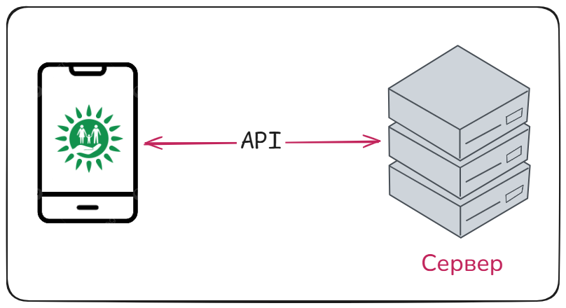
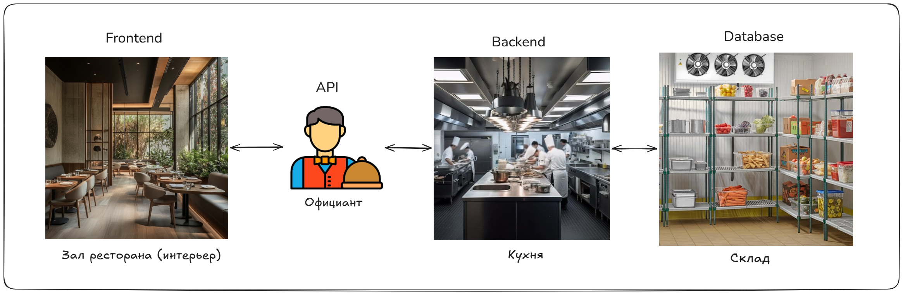
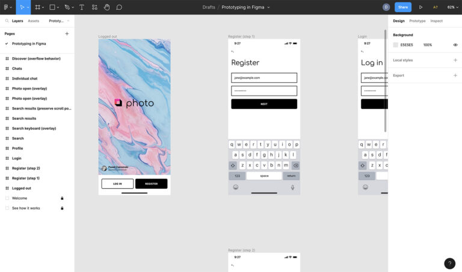
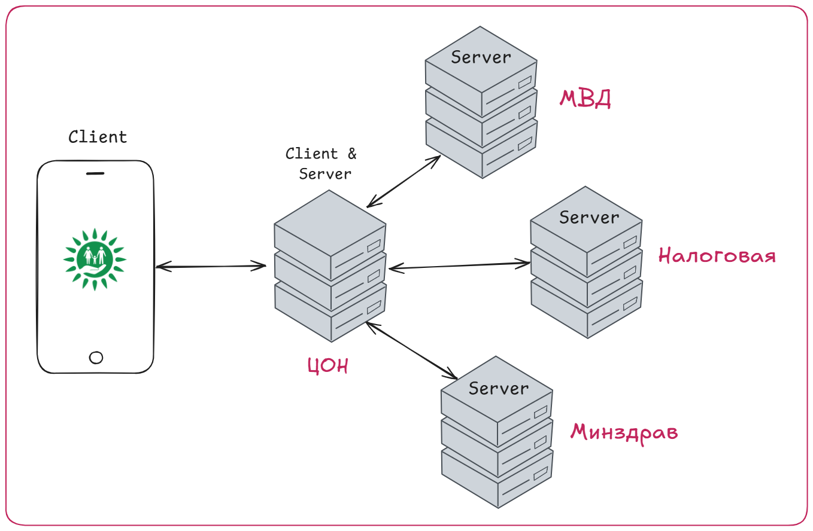
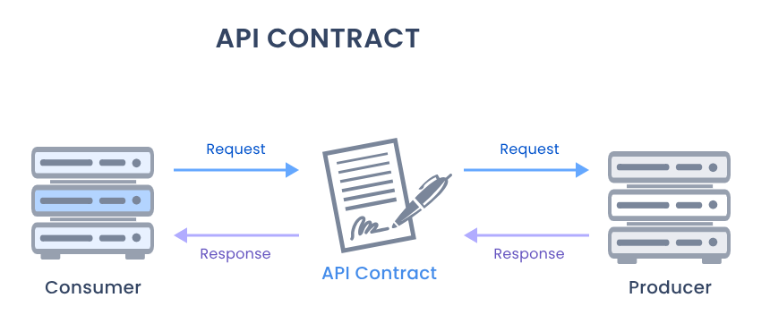
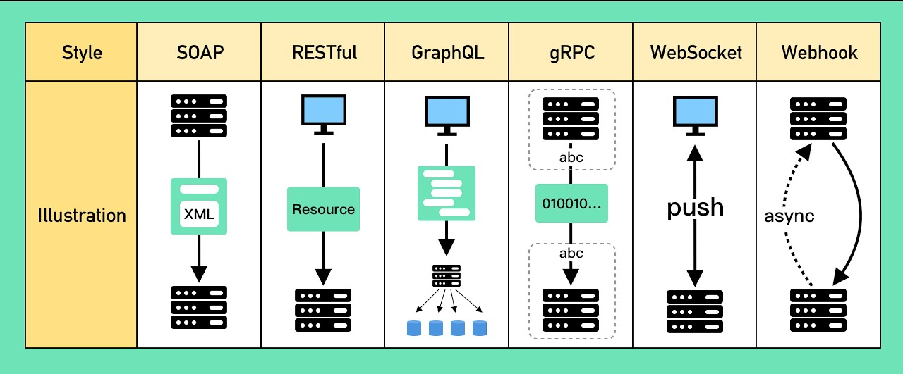
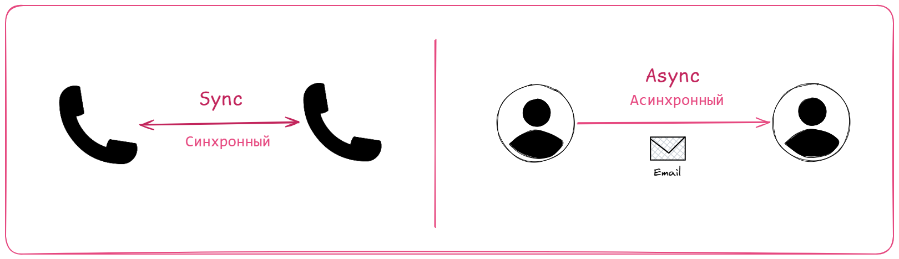

# 🧩 Как устроена IT-система: Frontend, Backend, API

## В этом уроке

- Из чего состоит IT-система: почему это не «одна программа»
- Интерфейс: витрина, а не магазин
- **Frontend и Backend**: где живёт логика, а где только картинка
- **Клиент и сервер**: кто просит, кто отвечает
- **API**: посредник и контракт между частями системы
- Общение не только внутри системы: свои и внешние сервисы (гос-пример)
- Протоколы: какие бывают (обзор, без деталей)
- **Sync и Async**: звонок против письма, и правило выбора

---

## Проблема

Новичок думает, что приложение, это «одна программа в телефоне»: открыл и работает.

На самом деле любое приложение состоит из нескольких частей, и большая часть работы происходит там, где вы вообще ничего не видите. Баланс на счёте, проверка пароля, список товаров, всё это считается и хранится не в телефоне.

Пока вы не разделите эти части в голове, вы не сможете описать ни одного требования. Аналитик описывает именно то, как эти части договариваются между собой.

---

## IT-система: набор частей, а не один кусок



Кажется, что приложение монолитно: одна иконка, один экран, одна «программа».

Но подумайте: когда вы смотрите баланс в банковском приложении, где лежит сама цифра баланса? Неужели прямо в телефоне?

> ❓ Почему цифра баланса не может храниться прямо в вашем телефоне? Подумайте 5 секунд, прежде чем читать дальше.

Если бы баланс лежал в телефоне, его можно было бы поменять, поковырявшись в телефоне. Очевидно, так нельзя. Значит, есть как минимум две разные части: **то, что вы видите на экране**, и **то, что реально хранит и считает данные**. Дальше весь урок про то, как они устроены и как общаются.

---

## Интерфейс: витрина, а не магазин

То, что вы видите (экран, кнопки, поля, списки), называется **интерфейс (Interface)**. Это витрина: она показывает информацию и принимает ваши нажатия.

Теперь главный вопрос, на котором спотыкается почти каждый новичок: а где живёт *логика*? Когда вы вводите пароль, где он проверяется, прямо в кнопке «Войти»?

Нет. Кнопка только отправляет пароль дальше. Сама проверка («верный или нет») происходит в другом месте. Витрина не считает деньги, она их показывает.

---

## Frontend и Backend, клиент и сервер



Вот это «другое место» и «витрина» получают имена. Причём имён две пары, и каждая отвечает на свой вопрос. Разберём обе на одном ресторане.

### Frontend и Backend: что я вижу, а что спрятано

Зал, где вы сидите и делаете заказ, это **Frontend**: всё, что видит и трогает гость (экран, кнопки, оформление). Его задача простая, показать картинку и принять нажатие.

> 💡 Frontend, это не только сайт в браузере. Мобильное приложение на телефоне, программа на компьютере, всё это тоже frontend. Объединяет их одно: с ними напрямую работает человек.

Кухня, куда гостей не пускают, это **Backend**: там думают и считают. Логика, правила, расчёты, всё это живёт там.

А где кухня берёт продукты и куда складывает запасы? В кладовой. Это **база данных (Database)**, склад ресторана: backend сам ничего не хранит на полках кухни, он идёт в склад, берёт нужные данные (баланс, список товаров, профиль пользователя) и кладёт туда новые. Кухня готовит, склад хранит.

Запомните, потому что путают чаще всего: проверка пароля, расчёт суммы заказа, список товаров, баланс счёта, это всё backend. Frontend сам по себе ничего не решает, он только красиво показывает то, что ему прислал backend.

**А чем тогда отличается UI/UX дизайн (Figma, прототип) от frontend?** Нарисовали в Figma экран точь-в-точь как настоящее приложение. Это уже frontend? Нет.

Дизайнер рисует, каким должен быть зал: цвета, расположение столиков, меню на стене. Это чертёж. Красивый, но мёртвый: текст и цифры на макете вписаны вручную и не меняются, реальной еды из кухни там нет. В прототипе баланс «1500 ₸» нарисован картинкой, он одинаковый у всех и не подтянется из базы.



Frontend, это стройка по этому чертежу. Он не просто повторяет картинку, а проводит к залу «трубы» от кухни (backend), чтобы в зал приходили настоящие блюда. Поэтому главная работа frontend, это не красота, а связь с backend: подтянуть реальные данные из базы и показать их живыми у каждого свои. Дизайн рисует, frontend оживляет.

> ❓ Пользователь жалуется: «я ввёл скидочный промокод, а скидка не применилась». Это скорее проблема frontend (зала) или backend (кухни)? Почему?
>
> **Ответ:** Скорее backend. Проверить промокод и пересчитать сумму, это логика и расчёт, а они живут на backend. Frontend лишь показывает итоговую цифру, которую ему прислали. (Оговорка: бывает, что frontend вообще не отправил код на сервер, но само *применение* скидки всё равно зона backend.)

### Клиент и сервер: кто просит, а кто отвечает

Теперь зайдём с другой стороны. Не «что показывает, а что считает», а «кто кого о чём просит».

**Клиент (Client)**, это тот, кто просит. **Сервер (Server)**, это тот, кто обрабатывает запрос и отвечает. В ресторане гость просит (клиент), кухня готовит и выдаёт (сервер).

> 💡 Сервер, это не что-то волшебное. Это обычный мощный компьютер, который включён круглосуточно (24/7) и подключён к интернету, чтобы в любой момент принять запрос и ответить. Ваш ноутбук тоже мог бы стать сервером, если бы никогда не выключался и слушал входящие запросы.

> 💡 По сути это два взгляда на одни и те же части. Frontend обычно выступает как клиент (просит и показывает), а Backend как сервер (обрабатывает и отвечает).

### Backend бывает и клиентом

Но не считайте, что клиент и сервер, это намертво приклеенные названия частей. Это роли в конкретном разговоре. В одном запросе часть отвечает (сервер), а в другом тот же самый код сам идёт и просит (клиент).
 
Frontend почти всегда только просит, поэтому он почти всегда клиент. А backend хитрее. Для вашего телефона он сервер, ведь он отвечает. Но как только backend'у самому нужны чужие данные, он идёт и просит другой backend, и в этот момент сам становится клиентом.

Самый наглядный пример, государственные системы. Представьте приложение ЦОНа. У каждого ведомства свой backend: у МВД свой, у налоговой свой, у Минздрава свой. Вы с телефона (клиент) просите у backend'а ЦОНа справку. Но у самого ЦОНа этих данных нет, поэтому он идёт за ними к МВД, налоговой и Минздраву. И вот тут backend ЦОНа меняет роль: для вашего телефона он сервер (отвечает вам), а для МВД он клиент (сам просит данные). Один и тот же backend в одном разговоре сервер, в другом клиент.



А как два чужих backend договариваются, что можно попросить и в каком виде придёт ответ? По строгим правилам. Про эти правила поговорим дальше.

> ❓ Наше приложение запрашивает у банка остаток по карте. Кто здесь клиент, кто сервер, и почему backend вдруг оказался в роли клиента?
>
> **Ответ:** Наш backend, это клиент (он просит остаток). Backend банка, это сервер (хранит и отдаёт). Backend оказался клиентом, потому что клиент и сервер, это роли в конкретном запросе. Когда телефон спрашивает наш backend, наш backend отвечает, значит он сервер. Но когда наш backend сам идёт за данными к банку, в этом запросе он просит, значит он клиент.

---

## Проблема: а как именно они общаются?

Вернёмся к самому частому случаю: телефон в руке (клиент) и сервер где-то далеко.

Между ними нет живого диалога, нельзя «просто спросить». Нужен строгий способ: клиент отправляет запрос по чётким правилам, сервер по чётким правилам отвечает.

Как же клиент просит сервер что-то сделать и получает ответ? Вот тут на сцену выходит API.

---

## API: официант между залом и кухней



**API**, это посредник, через которого клиент обращается к серверу. Вы не идёте на кухню готовить сами, вы говорите официанту, что хотите, а он передаёт на кухню и приносит результат.

Разложим ресторан на части:

- зал и интерьер, который вы видите = **Frontend**
- кухня, которую вы не видите = **Backend**
- **официант = API**: передаёт ваш заказ на кухню и возвращает блюдо
- **меню = контракт (список того, что можно заказать)**

Вот меню, это самое важное. Меню, это **контракт (Contract)**. И обратите внимание: меню не берётся из воздуха, это то, о чём кухня и зал заранее договорились. Кухня сказала «вот что я умею готовить», зал сказал «вот что я буду подавать гостям», и итог записали в меню. Оно обещает: «попросите стейк (запрос), получите приготовленную говядину (ответ)». Вы заранее знаете, что можно попросить и что придёт в ответ.

Так же и API: это контракт между frontend и backend. Он фиксирует, *что* можно попросить у сервера и *что* тот вернёт. Договорились о контракте, и дальше две команды (frontend и backend) могут работать независимо, не мешая друг другу, пока соблюдают меню.

> ❓ Почему API называют «контрактом», а не просто «соединением»? Что именно он гарантирует?
>
> **Ответ:** Соединение лишь передаёт данные туда-сюда, как провод. Контракт же *обещает состав*: что именно можно попросить и что придёт в ответ (как меню обещает блюда). Благодаря этому обещанию команды frontend и backend работают независимо, каждая верит, что другая соблюдёт контракт.

---

## Способы общения: протоколы

Раз частей много и всем надо общаться, придумали разные **протоколы (Protocols)**. Протокол, это набор правил, по которым две системы договариваются, как именно передавать запросы и ответы.

Самые распространённые: **REST, SOAP, WebSocket, gRPC, GraphQL**.



Не пугайся списка, каждый разберём в отдельных уроках. Сейчас нам важно одно: все они решают одну задачу (как системам общаться), просто по-разному. И начнём мы с фундамента, на котором стоит большинство, с **HTTP** (это будет следующий урок).

---

## Sync и Async: звонок или письмо

Последнее на сегодня, и снова через проблему.

Иногда вам нужно дождаться ответа, прежде чем продолжить. А иногда нет, ответ может прийти позже. Если *всегда* стоять и ждать, система будет тормозить и простаивать. Как быть?

Есть два режима общения.



**Синхронный (Synchronous), это телефонный звонок.** Когда вы звоните, вы стоите с трубкой у уха, пока собеседник не ответит, и пока ждёте, ничего другого сделать не можете. Поэтому *sync* называют **блокирующий (blocking)**: запрос блокирует вас до ответа.

**Асинхронный (Asynchronous), это письмо или email.** Вы отправили сообщение и сразу занялись другими делами, не дожидаясь ответа. Он придёт позже, и вы прочитаете его, когда будет удобно. Поэтому *async* называют **неблокирующий (non-blocking)**: отправил и свободен.

В этом вся выгода async: письмо ушло, а вы уже заняты следующим делом, а не простаиваете в ожидании. Отправили пользователю уведомление, зачем стоять и ждать доставки? Идите обрабатывайте следующего.

Но async подходит не всегда. Иногда вы физически не можете продолжить, пока не получите ответ. Самый ясный пример, оплата. Нельзя показать пользователю чек и отдать товар, пока банк не подтвердил «платёж прошёл». Тут выбора нет: приходится ждать ответ, то есть работать синхронно.

> 💡 **Правило для запоминания.** Чтобы выбрать режим, спроси себя: *«Могу ли я продолжить, не дожидаясь ответа?»*
> **Да** → асинхронно (письмо, non-blocking). Пример: push-уведомление, письмо на почту.
> **Нет** → синхронно (звонок, blocking). Пример: оплата, нужно дождаться «платёж прошёл», прежде чем показать чек.

> ❓ Пользователь регистрируется, и после регистрации система шлёт ему приветственное письмо. Отправку письма стоит делать синхронно или асинхронно? Обоснуйте через правило выше.
>
> **Ответ:** Асинхронно. По правилу «могу ли продолжить, не дожидаясь ответа?», да: регистрацию можно завершить и сразу показать пользователю «готово», а письмо уйдёт в фоне. Стоять и ждать отправку незачем, пользователь не должен из-за этого ждать.


---

## Module Check

> 💡 **1.** Почему цифра баланса не хранится прямо в телефоне? Где она живёт и почему именно там?
> **Ответ:** Телефон легко обмануть: лежи баланс в нём, любой подменил бы себе сумму. Поэтому баланс хранит и считает backend на сервере (под контролем банка), а телефон лишь *показывает* присланную цифру. Важные данные нельзя доверять стороне, которую легко взломать.

> 💡 **2.** Объясните своими словами разницу между Frontend и Backend. Приведите по одному примеру того, за что отвечает каждый.
> **Ответ:** Frontend, это витрина: показывает экран и принимает нажатия (например, отрисовать кнопку «Оплатить»). Backend, это кухня: логика, расчёты, данные (например, проверить, хватает ли денег на счёте). Frontend показывает, backend думает и хранит.

> 💡 **3.** Какой режим, sync или async, выбрать, если после нажатия «Купить» нужно дождаться подтверждения оплаты, прежде чем показать чек? Почему?
> **Ответ:** Синхронный. По правилу «могу ли продолжить, не дожидаясь ответа?», нет, чек нельзя показать, пока не известно, прошла ли оплата. Значит, ждём ответ = sync (звонок).

> 💡 **4.** Spot the bug. Разработчик говорит: «список товаров и их цены я зашью прямо во frontend, чтобы не дёргать сервер». Что не так?
> ```
> Frontend хранит: товары + цены (захардкожено в приложении)
> ```
> **Ответ:** Данные (товары, цены), это зона backend. Если зашить их во frontend, то при любом изменении цены придётся переписывать и заново выкатывать приложение, а разные пользователи увидят разные цены. Frontend должен *запрашивать* актуальные данные у backend через API, а не хранить их.

> 💡 **5.** True / False + объясните: «API, это просто провод, который соединяет frontend и backend».
> **Ответ:** False. API, это не «провод», а контракт: он задаёт, *что* можно попросить у сервера и *что* придёт в ответ (как меню в ресторане). Соединение, это канал; API, это правила и обещания поверх него.

> 💡 **6.** Design mini-task. Наша система должна получить паспортные данные пользователя из базы МВД. Опишите в двух словах: кто здесь клиент, кто сервер, и через что они общаются?
> **Ответ:** Клиент, это наш backend (он просит данные). Сервер, это backend МВД (он хранит и отдаёт). Общаются через API МВД по протоколу (чаще всего SOAP или REST/HTTP). Это пример общения между двумя backend-сервисами, а не frontend↔backend.

<!--
ИНСТРУКЦИЯ ПО ИМПОРТУ В NOTION:
1. Notion → Import → Markdown/CSV → выбрать этот файл
2. Вручную конвертировать:
   - Все "> ❓" → Callout блок (жёлтый)
   - Все "> 💡" в тексте → Callout блок (синий)
   - Все "> ⚠️" → Callout блок (красный)
   - Все "> 💡" в Module Check → Toggle блок (ответ скрыт)
3. Проверить, что код-блоки отобразились корректно
-->
