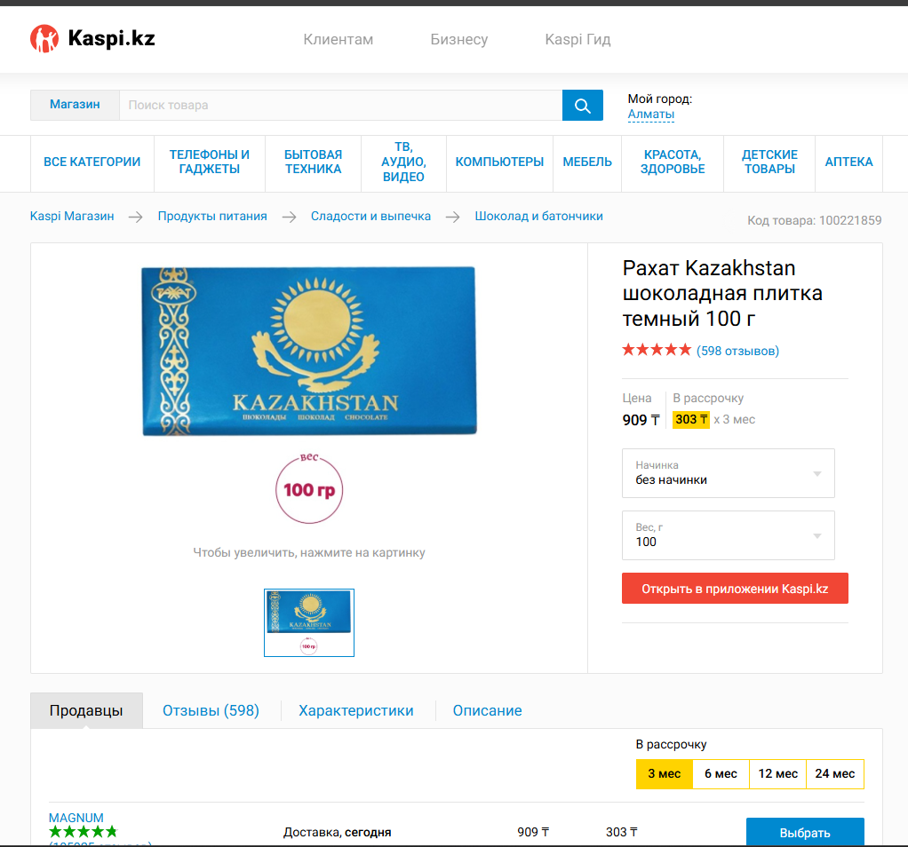

# 📦 Форматы данных: JSON и XML

В прошлом уроке данные ехали в теле запроса, и мы отложили вопрос: а в каком именно виде они там записаны? Почему нельзя просто «текстом»?

---

## В этом уроке

- Зачем вообще нужен **формат данных**, а не «просто текст»
- **JSON**: формат по умолчанию для современных API
- **XML**: старший брат, многословнее, но всё ещё живой
- Где XML правит: **SOAP**-сервисы, контракты **XSD** и **WSDL**
- Реальный кейс: **ШЭП** и **Smart Bridge**, как устроены госсервисы РК
- **YAML**: один абзац, просто узнавать в лицо

---

## Проблема: «просто текст» каждый поймёт по-своему

Клиент отправляет серверу данные о пользователе: имя Айгерим, возраст 25, активен. Если послать это как обычную строку `Айгерим 25 да`, сервер не поймёт, где имя, где возраст, где граница одного поля и начало другого. А если полей 50?

Обе стороны должны **одинаково** понимать структуру. Значит, нужен общий строгий формат записи: договорённость, как отделять одно поле от другого и как обозначить их названия. Таких форматов несколько, разберём два главных.

---

## JSON: формат по умолчанию

**JSON (JavaScript Object Notation)** это способ записать данные парами «ключ: значение». Он понятен и человеку (читается глазами), и машине (парсится однозначно). Сегодня это формат номер один для REST API.

```json
{
  "name": "Айгерим",
  "age": 25,
  "isActive": true
}
```

Слева ключ (`name`), справа значение (`"Айгерим"`). Теперь сервер точно знает: вот имя, вот возраст, вот флаг. Никаких догадок.

Значения бывают разных типов:

```json
{
  "name": "Айгерим",
  "age": 25,
  "isActive": true,
  "middleName": null,
  "roles": ["admin", "editor"],
  "address": { "city": "Алматы", "zip": "050000" }
}
```

- cтрока в кавычках (как в SQL)
- число без кавычек 
- `true`/`false`
- `null` (значения нет)
- массив в `[]`
- вложенный объект в `{}`
Этого набора хватает, чтобы описать почти что угодно.

> ❓ В JSON выше поле `age` записано как `25`, а `zip` как `"050000"`. Почему возраст без кавычек, а индекс в кавычках? Что будет с ведущим нулём, если записать индекс числом?
> **Ответ:** `age` это настоящее число, с ним считают, поэтому без кавычек. `zip` это не число, а строка из цифр, её не складывают. Если записать индекс числом `050000`, ведущий ноль отпадёт и останется `50000`: для числа `050000` и `50000` это одно и то же. То же с ИИН: он часто начинается с нуля, и как число `012345678901` превратится в `12345678901`, цифра потеряется. Всё, что начинается с нуля и не участвует в вычислениях (индекс, ИИН, телефон, номер счёта), пишут строкой в кавычках.

---

## JSON вживую: Kaspi

Всё, что вы видите на сайте, это уже разобранный JSON. Браузер отправил запрос, сервер вернул JSON, а красивые карточки товаров нарисовались из этих данных. Разберём на Kaspi.

**1. Каталог: список товаров по поиску «Шоколад».**


**2. Карточка одного товара.**



**3. Отзывы этого товара.**


*(Ниже допишем запрос и ответ для каждого экрана.)*

---

## XML: старший брат, многословнее

До JSON главным форматом обмена был **XML (eXtensible Markup Language)**. Те же данные, но каждое поле оборачивается в парный тег `<тег>значение</тег>`:

```xml
<user>
  <name>Айгерим</name>
  <age>25</age>
  <isActive>true</isActive>
</user>
```

Данные те же, что в JSON выше, но букв заметно больше: каждое поле пишется дважды (открывающий и закрывающий тег). Зато XML строже и умеет то, чего у JSON из коробки нет: пространства имён, атрибуты, и главное, проверку структуры по схеме (об этом ниже).

Простое правило выбора: новый REST API почти всегда **JSON**. Если вы видите **XML**, скорее всего перед вами что-то корпоративное или государственное, часто **SOAP**.

---

## XML живёт в SOAP: контракт заранее

**SOAP (Simple Object Access Protocol)** это строгий протокол обмена сообщениями, и он **всегда** использует XML. Вспомните из прошлого урока: REST это гибкий стиль, где многое на усмотрение разработчика. SOAP наоборот, это жёсткие рельсы, где всё описано заранее.

«Описано заранее» означает **контракт**: обе стороны договариваются о структуре ещё до первого запроса. В мире SOAP контракт состоит из двух частей:

- **XSD (XML Schema Definition)** это схема, которая задаёт структуру запроса и ответа: какие поля есть, какого они типа, какие обязательны. По сути «бланк с правилами заполнения» для XML.

> 📎 Именно такие контракты (структуру запроса и ответа) Smart Bridge и хранит: по одному на каждый сервис разных министерств и ведомств.

```xml
<xs:element name="age" type="xs:integer"/>
<xs:element name="name" type="xs:string"/>
```

Здесь схема заявляет: поле `age` обязано быть целым числом, `name` строкой. Пришлёте текст вместо числа в `age`, сервер отклонит запрос ещё до обработки: не по контракту.

- **WSDL (Web Services Description Language)** это описание самого сервиса: какие методы он предоставляет, что принимает на вход и что отдаёт. По сути это «меню» SOAP-сервиса в машинночитаемом виде.

> 📎 Аналогия для REST: WSDL это как **Swagger (OpenAPI)** в мире JSON.
---

## Кейс Казахстана: ШЭП и Smart Bridge

Это не абстракция: так работают все госуслуги РК. Когда вы через eGov заказываете справку, а банк проверяет вас в базе МВД, данные между организациями идут не напрямую, а через единый шлюз.

Зачем государству такой шлюз:

- **Единая точка обмена**: все госорганы интегрируются через один шлюз, а не строят сотни прямых связей друг с другом.
- **Единый формат и правила**: общий контракт и протокол для всех, чтобы системы понимали друг друга.
- **Безопасность и доверие**: проверяет, кто отправитель (логин/пароль, ЭЦП), и что данные не подменили.
- **Контроль и мониторинг**: все запросы идут через шлюз, поэтому обмен можно логировать и отслеживать.

Этот шлюз называется **ШЭП (Шлюз электронного правительства)**. Все госорганы общаются друг с другом через него, и формат обмена там **SOAP/XML**, а не REST/JSON.

Как сервис попадает в эту систему: министерство или организация пишет свой сервис, а потом регистрирует его в каталоге **Smart Bridge** (`sb.egov.kz`). Публикует туда контракт (**XSD** структуры и **WSDL** методов), и после этого другие организации берут этот контракт и подключаются к сервису.

Отдельный вопрос это **аутентификация**: как шлюз понимает, что запрос пришёл от настоящего банка, а не от мошенника. Здесь два механизма:

- **логин и пароль (API-ключи)** это базовый пропуск, кто вы вообще такой.
- **ЭЦП (электронная цифровая подпись)** это подпись каждого запроса. Она доказывает, что запрос действительно от этой организации и что его не подменили по дороге.

> 💡 Вывод для аналитика: если в задаче стоит интеграция с госсервисом РК, готовьтесь не к REST/JSON, а к SOAP + XML, контракту XSD из Smart Bridge и подписи ЭЦП на каждом запросе. Это другой мир, чем публичные REST API, и закладывать его в требования надо сразу.

---

## YAML: одним абзацем

Есть ещё формат **YAML**. Его вы встретите не в трафике между клиентом и сервером, а в **конфигах**: настройки приложений, описания пайплайнов, файлы вроде OpenAPI. Данные в нём задаются отступами, без скобок и тегов. Отдельный урок ему не нужен, достаточно узнавать в лицо: если файл читается как список с отступами и двоеточиями, это, скорее всего, YAML.

```yaml
name: Айгерим
age: 25
isActive: true
```

---

## 🧠 Module Check

> 💡 **1.** Своими словами: зачем вообще нужен формат данных (JSON или XML), почему нельзя слать «просто текст»?
> **Ответ:** Обе стороны должны одинаково понимать структуру: где какое поле, где его границы. Формат задаёт строгие правила записи (ключ-значение в JSON, теги в XML), чтобы сервер парсил данные однозначно, а не гадал.

> 💡 **2. Use-case.** Вы проектируете интеграцию с базой госоргана Казахстана через eGov. Какой формат и протокол вы закладываете в требования и почему?
> **Ответ:** SOAP + XML через ШЭП, с контрактом XSD/WSDL из Smart Bridge и подписью ЭЦП на каждом запросе. Госсервисы РК работают не на REST/JSON, а на этом стеке, заложить его надо сразу.

> 💡 **3. Spot the bug.** Разработчик присылает в SOAP-сервис вот такое поле:
> ```xml
> <age>двадцать пять</age>
> ```
> XSD-схема сервиса объявляет `age` как `xs:integer`. Что произойдёт и почему?
> **Ответ:** Сервер отклонит запрос ещё до обработки. XSD требует целое число, а пришёл текст, это нарушение контракта. В этом и смысл XSD: он ловит несоответствие структуры до того, как данные дойдут до логики.

> 💡 **4. Compare.** Чем XSD отличается от WSDL? По одному предложению.
> **Ответ:** XSD описывает **структуру данных** (какие поля, каких типов, в запросе и ответе). WSDL описывает **сам сервис** (какие методы он предоставляет, что принимает и отдаёт). XSD это «бланк полей», WSDL это «меню методов».

> 💡 **5. True / False + объясни.** «ЭЦП в ШЭП нужна просто чтобы залогиниться, как пароль».
> **Ответ:** False. Логин и пароль отвечают на вопрос «кто вы». ЭЦП идёт дальше: она подписывает **каждый запрос**, доказывая, что он от этой организации и что его не подменили по дороге. Это защита целостности, а не просто вход.

<!--
ИНСТРУКЦИЯ ПО ИМПОРТУ В NOTION:
1. Notion → Import → Markdown/CSV → выбрать этот файл
2. Вручную конвертировать:
   - Все "> ❓" → Callout блок (жёлтый)
   - Все "> 💡" в тексте → Callout блок (синий)
   - Все "> ⚠️" → Callout блок (красный)
   - Все "> 💡" в Module Check → Toggle блок (ответ скрыт)
3. Проверить, что код-блоки (JSON, XML, YAML) отобразились корректно
-->
