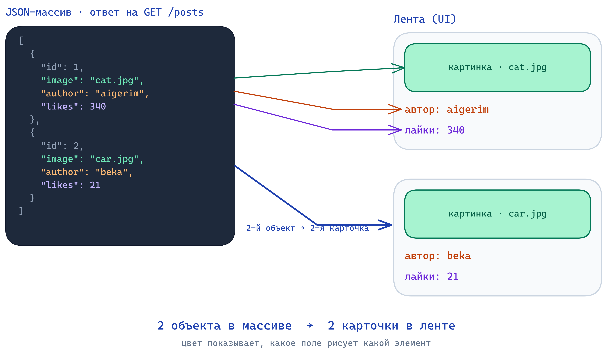
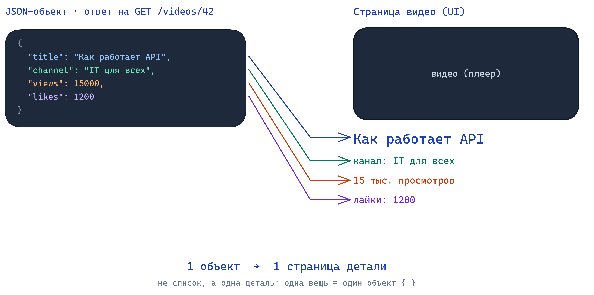
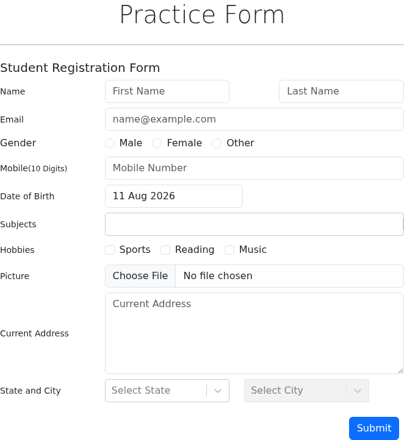
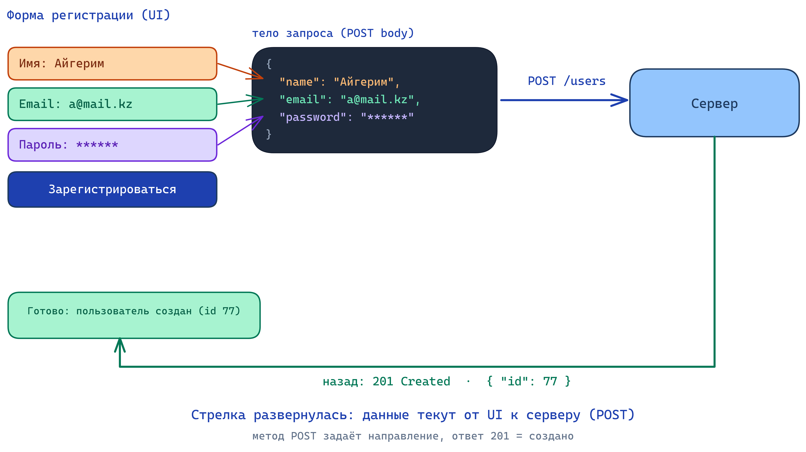

# 🖼️ Откуда страница берёт данные: endpoint → JSON → UI

Откройте YouTube. Заголовок видео, число просмотров, аватар канала, лента снизу. Браузер не хранит это у себя, страница по умолчанию пустая. Откуда тогда берётся всё, что вы видите на экране?

---

## В этом уроке

- Почему **Frontend** (витрина) по умолчанию пустой, а данные живут на сервере
- Главная мысль урока: **UI это JSON, нарисованный на экране**
- Сценарий 1: **список** (лента) приходит как JSON-массив, каждый объект это карточка
- Сценарий 2: **одна деталь** (страница видео) приходит как один JSON-объект
- Сценарий 3: **форма** разворачивает стрелку, данные текут от UI к серверу (`POST`)
- Коротко: лайк одной кнопкой, поиск с фильтрами, кнопка «Показать ещё»
- Как аналитику это помогает читать любой экран как «данные плюс шаблон»

---

## Проблема: витрина пустая, данные на сервере

Frontend это шаблон с пустыми местами: рамка под аватар, пустая строка под заголовок, сетка под ленту. Сам по себе он ничего не знает: ни вашего имени, ни числа лайков. Всё это лежит на сервере, далеко от браузера.

Значит, кто-то должен сходить на сервер, забрать данные и разложить их по пустым местам. В прошлых уроках вы уже видели обе половинки по отдельности: **запрос (Request)** по адресу (endpoint) из урока про HTTP, и **JSON** как формат данных из урока про форматы. Осталось соединить их в одну картину.

> ❓ Представьте, что вы делаете страницу профиля: имя, аватар, число подписчиков. Откуда фронтенд возьмёт эти три значения в момент, когда пользователь открыл страницу? Подумайте пару секунд, прежде чем читать дальше.

---

## Главная идея: UI это JSON, нарисованный на экране

Ответ на вопрос выше: фронтенд делает запрос на сервер, получает в ответ JSON и раскладывает его поля по местам на странице. Всё, что вы видите в приложении, это чьи-то поля из ответа сервера.

Схема одна и та же для любого экрана:

**запрос по endpoint → сервер отвечает JSON → фронтенд раскладывает поля по UI.**

Запомните это как мантру: **страница = данные + шаблон**. Шаблон рисует дизайнер и разработчик один раз, данные приходят свежие на каждый запрос. Поняв это, вы перестаёте бояться API: за каждым экраном стоит понятный JSON, который можно прочитать.

Дальше три сценария от простого к сложному. В каждом слева реальный экран, справа тот же экран как связка «JSON и UI».

---

## Сценарий 1: список приходит как массив

Начнём с ленты. Вот как выглядит настоящая лента карточек, которую вы листаете каждый день:

Проблема: карточек в ленте много, и они однотипные. Не будет же разработчик писать каждую карточку руками. Откуда фронтенд знает, сколько карточек рисовать и что писать в каждой?

Фронтенд делает один запрос за списком: `GET /posts` (метод `GET`, потому что мы только читаем, ничего не меняем). Сервер отвечает **массивом** объектов. Массив вы уже видели в уроке про форматы: это список в квадратных скобках `[ ]`, а каждый элемент внутри это отдельный объект `{ }`.

Посмотрите на схему: слева JSON-массив из двух объектов, справа две карточки ленты.

Один объект массива превращается в одну карточку. Поле `author` становится подписью карточки, `likes` числом лайков, `image` картинкой. Цвет стрелки показывает, какое поле куда попадает.

Отсюда главный вывод сценария: **длина массива это число карточек**. Два объекта в ответе дают две карточки. Сервер вернул сто объектов, вы увидите сто карточек. Добавили объект в массив, на странице появилась ещё одна карточка. Лента это буквально массив, нарисованный сверху вниз.

> ❓ Сервер на `GET /posts` вернул массив из 8 объектов. Сколько карточек увидит пользователь в ленте и почему? А если массив вернулся пустой `[ ]`?

---

## Сценарий 2: одна деталь приходит как объект

Теперь вы нажали на одну карточку и провалились на страницу видео. Вот она:

Проблема: здесь не список. Это одна конкретная деталь, у неё один заголовок, одно число просмотров, один канал. Массив из одного элемента выглядел бы странно. В каком виде сервер отдаёт **одну** вещь?

Фронтенд просит конкретный ресурс по id: `GET /videos/42` (дай видео с номером 42). В ответ приходит не массив, а **один объект** `{ }`. Это прямое следствие REST из урока про HTTP: `/videos` это список, `/videos/42` это один элемент списка.

Посмотрите на схему: слева один JSON-объект, справа страница видео. Каждое поле объекта уезжает на своё место.

Поле `title` становится крупным заголовком, `views` строкой «15 тыс. просмотров», `channel` именем под видео. Одна деталь это один заполненный шаблон страницы, а не список.

> ❓ Сравните с прошлым сценарием. Почему лента приходит как массив `[ ]`, а страница одного видео как объект `{ }`? Ответьте одной фразой про «список против детали».

---

## Сценарий 3: форма разворачивает стрелку

В первых двух сценариях данные текли в одну сторону: сервер → UI. Фронтенд просил, сервер отдавал, страница рисовалась. Но регистрация устроена наоборот.

Проблема: при регистрации на сервере ещё **нет** вашего аккаунта, брать нечего. Наоборот, это вы приносите новые данные серверу. Как данные попадают от пользователя обратно на сервер?

Здесь работает `POST` (создать новое), а не `GET`. Форма собирает то, что вы ввели, и упаковывает в JSON. Этот JSON едет в **теле (body)** запроса на сервер: `POST /users`. Метод и определяет направление: `GET` это «принеси мне», `POST` это «на, создай».

Посмотрите на схему: теперь стрелка развернулась. Поля формы собираются в тело запроса и уезжают вправо, на сервер. А обратно приходит короткий ответ.

Что отвечает сервер: `201 Created` (создано) и объект нового пользователя, теперь уже с полем `id`. Этот `id` и значит, что пользователь реально появился в базе. Код `201` из урока про статусы это сигнал фронтенду «всё прошло, показывай успех или веди на следующий экран».

> ❓ Пользователь заполнил форму и нажал «Зарегистрироваться», но интернет моргнул, и он нажал кнопку второй раз. Почему для `POST` это опаснее, чем для `GET`? Вспомните идемпотентность из урока про HTTP.

---

## Ещё три коротких сценария

Три ядра (список, деталь, форма) закрывают большинство экранов. Ниже три частых случая поверх той же идеи, коротко.

**Лайк одной кнопкой.** Серое сердечко стало красным, счётчик плюс один. Кажется, что поменялась только картинка, но под капотом ушёл запрос: `POST /videos/42/like` (поставить), `DELETE /videos/42/like` (убрать). UI меняется, потому что пришёл успешный ответ. Даже одно нажатие сердечка это HTTP-запрос.

**Поиск и фильтры.** То, что вы вводите в строку поиска и выбираете в фильтрах, становится **query-параметрами** в адресе: `GET /products?category=phones&sort=price&q=samsung`. Вспомните из урока про HTTP: path говорит, что за ресурс, query уточняет, как его отдать. Меняете фильтр, меняется endpoint, приходит другой массив, перерисовывается список.

**Кнопка «Показать ещё».** Лента не грузит всё сразу. Первый экран это `GET /posts?page=1`, кнопка «ещё» или прокрутка вниз шлёт `GET /posts?page=2`, и новые карточки дописываются снизу. Бесконечная лента это автоматические запросы следующих страниц по мере скролла.

---

## Типичная ошибка

Новичок думает, что страница «сама знает» свои данные, что текст и картинки как-то зашиты в неё. Из-за этого он не может ответить на простой рабочий вопрос: «а откуда возьмётся вот это число на экране?»

> ⚠️ Не путайте шаблон и данные. Всё, что меняется от пользователя к пользователю и от открытия к открытию (имя, лента, цена, счётчик), это **данные из ответа сервера**, а не часть страницы. Открывая любой экран, аналитик должен уметь назвать: какой это запрос, какой примерно JSON придёт и какое поле рисует какой элемент.

---

## 🧠 Module Check

> 💡 **1.** Своими словами: что значит фраза «UI это JSON, нарисованный на экране»? Опишите путь от открытия страницы до готового экрана.
> **Ответ:** Фронтенд по умолчанию пустой шаблон. При открытии он делает запрос по endpoint, сервер отвечает JSON, фронтенд раскладывает поля этого JSON по местам на странице. Всё видимое (имя, лайки, заголовок) это поля из ответа сервера. Схема: запрос → JSON → раскладка по UI.

> 💡 **2. Use-case.** Пользователь открывает страницу профиля: имя, аватар, число подписчиков. Какой метод и примерно какой endpoint дёрнет фронтенд и в каком виде (массив или объект) придёт ответ?
> **Ответ:** `GET /users/5` (или `/profile/5`), метод `GET`, потому что мы только читаем. Профиль это одна деталь, поэтому придёт один **объект** `{ }` с полями `name`, `avatar`, `followers`, а не массив.

> 💡 **3. Compare.** Почему лента приходит как массив `[ ]`, а страница одного видео как объект `{ }`? По одной фразе на каждое.
> **Ответ:** Лента это список однотипных элементов, а список в JSON это массив, где каждый объект = одна карточка. Страница видео это одна конкретная деталь, а одна вещь это один объект. Список → массив, деталь → объект (это же REST: `/videos` против `/videos/42`).

> 💡 **4. Spot the bug.** Разработчик, чтобы просто **показать** видео, делает запрос `POST /videos/42`. Что здесь не так и как правильно?
> **Ответ:** Показ это чтение, значит нужен `GET /videos/42`. `POST` означает «создать новое» и возит тело, для простого открытия страницы он неуместен. Направление перепутано: данные должны идти сервер → UI (`GET`), а не UI → сервер (`POST`).

> 💡 **5. True / False + объясни.** «Когда вы ставите лайк, никакой запрос на сервер не уходит, меняется только картинка на экране».
> **Ответ:** False. Смена цвета сердечка это лишь видимая часть. Под капотом уходит запрос (`POST /videos/42/like` или `DELETE`, чтобы убрать), сервер сохраняет лайк и отвечает успехом, и только поэтому счётчик держится после перезагрузки. Если бы менялась только картинка, лайк пропал бы при обновлении страницы.

<!--
ИНСТРУКЦИЯ ПО ИМПОРТУ В NOTION:
1. Notion → Import → Markdown/CSV → выбрать этот файл
2. Вручную конвертировать:
   - Все "> ❓" → Callout блок (жёлтый)
   - Все "> 💡" в тексте → Callout блок (синий)
   - Все "> ⚠️" → Callout блок (красный)
   - Все "> 💡" в Module Check → Toggle блок (ответ скрыт)
3. Картинки в assets/: диаграммы (01-03) и реальные скриншоты (scr-01..03). При импорте загрузить их вручную в соответствующие блоки
4. Проверить, что код-блоки и стрелки на диаграммах отобразились корректно
-->
</content>
</invoke>
