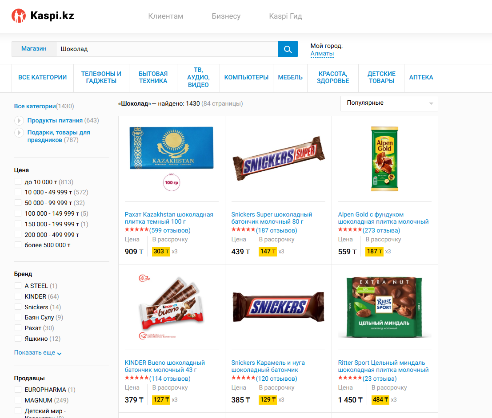
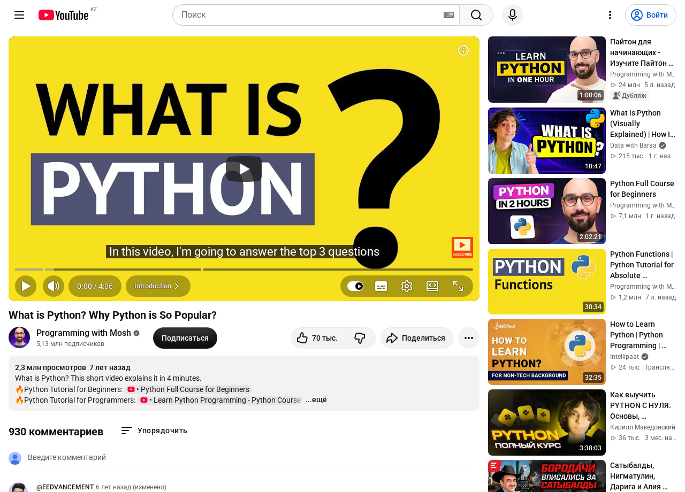
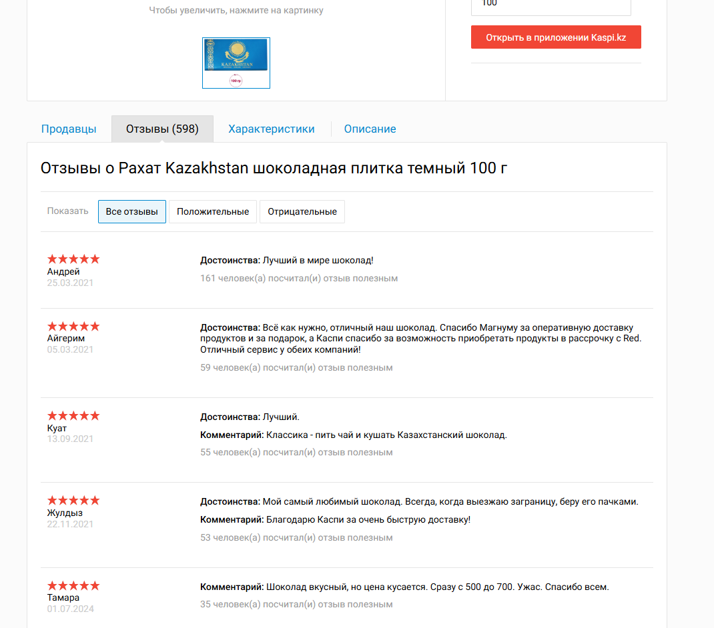
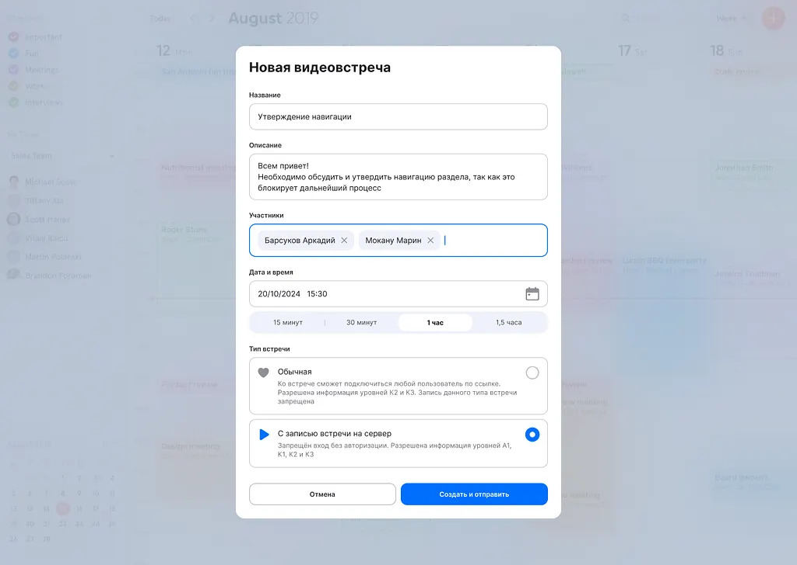

# 🖼️ Как Frontend получает данные от Backend через эндпойнты

**Endpoint** это конкретный адрес на сервере, по которому фронтенд забирает или отправляет данные (например `/products` или `/videos/42`). Вы уже знаете API и HTTP, теперь соберём всё вместе.

---

## В этом уроке

- Почему страница по умолчанию пустая, а данные живут на сервере
- Что такое **endpoint** и как фронтенд забирает по нему данные
- Как JSON с сервера превращается в то, что вы видите на экране
- Три формы данных: список (массив), деталь (объект), форма (`POST`)

---

## Проблема: витрина пустая, данные на сервере

Frontend это шаблон с пустыми местами:

- рамка под картинку или аватар
- пустая строка под заголовок или имя
- ячейка под цену, дату, счётчик

Сам по себе он ничего не знает: ни имени пользователя, ни его возраста, ни цены товара, ни числа лайков. Все эти данные лежат на сервере, далеко от браузера.

И главное: эти значения **нельзя вписать заранее**. Фронтенд-разработчик не знает, кто откроет страницу и что он введёт, какие товары появятся в каталоге через месяц. Поэтому он не пишет ваше имя руками в коде. Он делает один общий шаблон с пустым местом и говорит: «сюда подставь имя, которое пришлёт сервер».

Пример со страницей профиля. Разработчик никогда не видел ваших имени и фамилии, поэтому не вписывал их. Он оставил пустое поле и связал его: «показать здесь `name` из ответа сервера». Когда вы логинитесь, backend достаёт ваши данные из базы (БД) и отдаёт их фронтенду, а тот красиво раскладывает по шаблону. Один и тот же шаблон, но у каждого пользователя в нём своё имя.

Значит, кто-то должен сходить на сервер, забрать данные и разложить их по пустым местам. 

В прошлых уроках вы уже видели обе половинки по отдельности: **запрос (Request)** по адресу (endpoint) из урока про HTTP, и **JSON** как формат данных из урока про форматы. Осталось соединить их в одну картину, и она одна и та же для любого экрана:

**запрос по endpoint → сервер отвечает JSON → фронтенд раскладывает поля по UI.**

Запомните это как мантру: **страница = данные + шаблон**. Шаблон рисуют один раз, данные приходят свежие на каждый запрос. Всё, что вы видите в приложении, это чьи-то поля из ответа сервера. Поняв это, вы перестаёте бояться API: за каждым экраном стоит понятный JSON, который можно прочитать.

Дальше три сценария от простого к сложному. В каждом слева реальный экран, справа тот же экран как связка «JSON и UI».

---

## Сценарий 1: список приходит как массив

Начнём с **ленты (feed)**. Лента это вертикальный список однотипных карточек, который вы прокручиваете вниз. Видео на YouTube, посты в Instagram, товары в поиске Kaspi. Разное наполнение, но форма одна: карточка за карточкой.

Вот как выглядит настоящая лента карточек, которую вы листаете каждый день:


> ? карточек в ленте много. Откуда фронтенд знает, сколько карточек рисовать и что писать в каждой?

Фронтенд делает один запрос за списком: `GET /posts` 
*(метод `GET`, потому что мы только читаем, ничего не меняем).*

Сервер отвечает **массивом** объектов. 
Массив вы уже видели в уроке про форматы: это список в квадратных скобках `[ ]`, а каждый элемент внутри это отдельный объект `{ }`.

Для ленты со скриншота выше это выглядит так: вы искали «system analyst», фронтенд отправил запрос, а сервер вернул массив видео. Каждый объект в нём это одна карточка на экране:

```http
GET /search?q=system analyst
```

```json
[
  {
    "id": "aZ9k2xQ",
    "title": "Системный аналитик: что это за профессия?",
    "channel": "Группа IT-компаний Lad",
    "views": 103000,
    "publishedAt": "2021-06-14",
    "duration": "10:07",
    "thumbnail": "https://i.ytimg.com/vi/aZ9k2xQ/hq.jpg"
  },
  {
    "id": "bL7m4wP",
    "title": "Собеседование Junior Системный Аналитик | Компания HuntIT (2025)",
    "channel": "Vadim Novoselov",
    "views": 33000,
    "publishedAt": "2024-09-20",
    "duration": "26:12",
    "thumbnail": "https://i.ytimg.com/vi/bL7m4wP/hq.jpg"
  },
  {
    "id": "cQ3n8vR",
    "title": "Кто такой системный аналитик и как им стать?",
    "channel": "(Не)Системная аналитика by Андрей Царев",
    "views": 43000,
    "publishedAt": "2023-08-02",
    "duration": "14:35",
    "thumbnail": "https://i.ytimg.com/vi/cQ3n8vR/hq.jpg"
  }
]
```

Посмотрите на скриншот ленты ещё раз. Откуда взялись эти заголовки, названия каналов, числа просмотров? Фронтенд не знал их заранее, он взял каждое значение из объекта массива. Один объект это одна карточка, а его поля разъезжаются по местам шаблона:

- `thumbnail` → превью слева
- `title` → заголовок видео
- `channel` → имя канала под заголовком
- `views` → строка «103 тыс. просмотров»
- `duration` → метка времени в углу превью

Отсюда главный вывод сценария: **длина массива это число карточек**. Два объекта в ответе дают две карточки. Сервер вернул сто объектов, вы увидите сто карточек. Добавили объект в массив, на странице появилась ещё одна карточка. Лента это буквально массив, нарисованный сверху вниз.

И так на любом сайте, не только на YouTube. Возьмём Kaspi: ищете «Шоколад», видите сетку товаров. Это тот же список однотипных карточек:



Строка поиска и фильтры уезжают в query-параметры, а в ответ приходит **массив** товаров:

```http
GET /products?q=шоколад&sort=popular&page=1
```

```json
[
  {
    "id": 100221859,
    "title": "Рахат Kazakhstan шоколадная плитка темный 100 г",
    "price": 909,
    "installment": { "monthly": 303, "months": 3 },
    "rating": 5,
    "reviewsCount": 599
  },
  {
    "id": 100418822,
    "title": "Snickers Super шоколадный батончик молочный 80 г",
    "price": 439,
    "installment": { "monthly": 147, "months": 3 },
    "rating": 5,
    "reviewsCount": 187
  },
  {
    "id": 101259437,
    "title": "Alpen Gold с фундуком шоколадная плитка молочный",
    "price": 559,
    "installment": { "monthly": 187, "months": 3 },
    "rating": 5,
    "reviewsCount": 273
  },
  {
    "id": 100883104,
    "title": "KINDER Bueno шоколадный батончик молочный 43 г",
    "price": 379,
    "installment": { "monthly": 127, "months": 3 },
    "rating": 5,
    "reviewsCount": 114
  }
]
```

Те же поля разъезжаются по карточке:

- `title` → подпись карточки
- `price` → цена
- `installment.monthly` → жёлтая плашка рассрочки
- `reviewsCount` → число в скобках рядом со звёздами

Ровно та же логика, что и в ленте YouTube, только на настоящем магазине.

---

## Сценарий 2: одна деталь приходит как объект

Теперь вы нажали на одну карточку и провалились на страницу видео. Вот она:



Здесь не список. Это одна конкретная деталь, у неё один заголовок, одно число просмотров, один канал. Массив из одного элемента выглядел бы странно. В каком виде сервер отдаёт **одну** вещь?

Фронтенд просит конкретный ресурс по его id: `GET /videos/dQw4w9`.

Это прямое следствие REST из урока про HTTP: `/videos` это список, `/videos/dQw4w9` это один элемент списка. Поэтому в ответ приходит не массив, а **один объект** `{ }`:

```http
GET /videos/dQw4w9
```

```json
{
  "id": "dQw4w9",
  "title": "What is Python? Why Python is So Popular?",
  "channel": "Programming with Mosh",
  "subscribers": 5130000,
  "views": 2300000,
  "likes": 70000,
  "commentsCount": 930,
  "publishedAt": "2019-02-18",
  "duration": "4:06",
  "description": "What is Python? This short video explains it in 4 minutes."
}
```

Один объект это один заполненный шаблон страницы, а не список. Его поля разъезжаются по местам:

- `title` → крупный заголовок над видео
- `channel` → имя канала под видео
- `subscribers` → «5,13 млн подписчиков»
- `views` → «2,3 млн просмотров»
- `likes` → счётчик у сердечка «70 тыс.»
- `description` → текст в блоке описания

Вернёмся на Kaspi. Кликнули по «Рахат Kazakhstan» из каталога и провалились на страницу товара. Это одна конкретная деталь:


Фронтенд просит один товар по его `id` (тот самый `100221859` из массива каталога, он же виден на странице как «Код товара»). В ответ приходит не массив, а **один объект**:

```http
GET /products/100221859
```

```json
{
  "id": 100221859,
  "title": "Рахат Kazakhstan шоколадная плитка темный 100 г",
  "price": 909,
  "installment": { "monthly": 303, "months": 3 },
  "rating": 5,
  "reviewsCount": 598,
  "options": {
    "filling": ["без начинки"],
    "weight": [100]
  },
  "sellers": [
    {
      "name": "MAGNUM",
      "rating": 5,
      "price": 909,
      "delivery": "сегодня"
    }
  ]
}
```

Снова один объект, снова его поля разъезжаются по местам:

- `title` → крупный заголовок товара
- `price` → цена, `installment.monthly` → плашка рассрочки
- `options` → выпадающие списки «Начинка» и «Вес»
- `sellers` → таблица продавцов внизу (это массив, продавцов может быть много)

А теперь стык двух сценариев. Нажимаете на странице товара вкладку «Отзывы», и это снова **список**, то есть снова массив. 

Отзывы принадлежат конкретному товару, поэтому endpoint строится от него, это **вложенный ресурс** `/products/{product_id}/reviews`:



```http
GET /products/100221859/reviews?filter=all&page=1
```

```json
[
  {
    "author": "Андрей",
    "date": "2021-03-25",
    "rating": 5,
    "pros": "Лучший в мире шоколад!",
    "comment": null,
    "helpfulCount": 161
  },
  {
    "author": "Куат",
    "date": "2021-09-13",
    "rating": 5,
    "pros": "Лучший.",
    "comment": "Классика - пить чай и кушать Казахстанский шоколад.",
    "helpfulCount": 55
  }
]
```

Один объект массива это один блок отзыва:

- `author` → имя слева
- `date` → дата под именем
- `rating` → звёзды
- `pros` и `comment` → текст отзыва
- `helpfulCount` → серая строка «посчитали отзыв полезным»

---

## Сценарий 3: форма разворачивает стрелку

В первых двух сценариях данные текли в одну сторону: сервер → UI. Фронтенд просил, сервер отдавал, страница рисовалась. Но регистрация устроена наоборот.


При регистрации на сервере ещё **нет** вашего аккаунта, брать нечего. Наоборот, это вы приносите новые данные серверу. Как данные попадают от пользователя обратно на сервер?

Здесь работает `POST` (создать новое), а не `GET`. Форма собирает то, что вы ввели в поля, и упаковывает в JSON. Этот JSON едет в **теле (body)** запроса на сервер. Метод и определяет направление: `GET` это «принеси мне», `POST` это «на, создай».

Заполнили форму со скриншота (`Robert`, `Robert.Johnson@gmail.com`, пароль) и нажали «Start free trial». Уходит такой запрос, поля формы лежат в теле:

```http
POST /users
```

```json
{
  "fullName": "Robert",
  "email": "Robert.Johnson@gmail.com",
  "password": "MyStr0ng!Pass"
}
```

Обратите внимание: стрелка развернулась. В первых двух сценариях JSON приходил **от** сервера, здесь он уходит **к** серверу, в теле запроса.

В ответ сервер отдаёт короткий объект нового пользователя, но уже с полем `id` и без пароля:

```http
201 Created
```

```json
{
  "id": 84213,
  "fullName": "Robert",
  "email": "Robert.Johnson@gmail.com",
  "createdAt": "2026-08-11T09:20:00Z"
}
```

Разберём ответ:

- `201 Created` → статус «создано» (из урока про статусы), сигнал фронтенду «всё прошло, показывай успех или веди дальше»
- `id` → сервер присвоил новому пользователю номер, значит он реально появился в базе
- пароля в ответе **нет** → сервер никогда не возвращает пароль обратно, это база безопасности

Ещё один `POST`, посложнее. Форма создания видеовстречи: не два-три поля, а список участников, дата, длительность, тип встречи.



Принцип тот же: нажали «Создать и отправить», форма собрала все поля в JSON и отправила его в теле `POST`. Смотрите, как разные элементы формы становятся полями:

```http
POST /meetings
```

```json
{
  "title": "Утверждение навигации",
  "description": "Всем привет! Необходимо обсудить и утвердить навигацию раздела, так как это блокирует дальнейший процесс",
  "participants": [
    "Барсуков Аркадий",
    "Мокану Марин"
  ],
  "startAt": "2024-10-20T15:30:00Z",
  "durationMinutes": 60,
  "type": "recorded"
}
```

Обратите внимание, как UI превращается в JSON:

- текстовые поля «Название» и «Описание» → строки `title` и `description`
- добавленные участники (два тега) → **массив** `participants`, тег за тегом
- дата и время из календаря → одно поле `startAt`
- выбранная кнопка «1 час» → число `durationMinutes: 60` (не «1 час», а минуты, серверу так удобнее считать)
- переключатель «С записью встречи на сервер» → `type: "recorded"`

Ответ снова `201 Created` с объектом созданной встречи и её новым `id`. Разные формы, разные поля, но механика одна: собрать UI в тело и отправить `POST`.

---

## Ещё три коротких сценария

Три ядра (список, деталь, форма) закрывают большинство экранов. Ниже три частых случая поверх той же идеи, коротко.

**Лайк одной кнопкой.** Серое сердечко стало красным, счётчик плюс один. Кажется, что поменялась только картинка, но под капотом ушёл запрос: `POST /videos/42/like` (поставить), `DELETE /videos/42/like` (убрать). UI меняется, потому что пришёл успешный ответ. Даже одно нажатие сердечка это HTTP-запрос.

**Поиск и фильтры.** То, что вы вводите в строку поиска и выбираете в фильтрах, становится **query-параметрами** в адресе: `GET /products?category=phones&sort=price&q=samsung`. Вспомните из урока про HTTP: path говорит, что за ресурс, query уточняет, как его отдать. Меняете фильтр, меняется endpoint, приходит другой массив, перерисовывается список.

**Кнопка «Показать ещё».** Лента не грузит всё сразу. Первый экран это `GET /posts?page=1`, кнопка «ещё» или прокрутка вниз шлёт `GET /posts?page=2`, и новые карточки дописываются снизу. Бесконечная лента это автоматические запросы следующих страниц по мере скролла.

---

<!--
ИНСТРУКЦИЯ ПО ИМПОРТУ В NOTION:
1. Notion → Import → Markdown/CSV → выбрать этот файл
2. Вручную конвертировать:
   - Все "> ❓" → Callout блок (жёлтый)
   - Все "> 💡" в тексте → Callout блок (синий)
   - Все "> ⚠️" → Callout блок (красный)
   - Все "> 💡" в Module Check → Toggle блок (ответ скрыт)
3. Картинки в assets/: скриншоты YouTube (scr-01-feed, scr-02-video), Kaspi (scr-kaspi-catalog / product / reviews) и формы (scr-03-form регистрация, scr-04-meeting видеовстреча). При импорте загрузить их вручную в соответствующие блоки
4. Проверить, что код-блоки и стрелки на диаграммах отобразились корректно
-->
