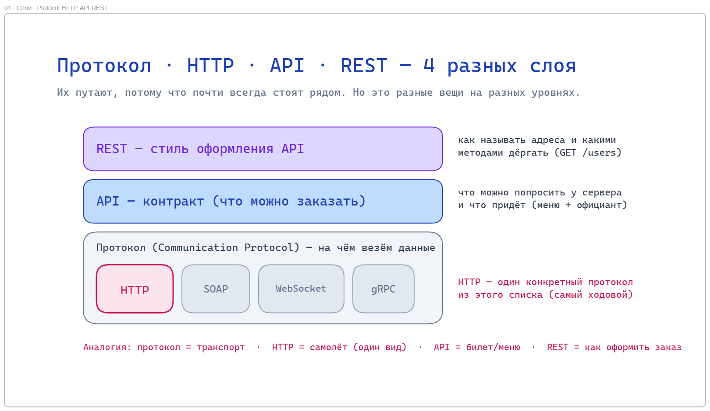
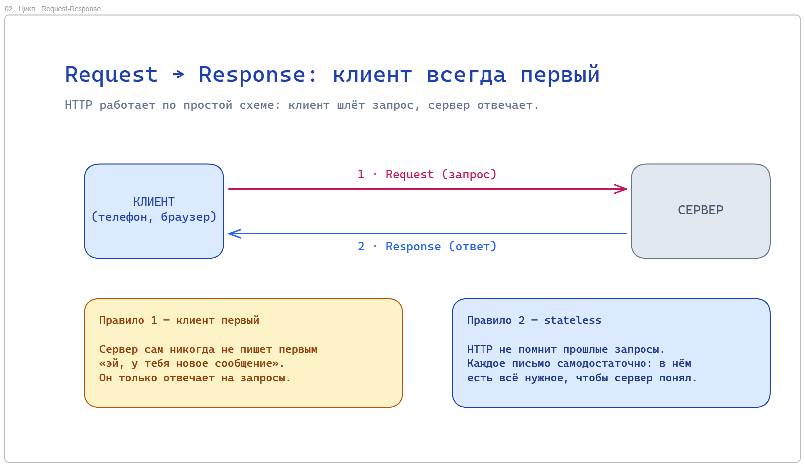
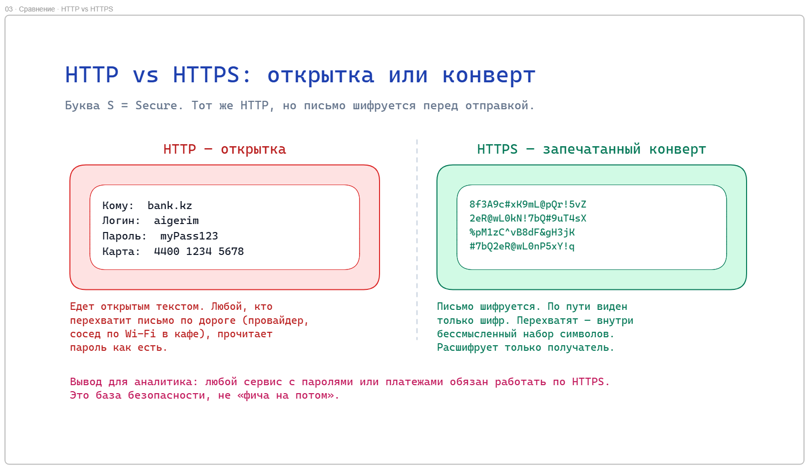
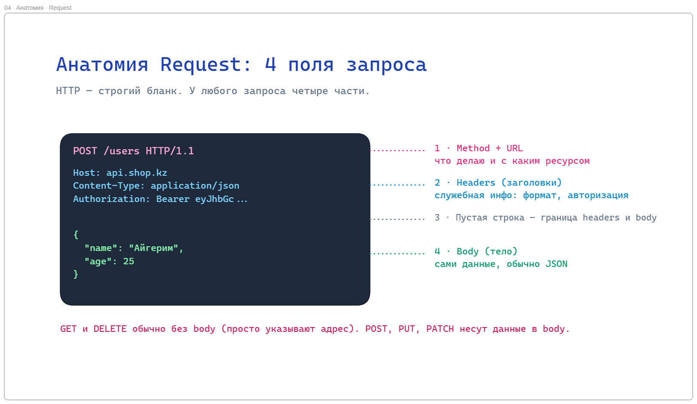
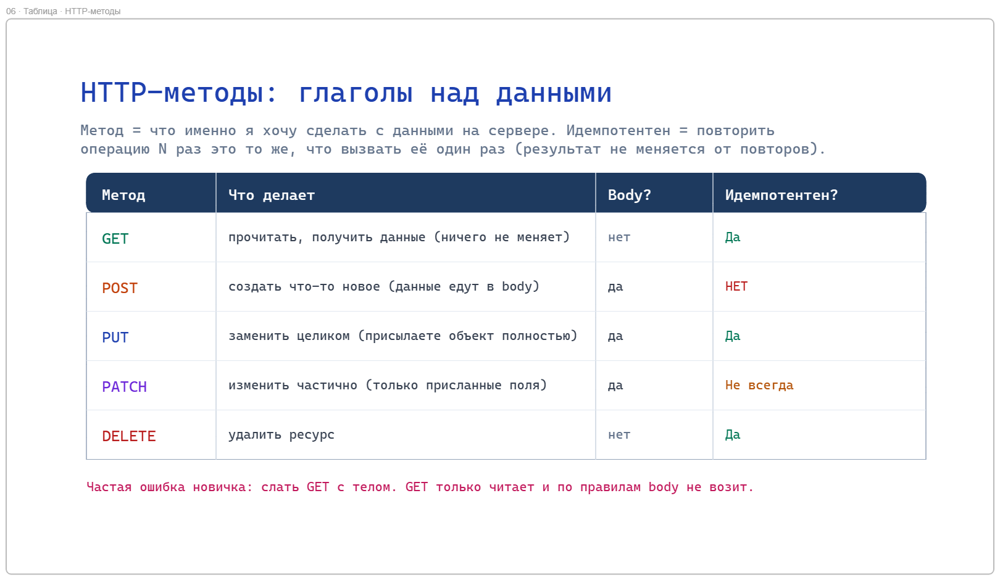
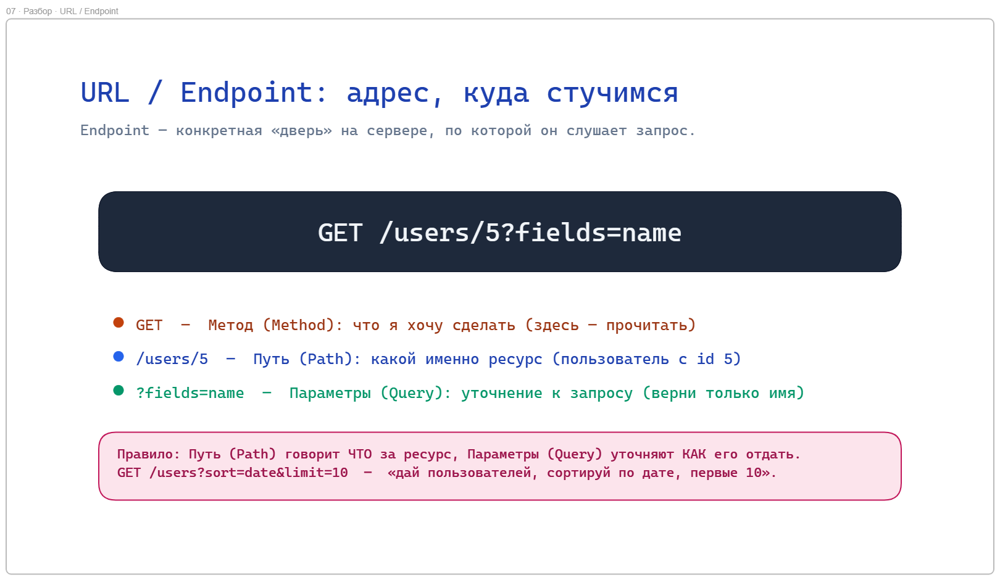
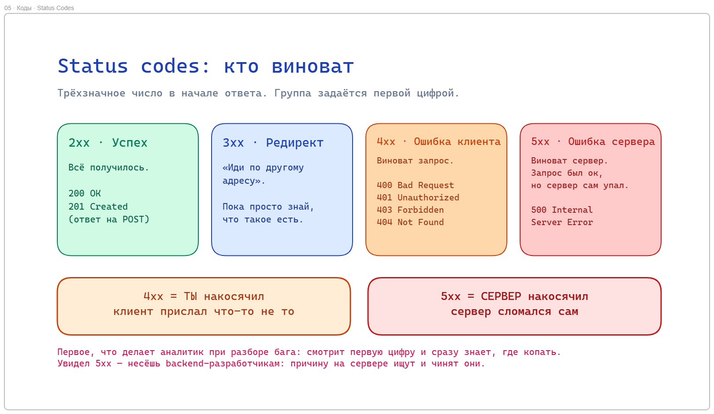
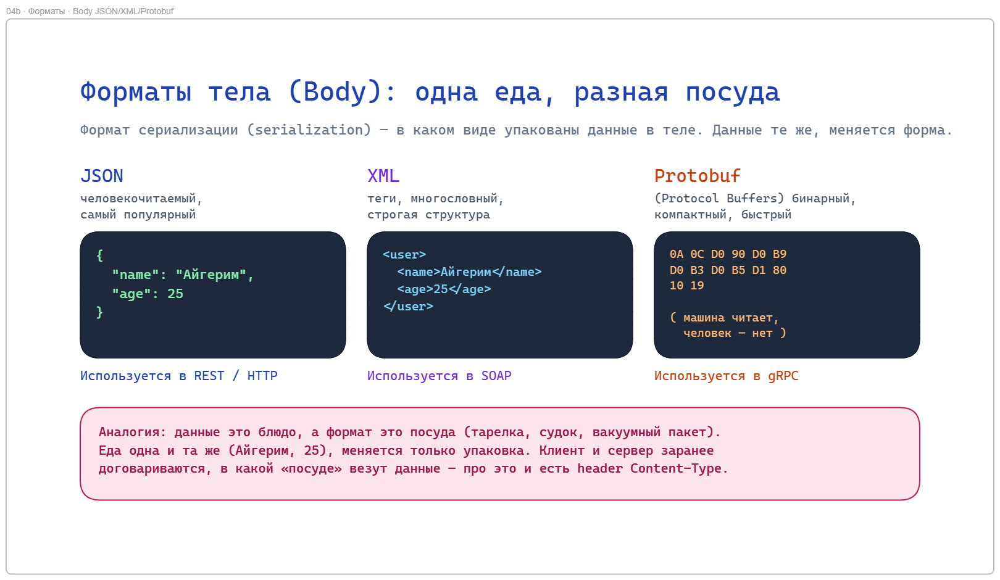
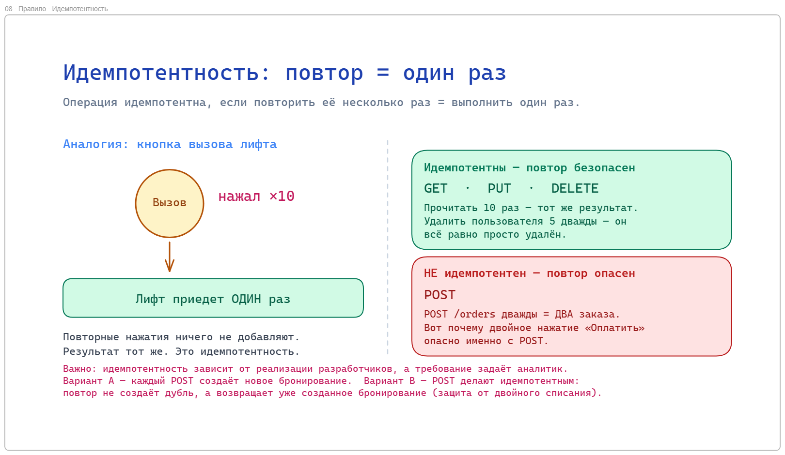

# 🌐 HTTP: как клиент и сервер реально разговаривают

Каждый раз, когда вы открываете сайт или листаете ленту, ваш телефон отправляет письмо по очень строгому шаблону, а сервер по такому же шаблону отвечает. Один и тот же формат письма держит почти весь интернет. Что это за формат и почему у него есть «брат» с буквой S на конце?

---

## В этом уроке

- Быстро вспомним, что такое **API**, и добавим одну мысль: способов доставки данных много, и один из них мы выбираем
- **Communication protocol (протокол связи)**: почему это как выбор транспорта (машина, поезд, самолёт)
- Раз и навсегда разложим по полочкам: **протокол vs API vs REST vs HTTP**
- **HTTP** и его брат **HTTPS**
- **Request и Response**: из чего состоит запрос и ответ
- Анатомия запроса: **метод, URL, headers, body**
- **HTTP-методы**: `GET`, `POST`, `PUT`, `PATCH`, `DELETE` (что каждый делает)
- **Status codes**: `2xx`, `4xx`, `5xx` и простое правило «кто виноват»
- **REST**: стиль, который превращает HTTP в удобный язык работы с данными
- Идемпотентность (idempotency): правило, по которому выбирают метод

---

## API это способ доставки данных

В прошлый раз мы разобрали, что система состоит из частей: **Frontend** (витрина), **Backend** (кухня), база данных (склад). И что общаются они через **API**, посредника с контрактом (официант + меню).

Добавим к этому одну простую мысль. У любого общения между системами есть цель: **переместить данные из точки A в точку B**. Телефон хочет получить баланс с сервера. Наш backend хочет получить паспорт из базы МВД. Данные надо как-то доставить.

А теперь представьте, что вам самим надо добраться из точки A в точку B. Вы же не телепортируетесь. Вы выбираете транспорт: пешком, на машине, на поезде, на самолёте. Цель одна (доехать), а способов много, и вы выбираете один под ситуацию.

С данными точно так же. Чтобы доставить запрос от клиента к серверу, systems выбирают один из **способов связи**. Эти способы называются **протоколы (Protocols)**. И сегодня мы разбираем самый популярный из них: **HTTP**.

> 💡 В прошлом уроке мы уже перечисляли протоколы: **REST, SOAP, WebSocket, gRPC, GraphQL**. Это как список видов транспорта. Сегодня садимся в самый ходовой из них.

---

## Протокол vs API vs REST vs HTTP: это НЕ синонимы



Прежде чем нырять в HTTP, закроем вопрос, на котором спотыкаются почти все. Студенты часто спрашивают: «API, REST, HTTP, протокол, это одно и то же, просто разные слова?»

Нет. Это разные вещи на разных уровнях. Их путают, потому что в жизни они почти всегда встречаются вместе. Разложим на нашей аналогии с доставкой.

> 💡 **Разложим по полочкам (запомните эту табличку):**
>
> - **Communication protocol (протокол связи)** это *правила транспорта*: как физически везём данные, в каком виде, по каким правилам. Примеры: **HTTP**, SOAP, WebSocket, gRPC. Это ответ на вопрос «на чём везём»: машина, поезд, самолёт.
>
> - **HTTP** это *один конкретный протокол* из списка выше. То есть один вид транспорта, самый популярный. HTTP относится к «протоколу» как «самолёт» относится к «транспорту».
>
> - **API** это *контракт*: что можно попросить у сервера и что придёт в ответ (меню + официант из прошлого урока). API едет **поверх** протокола. Меню не зависит от того, на чём вам привезли еду.
>
> - **REST** это *стиль оформления API* поверх HTTP: набор соглашений, как называть адреса и какими методами дёргать (`GET /users`, `DELETE /users/5`). Это не протокол и не транспорт, это «правила хорошего тона» для API.

Ещё короче, одной фразой каждое:

- **Протокол** = на чём везём.
- **HTTP** = конкретный транспорт (самый ходовой).
- **API** = что именно можно заказать (контракт).
- **REST** = как аккуратно оформить этот заказ.

> ⚠️ Почему их путают? Потому что в 80% случаев всё это стоит рядом: у сервиса есть **API**, оформленный в стиле **REST**, который ездит по протоколу **HTTP**. Три разных слоя, но вы видите их вместе, вот и кажется, что это синонимы. Как «самолёт», «билет» и «рейс»: связаны, но не одно и то же.

---

## Проблема: между клиентом и сервером нет живого диалога

Вернёмся к HTTP. Телефон в руке (клиент) и сервер где-то далеко. Между ними нельзя «просто поговорить»: сервер не человек, он не поймёт «эй, дай мой баланс».

Значит, нужен **строгий шаблон письма**. Клиент обязан оформить запрос по чётким правилам, а сервер по таким же чётким правилам ответить. Если каждый будет писать как попало, никто никого не поймёт.

Вот этот строгий шаблон и есть **HTTP**.

---

## HTTP это формат письма (запрос → ответ)



**HTTP (HyperText Transfer Protocol)** это протокол, по которому клиент и сервер обмениваются сообщениями. Работает он по простой схеме, которую называют **request-response (запрос-ответ)**:

1. Клиент отправляет **запрос (Request)**.
2. Сервер обрабатывает и отправляет **ответ (Response)**.

И два важных правила, которые надо запомнить сразу:

**Первым всегда начинает клиент.** Сервер сам по себе молчит, он только отвечает на запросы. Сервер никогда не пишет вам первым «эй, у тебя тут новое сообщение». 
*(Как это обходят для уведомлений где сервер должен первым начать общение, разберём в уроке про WebSocket.)*

**Каждое письмо самодостаточно (stateless).** HTTP не помнит прошлые запросы. Каждый запрос это отдельное письмо, в котором должно быть всё нужное, чтобы сервер его понял. Сервер не держит в голове, что вы просили минуту назад.

> 💡 Аналогия: HTTP это как почтовое отправление со строгими полями. Есть шаблон бланка, куда что писать: кому, что хочу, вложение. Заполнил бланк по правилам, отправил, получил ответ таким же бланком. Почта не помнит ваши прошлые письма, каждое обрабатывается само по себе.

---

## HTTPS: тот же HTTP, но в запечатанном конверте



У HTTP есть брат: **HTTPS**. Буква S в конце значит **Secure (защищённый)**. Разберём через проблему.

Обычный HTTP отправляет письмо **открытым текстом**. Ваш пароль, номер карты, сообщения, всё едет так, что любой, кто перехватит письмо по дороге (провайдер, взломщик в кафе через Wi-Fi), прочитает его как есть.

> ❓ Вы вводите пароль от Kaspi на сайте, который работает по обычному HTTP (без S). 
> Что физически мешает человеку, сидящему с вами в одной кофейне на общем Wi-Fi, увидеть ваш пароль? Подумайте пару секунд.

Ничего не мешает. Именно в этом проблема. Поэтому придумали HTTPS: тот же HTTP, но письмо **шифруется (encryption)** перед отправкой.

> 💡 Аналогия (её используют повсеместно): **HTTP это открытка, HTTPS это запечатанный конверт.**
> Открытку (HTTP) читает любой почтальон по дороге. Конверт (HTTPS) непрозрачный, по пути видно только шифр вроде `xK9#mL@pQr!5`, а расшифровать и прочитать может только получатель. Даже если письмо перехватят, внутри бессмысленный набор символов.

Что это даёт: пароли, номера карт, личные данные защищены в пути. Поэтому сегодня **весь нормальный интернет работает на HTTPS**, а браузер показывает замочек в адресной строке. Обычный HTTP без шифрования для реальных сервисов уже не используют.

> 💡 Для аналитика вывод простой: любой сервис, который принимает пароли или платежи, обязан работать по HTTPS. Это не «фича на потом», это база безопасности. HTTP без S для боевой системы это дыра.

---

## Анатомия запроса: из чего состоит Request



Раз HTTP это строгий бланк, посмотрим, какие поля в нём есть. У любого запроса четыре части:

1. **Метод (Method)** = что вы хотите сделать (прочитать? создать? удалить?).
2. **URL** = адрес, у кого/чего вы это просите.
3. **Headers (заголовки)** = служебная информация о письме (кто шлёт, в каком формате данные, авторизация).
4. **Body (тело)** = сами данные, которые вы отправляете (не всегда есть).

Разберём каждую часть отдельно. Дальше урок пойдёт именно по этим четырём полям.

---

## HTTP-методы: глаголы, что делаем с данными



Первое поле запроса это **метод**. Метод отвечает на вопрос: *что именно я хочу сделать* с данными на сервере. Это глаголы.

Заход через проблему: а зачем вообще нужно 5 разных методов? Нельзя всё слать одним? Технически можно. Но представьте посылку без пометки, «доставить» там или «забрать». Курьер не поймёт намерение. Метод это и есть такая пометка намерения: сервер, кэш и другой разработчик сразу видят, что вы хотите сделать.

Вот основные (это и есть «ядро», которое надо знать):

- **`GET`** = прочитать, получить данные. **Ничего не меняет** на сервере. `GET /users/5` = «дай мне пользователя 5».
- **`POST`** = создать что-то новое. `POST /users` = «создай нового пользователя» (данные едут в body).
- **`PUT`** = заменить целиком. Присылаете объект полностью, он перезаписывает старый.
- **`PATCH`** = изменить частично. Присылаете только те поля, что меняются.
- **`DELETE`** = удалить. `DELETE /users/5` = «удали пользователя 5».

> 💡 Мнемоника: методы это как действия с записью в блокноте. `GET` прочитать, `POST` дописать новую, `PUT`/`PATCH` исправить существующую, `DELETE` вычеркнуть.

> ❓ **Compare.** Чем `PUT` отличается от `PATCH`? Одним предложением каждый.
>
> **Ответ:** `PUT` заменяет объект **целиком** (что не прислали, то затрётся/обнулится). `PATCH` меняет **только присланные поля**, остальное не трогает. Хотите поменять один email у пользователя, логичнее `PATCH`; хотите полностью перезаписать профиль, `PUT`.

> ⚠️ Частая ошибка новичка: слать `GET` с телом, чтобы «передать данные». `GET` предназначен только для чтения и по правилам тело не возит. Нужно передать данные на сервер? Это `POST` (или `PUT`/`PATCH`).

---

## URL / Endpoint: адрес, куда стучимся



Второе поле это **URL**, адрес ресурса. Конкретную «дверь» на сервере, по которой он слушает запрос, называют **endpoint (эндпоинт)**.

Разберём на примере: `GET /users/5?fields=name`

- `/users/5` это **path (путь)**: какой именно ресурс. Здесь «пользователь с id 5».
- `?fields=name` это **query-параметры**: уточнения к запросу после знака `?`. Здесь «верни только имя».

Простое правило: **path говорит, ЧТО за ресурс, а query уточняет КАК его отдать** (отфильтровать, отсортировать, сколько штук). `GET /users?sort=date&limit=10` = «дай пользователей, отсортируй по дате, только первые 10».

> ❓ **Design mini-task.** Придумайте endpoint для «получить список товаров в категории `phones`, отсортированных по цене». Метод + путь + query.
>
> **Ответ (один из вариантов):** `GET /products?category=phones&sort=price`. Метод `GET` (читаем, ничего не меняем), путь `/products` (ресурс = товары), query уточняет категорию и сортировку.

---

## Status codes: ответ сервера и правило «кто виноват»



Клиент отправил запрос. Сервер отвечает, и в начале ответа стоит **status code (код ответа)**, трёхзначное число. Оно коротко говорит, чем всё кончилось: получилось или нет, и если нет, то по чьей вине.

Проблема, которую они решают: без кода клиенту пришлось бы гадать по тексту ответа, всё ли ок. Число даёт мгновенный однозначный сигнал.

Коды делятся на группы по **первой цифре**. Вот всё, что нужно на старте:

- **`2xx` = успех.** Всё получилось. `200 OK` (ок), `201 Created` (создано, обычно ответ на `POST`).
- **`3xx` = редирект.** «Иди по другому адресу». (Пока просто знайте, что есть.)
- **`4xx` = ошибка клиента. Виноваты ВЫ (запрос).** Прислали кривой запрос, не туда, без прав.
- **`5xx` = ошибка сервера. Виноват СЕРВЕР.** Запрос был нормальный, но сервер сам сломался.

> 💡 **Главная мнемоника, запомните её:** смотрите на первую цифру ошибки.
> **`4xx` = «ты накосячил»** (клиент прислал что-то не то).
> **`5xx` = «сервер накосячил»** (сервер сломался сам).
> Это первое, что делает любой разработчик и аналитик при разборе бага: смотрит первую цифру и сразу знает, где копать: в запросе или на сервере.

Ядро конкретных кодов, которые встретите постоянно:

- `200 OK` : успех.
- `201 Created` : успешно создано (ответ на `POST`).
- `400 Bad Request` : кривой запрос (сервер не понял).
- `401 Unauthorized` : вы не авторизованы (нет/протух токен). По сути «кто ты?».
- `403 Forbidden` : мы знаем, кто вы, но вам сюда нельзя. По сути «тебе нельзя».
- `404 Not Found` : ресурс не найден (нет такого адреса или объекта).
- `500 Internal Server Error` : сервер сломался (упал код на сервере).

> ❓ **Spot the bug / разбор.** Пользователь жалуется: «нажимаю Оплатить, вылезает ошибка `500`». Куда смотреть в первую очередь: во frontend (запрос) или в backend (сервер)? Почему?
>
> **Ответ:** В backend. `5xx` = вина сервера, значит запрос дошёл нормально, но сервер упал при обработке (например, ошибка в коде или база не ответила). Если бы было `400` или `404`, тогда копали бы в сторону запроса (frontend прислал что-то не то). Первая цифра сразу направила поиск.

> 💡 Разница `401` vs `403`, которую путают: `401` = «я не знаю, кто ты» (не залогинен). `403` = «я знаю, кто ты, но тебе сюда нельзя» (не хватает прав). Первое лечится входом, второе нет.

---

## Headers: служебная информация о письме

Третье поле это **headers (заголовки)**. Это метаданные письма: данные о самих данных, а не сам заказ.

Заход через проблему: сервер получил тело запроса, набор байтов. Но как он поймёт, что это? JSON? Картинка? На каком языке? И кто вообще прислал, есть ли у него право? Сам body этого не говорит. Об этом и договариваются в headers.

Самые ходовые:

- **`Content-Type`** : в каком формате едет тело. `Content-Type: application/json` = «внутри JSON».
- **`Authorization`** : кто вы и есть ли право. Обычно везёт токен (пропуск), по которому сервер узнаёт пользователя.
- **`Accept`** : в каком формате вы **хотите** получить ответ.

> 💡 Аналогия: если body это посылка, то headers это наклейка на коробке: «хрупкое», «еда, хранить в холоде», «от кого». Курьеру важна и посылка, и наклейка, иначе он не поймёт, как с ней обращаться.

> ❓ Сервер получил `POST` с телом, но не смог его разобрать и вернул ошибку. Какой header стоит проверить в первую очередь и почему?
>
> **Ответ:** `Content-Type`. Если клиент прислал JSON, но не указал `Content-Type: application/json` (или указал неверный), сервер попробует разобрать тело не как JSON и споткнётся. Наклейка на коробке не совпала с содержимым.

---

## Body: где едут сами данные (обычно JSON)



Четвёртое поле это **body (тело)**, сами данные запроса или ответа. Именно тут лежит содержательная часть: какого пользователя создать, какие поля обновить.

Не у каждого запроса есть тело. `GET` и `DELETE` обычно **без тела** (они просто указывают адрес). А `POST`, `PUT`, `PATCH` **с телом** (они несут данные для создания/изменения).

В каком виде пишут данные в теле? Чаще всего в формате **JSON (JavaScript Object Notation)**. Это способ записать данные парами «ключ: значение», понятный и человеку, и машине:

```json
{
  "name": "Айгерим",
  "age": 25,
  "isActive": true
}
```

Почему именно JSON, а не «просто текст»? Потому что и клиент, и сервер должны **одинаково** понять, где имя, где возраст, где граница одного поля и начало другого. JSON это как раз общий строгий формат для этого. Детально JSON разберём отдельным уроком, пока достаточно узнавать его в лицо.

> ❓ **Spot the bug.** Разработчик пишет: `GET /users` и кладёт в тело `{"id": 5}`, чтобы получить пользователя 5. Что не так и как правильно?
>
> **Ответ:** `GET` не должен возить тело, его игнорируют. Идентификатор ресурса передают **в адресе**, а не в теле. Правильно: `GET /users/5` (id в пути) или `GET /users?id=5` (в query). Тело для `GET` это ошибка проектирования.

---

## REST: стиль, который наводит порядок в API

Мы разобрали кирпичики HTTP: методы, адреса, коды, тело. Но HTTP сам по себе не диктует, **как красиво их сложить**. Один разработчик назовёт адрес `/getUser`, другой `/user/fetch`, третий `/data?action=user`. Хаос: каждый API устроен по-своему, и в каждом надо разбираться заново.

**REST (Representational State Transfer)** это набор соглашений, как наводить в этом порядок. Не протокол, не транспорт, а **стиль оформления API поверх HTTP**. Главная идея REST:

**Всё это ресурс (существительное), а метод это действие над ним (глагол).**

Смотрите, как это упрощает жизнь. Вместо десятка выдуманных названий: один ресурс `/users` и стандартные методы:

- `GET /users` : получить список пользователей
- `GET /users/5` : получить пользователя 5
- `POST /users` : создать пользователя
- `PATCH /users/5` : изменить пользователя 5
- `DELETE /users/5` : удалить пользователя 5

Один адрес (`/users`), а что с ним делать, говорит метод. Зная REST, вы открываете **любой** REST API и уже примерно понимаете, как он устроен. Это и есть ценность соглашения: общий язык вместо «у каждого свой велосипед».

> 💡 Связка с прошлым уроком: REST это способ аккуратно записать **контракт** (меню). Меню в стиле REST предсказуемо: блюда это существительные (ресурсы), а «принести/убрать/заменить» это стандартные действия. Не надо каждый раз изобретать новое меню.

> ❓ **True / False + объясни:** «REST это протокол, конкурент HTTP».
>
> **Ответ:** False. HTTP это протокол (транспорт). REST это стиль оформления API, который **работает поверх** HTTP, а не вместо него. Они не конкуренты, а разные слои: REST едет на HTTP, как груз едет на самолёте.

---

## Идемпотентность: правило, по которому выбирают метод



Последнее на сегодня, снова через проблему. Представьте: вы нажали «Оплатить», но интернет моргнул, и вы не поняли, дошёл запрос или нет. Нажимаете ещё раз. Спишут ли деньги дважды?

Ответ зависит от **идемпотентности (idempotency)** операции.

**Операция идемпотентна, если повторить её несколько раз это то же самое, что выполнить один раз.** Результат не меняется от повторов.

> 💡 Аналогия (классическая): **кнопка вызова лифта.** Нажали один раз, лифт едет. Нажали ещё десять раз, пока ждёте, лифт всё равно приедет один. Повторные нажатия ничего не добавляют. Это идемпотентность.

Как это раскладывается по методам:

- **`GET`, `PUT`, `DELETE` идемпотентны.** Прочитать пользователя 10 раз, результат тот же. Удалить пользователя 5 дважды, он всё равно просто удалён. Заменить объект целиком дважды тем же телом, итог одинаков.
- **`POST` НЕ идемпотентен.** `POST /orders` дважды создаст **два заказа**. Вот почему двойное нажатие «Оплатить» опасно именно с `POST`.

> ⚠️ Почему это важно аналитику и разработчику: в реальной сети запросы теряются и повторяются постоянно. Идемпотентные операции можно **безопасно повторить** при сбое. А неидемпотентные (`POST` на оплату/заказ) требуют защиты от дублей, иначе клиент заплатит дважды. Это прямое требование, которое аналитик обязан заложить.

> ❓ **Use-case.** Пользователь оформляет заказ, нажимает «Купить», кружок крутится, ничего не происходит, он нажимает ещё раз. Какой риск и как метод с этим связан?
>
> **Ответ:** Риск в двойном заказе/списании. Создание заказа это `POST`, а он **не идемпотентен**: два запроса = два заказа. Поэтому такие операции защищают от повторов (например, уникальный ключ запроса на стороне сервера), чтобы повтор не создал дубль.

---

## Module Check

> 💡 **1.** Своими словами: чем отличаются **протокол**, **API**, **REST** и **HTTP**? По одной фразе на каждое.
> **Ответ:** Протокол = способ доставки данных (на чём везём). HTTP = один конкретный протокол, самый ходовой. API = контракт, что можно попросить и что придёт. REST = стиль оформления API поверх HTTP. Разные слои, не синонимы: у сервиса есть API в стиле REST, который ездит по HTTP.

> 💡 **2. Use-case.** Пользователь заполнил форму регистрации и нажал «Зарегистрироваться». Данные надо отправить на сервер и создать нового пользователя. Какой HTTP-метод и почему?
> **Ответ:** `POST`. Мы **создаём** новый ресурс (пользователя) и **отправляем данные** в теле запроса. `GET` не подходит (он только читает и не возит тело), `PUT`/`PATCH` про изменение существующего.

> 💡 **3. Spot the bug.** Разработчик делает `GET /deleteUser?id=5`, чтобы удалить пользователя. Что здесь не так по духу HTTP и REST?
> **Ответ:** Две ошибки. Первая: удаление это `GET`, а `GET` не должен ничего менять (только читать). Вторая: `deleteUser` это глагол в адресе, против REST (адрес = существительное-ресурс, действие = метод). Правильно: `DELETE /users/5`.

> 💡 **4.** Сервер вернул `500`. Кто, скорее всего, виноват и куда смотреть в первую очередь? А если бы вернул `404`?
> **Ответ:** `500` = вина **сервера**, запрос дошёл, но сервер сломался при обработке (смотреть в backend/логи сервера). `404` = ресурс не найден, ближе к стороне клиента/запроса (неверный адрес или объекта нет). Первая цифра сразу говорит, где копать: `4xx` = ты, `5xx` = сервер.

> 💡 **5. Compare.** Чем `PUT` отличается от `PATCH`? И какой из них идемпотентен?
> **Ответ:** `PUT` заменяет ресурс **целиком** (непереданные поля затираются), `PATCH` меняет **только присланные поля**. `PUT` идемпотентен (повтор тем же телом даёт тот же результат), а `PATCH` не всегда (например, «прибавь 5 к балансу» при повторе даст другой итог).

> 💡 **6.** Сайт принимает пароли по обычному `HTTP` (без S). В чём опасность и что нужно вместо этого?
> **Ответ:** По HTTP данные едут открытым текстом (как открытка), любой, кто перехватит трафик, прочитает пароль. Нужен **HTTPS**: то же самое, но письмо шифруется (запечатанный конверт), и по пути виден только нечитаемый шифр. Любой сервис с паролями/платежами обязан работать по HTTPS.

> 💡 **7. Design mini-task.** Спроектируйте 3 endpoint для каталога товаров: получить список, получить один товар, создать товар. Метод + путь для каждого.
> **Ответ (один из вариантов):** `GET /products` (список), `GET /products/5` (один товар по id), `POST /products` (создать, данные в теле). Ресурс один (`/products`), действие задаёт метод, это и есть REST-стиль.

<!--
ИНСТРУКЦИЯ ПО ИМПОРТУ В NOTION:
1. Notion → Import → Markdown/CSV → выбрать этот файл
2. Вручную конвертировать:
   - Все "> ❓" → Callout блок (жёлтый)
   - Все "> 💡" в тексте → Callout блок (синий)
   - Все "> ⚠️" → Callout блок (красный)
   - Все "> 💡" в Module Check → Toggle блок (ответ скрыт)
3. Картинки в assets/ (01-09 .png) готовы, экспортированы из http-visuals.excalidraw. При импорте загрузить их вручную в соответствующие блоки
4. Проверить, что код-блоки (JSON) отобразились корректно
-->
