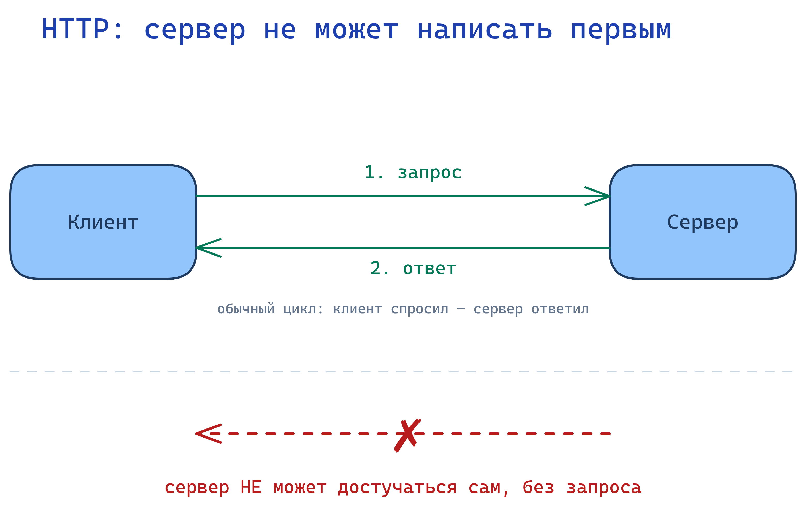
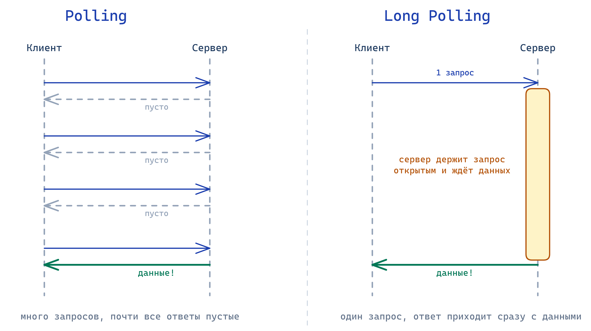
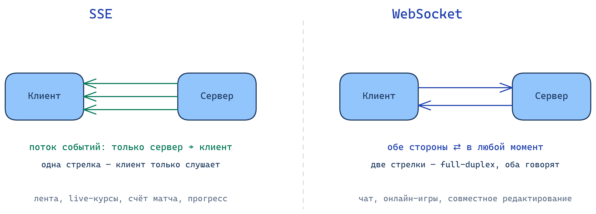

# ⚡ Real-time протоколы: как сервер пишет первым

В уроке про HTTP было железное правило: первым всегда начинает клиент, сервер только отвечает. Но чат показывает сообщение сам, Kaspi присылает пуш о зачислении, табло цен обновляется без перезагрузки. Если сервер не может написать первым, то как всё это работает?

---

## В этом уроке

- Почему обычный HTTP **не умеет** сам присылать данные
- **Polling**: наивное решение и почему оно расточительно
- **Long Polling**: сервер держит запрос открытым
- **SSE (Server-Sent Events)**: сервер льёт поток в одну сторону
- **WebSocket**: оба говорят в обе стороны
- Таблица «когда что выбирать» и вывод для аналитика

---

## Проблема: HTTP не умеет присылать данные сам

Посмотрите на схему выше. Зелёная стрелка это обычный HTTP: клиент спросил, сервер ответил, всё как мы разбирали. А красная перечёркнутая стрелка это то, чего HTTP **не позволяет**: сервер не может по своей инициативе достучаться до клиента.

Причина в самой природе HTTP. Соединение живёт ровно на один цикл «запрос-ответ» и закрывается. Между запросами связи нет: серверу физически некуда «постучаться», он не знает, где вы и открыто ли у вас приложение.

Вот в чём боль. Новое сообщение в чате появилось на сервере **сейчас**, но клиент об этом не узнает, пока сам не спросит. А спрашивать он по правилам HTTP должен первым. Как получить «свежие» данные, если инициировать может только клиент? Дальше четыре способа обойти это ограничение, от простого к мощному.

---

## Polling: спрашивать снова и снова

Самое очевидное решение в лоб: раз сервер не может сказать сам, пусть клиент **постоянно переспрашивает**. Каждые пару секунд шлёт запрос «есть что-нибудь новое?» и в ответ обычно получает «нет».

Это и называется **polling (опрос)**. Работает, но представьте: 99 запросов из 100 возвращают пустоту. Вы держите штат курьеров, которые каждые 3 секунды бегают на почту спросить «мне письмо не пришло?» и почти всегда возвращаются ни с чем.

Две расплаты за простоту. Первая: куча лишних запросов, которые грузят сервер впустую. Вторая: задержка. Если опрос раз в 5 секунд, сообщение может «зависнуть» на сервере до 5 секунд, пока клиент не соберётся спросить в следующий раз.

> ❓ Приложение опрашивает сервер раз в 10 секунд. Пользователь жалуется, что сообщения в чате приходят с ощутимым запозданием. Как это связано с интервалом опроса?

---

## Long Polling: сервер держит запрос открытым

Улучшим идею. Проблема polling в пустых ответах. А что, если сервер, получив запрос, **не будет отвечать сразу**? Пусть подержит запрос открытым и ответит только тогда, когда реально появятся данные.

Это **long polling (долгий опрос)**. Сравните на схеме две колонки. Слева обычный polling: частые запросы и почти все ответы пустые (серые). Справа long polling: клиент спросил один раз, а сервер молчит и держит линию, пока не пришло сообщение, и только тогда отвечает (зелёный).

Что это даёт: пустых ответов почти нет, а данные приходят практически сразу, как только появились, без ожидания следующего интервала. Как только клиент получил ответ, он тут же открывает новый запрос, и сервер снова держит его наготове.

Long polling это уже почти «сервер пишет первым», собранный из обычных HTTP-запросов. Именно поэтому он работает даже там, где ничего современного не поднять: это всё ещё простой HTTP.

> ❓ По схеме: чем ответ сервера в long polling (правая колонка) отличается от ответа в обычном polling (левая) по времени? Почему пустых ответов почти нет?

---

## SSE: сервер льёт поток в одну сторону

Long polling всё ещё дёргает по одному запросу за раз. Следующий шаг: а что, если открыть **одну постоянную связь** и позволить серверу слать по ней сообщения, когда захочет, без нового запроса на каждое?

Это **SSE (Server-Sent Events)**. Клиент один раз открывает соединение, и дальше сервер **непрерывно шлёт события** в эту трубу: одно, второе, десятое, по мере появления. Клиент просто слушает и отображает.

Ключевое слово: **в одну сторону**. Поток идёт только от сервера к клиенту. Клиент через этот канал ответить не может, он только получатель. Это ровно тот случай, когда серверу надо **вещать**, а клиенту только смотреть.

Живые примеры: лента уведомлений, обновление счёта матча, котировки на табло, прогресс-бар долгой операции. Везде, где сервер обновляет, а пользователь только наблюдает.

> ❓ Use-case: нужно показывать на странице live-курс валют, который сервер обновляет каждую секунду. Пользователь на курс никак не влияет, только смотрит. Почему здесь хватает SSE и не нужен WebSocket?

---

## WebSocket: оба говорят в обе стороны

Последний уровень. SSE отлично «вещает», но что если клиенту тоже надо постоянно и быстро слать данные серверу? В чате вы не только получаете чужие сообщения, но и печатаете свои. Нужна связь **в обе стороны**.

Это **WebSocket**. Сравните на схеме: у SSE одна стрелка (сервер → клиент), у WebSocket две (клиент ⇄ сервер). Открывается одно постоянное соединение, и по нему **оба** могут слать сообщения в любой момент, без переоткрытия. Это называется **full-duplex (полнодуплексная связь)**: как телефонный разговор, где оба говорят и слышат одновременно, а не рация «приём, отбой».

Где нужен именно WebSocket: чат, совместное редактирование документа, онлайн-игры, торговый терминал. То есть везде, где **обе стороны** активно и часто обмениваются данными в реальном времени.

Важно из прошлого урока: WebSocket это уже **отдельный протокол**, не HTTP-запросы. Соединение стартует как HTTP, а потом «переключается» на постоянный канал. Это и есть тот самый «обход» правила «сервер не пишет первым», который мы обещали разобрать в уроке про HTTP.

> ❓ Compare: чем WebSocket отличается от SSE по направлению связи, одним предложением? Приведите пример, где нужен именно WebSocket, а SSE не хватит.

---

## Когда что выбирать

Все четыре способа решают одну задачу (получить свежие данные), но с разной ценой и возможностями. Правило выбора простое: берите **самый простой**, которого хватает под вашу задачу.

| Способ | Направление | Постоянная связь | Пример |
|---|---|---|---|
| **Polling** | клиент спрашивает | нет | редкие обновления, где задержка не важна |
| **Long Polling** | клиент спрашивает, сервер держит | нет (но имитирует) | уведомления там, где WebSocket не поднять |
| **SSE** | только сервер → клиент | да | live-курсы, лента, счёт матча, прогресс |
| **WebSocket** | оба ⇄ | да | чат, совместное редактирование, игры |

Направление это главный водораздел. Данные текут только от сервера и клиент лишь смотрит: **SSE**. Обе стороны активно шлют друг другу: **WebSocket**.

> 💡 Вывод для аналитика: «реалтайм» в требованиях это не один вариант, а выбор из четырёх. Когда пишете требование на живые обновления, укажите направление (сервер вещает или диалог в обе стороны) и частоту. Это и определит протокол. Написать «сделайте реалтайм» без этого значит переложить решение на разработчика наугад.

---

## Типичная ошибка

Новичок пишет «нужен WebSocket» на любую задачу с обновлениями, потому что это звучит современно. В итоге на простую ленту уведомлений, где сервер только вещает, тащат тяжёлый двусторонний канал, который сложнее поднять и поддерживать.

> ⚠️ Не делайте так: не требуйте WebSocket там, где данные идут только в одну сторону (сервер → клиент). Для этого есть SSE, он проще. WebSocket нужен, когда **клиент тоже** активно шлёт данные.

---

## 🧠 Module Check

> 💡 **1.** Своими словами: почему обычный HTTP не может сам прислать клиенту новое сообщение?
> **Ответ:** HTTP работает по циклу «запрос-ответ», соединение закрывается после ответа, и между запросами связи нет. Первым всегда начинает клиент, поэтому сервер не может достучаться сам, пока его не спросят.

> 💡 **2. Compare.** Чем long polling лучше обычного polling? Одним предложением.
> **Ответ:** Сервер держит запрос открытым и отвечает только когда появились данные, поэтому нет кучи пустых ответов и данные приходят почти сразу, а не после следующего интервала опроса.

> 💡 **3. Use-case.** Нужно показывать пользователю живой прогресс загрузки файла на сервере. Пользователь на процесс не влияет, только смотрит. Polling, SSE или WebSocket и почему?
> **Ответ:** SSE. Данные идут только в одну сторону (сервер → клиент), клиент лишь наблюдает. Постоянная связь есть, но двусторонний WebSocket тут избыточен, а polling дал бы задержку и лишние запросы.

> 💡 **4. Spot the bug.** В требованиях написано: «Лента уведомлений (сервер присылает уведомления пользователю). Реализовать через WebSocket». Что здесь спорно?
> **Ответ:** Уведомления идут только от сервера к клиенту, обратный канал не нужен. Значит хватает SSE, который проще. WebSocket оправдан, только если клиент тоже активно шлёт данные (как в чате).

> 💡 **5. True / False + объясни.** «WebSocket это просто разновидность HTTP-запроса».
> **Ответ:** False. WebSocket это отдельный протокол: соединение стартует как HTTP, а затем переключается на постоянный двусторонний канал, по которому оба могут слать данные в любой момент. Обычный HTTP так не умеет.

<!--
ИНСТРУКЦИЯ ПО ИМПОРТУ В NOTION:
1. Notion → Import → Markdown/CSV → выбрать этот файл
2. Вручную конвертировать:
   - Все "> ❓" → Callout блок (жёлтый)
   - Все "> 💡" в тексте → Callout блок (синий)
   - Все "> ⚠️" → Callout блок (красный)
   - Все "> 💡" в Module Check → Toggle блок (ответ скрыт)
3. Картинки в assets/ (01-03 .png) готовы. При импорте загрузить их вручную в соответствующие блоки
4. Проверить, что таблица и код-блоки отобразились корректно
-->
