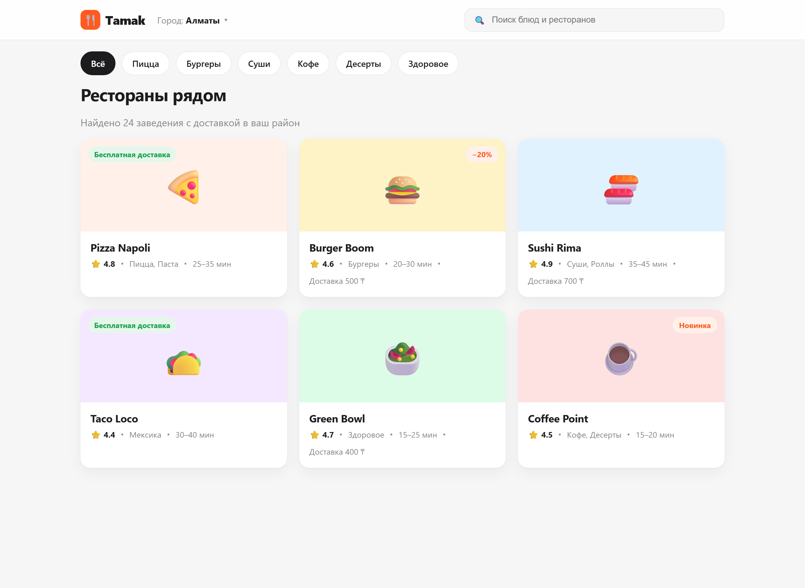
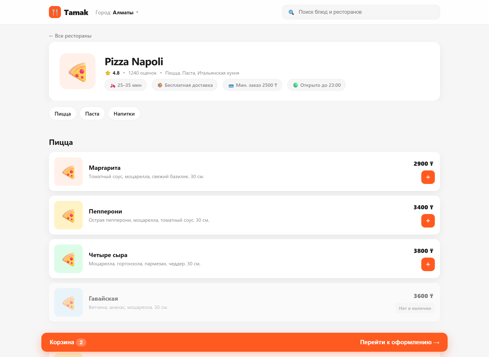
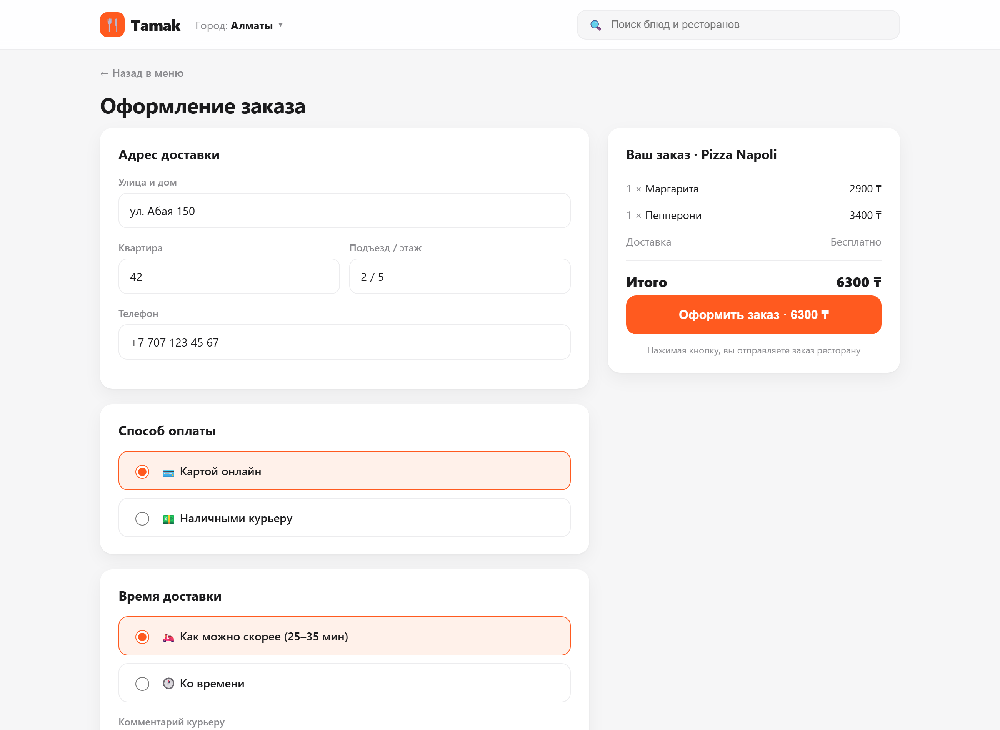
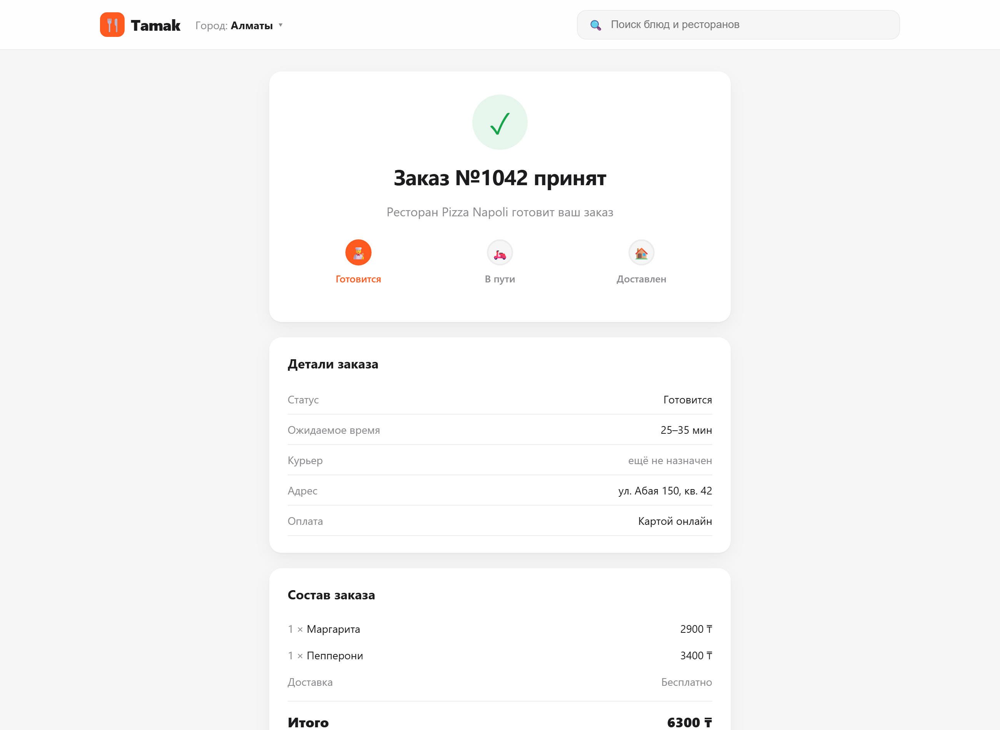

# 🍕 Практика 1: Спроектируй API для доставки еды

## Легенда

Ты системный аналитик в стартапе **Tamak** (доставка еды, как Glovo или Wolt). Дизайнер уже нарисовал экраны, продакт описал, как всё должно работать. **Backend ещё не существует**, его только предстоит построить, и это твоя зона ответственности.

Разработчикам нужно от тебя два документа:

1. **Модель данных** — какие сущности (таблицы) хранит база и какие у них поля.
2. **Контракт API** — какие endpoint дёргает фронтенд на каждом экране: метод, путь, тело запроса и пример тела ответа (JSON).

Ты уже проходил, что **UI это JSON, нарисованный на экране**. Здесь задача обратная: по экрану восстановить тот JSON и endpoint, который его наполняет.

---

## Как выполнять

- Открой интерактивный прототип: файл `case-a-food-delivery/index.html` (двойной клик, кликай по карточкам и кнопкам).
- Разбери каждый экран ниже: какие данные на нём видны, откуда они берутся.
- Заполни два блока: **Сущности БД** и **Endpoints**. Шаблоны в конце.

> 💡 Подсказка по методам: если экран **читает** данные — это `GET`. Если пользователь **создаёт** что-то (заказ) — это `POST`, и данные едут в теле запроса.

---

## Требования (как работает Tamak)

Прочитай внимательно, отсюда вытекают поля сущностей и endpoint.

- На главной пользователь видит **список ресторанов** своего города. У ресторана есть название, кухня (пицца, суши…), рейтинг, число оценок, время доставки и стоимость доставки (может быть **бесплатной**).
- У ресторана бывает **промо-акция** (скидка, «Новинка»). Если акции нет, поле пустое.
- Внутри ресторана меню разбито на **категории** (Пицца, Паста, Напитки). В каждой категории несколько **блюд**: название, описание, цена, фото.
- Блюдо может быть **временно недоступно** («Нет в наличии»), тогда его нельзя заказать.
- Пользователь набирает блюда в **корзину**, затем оформляет **заказ**: указывает адрес, телефон, способ оплаты (карта / наличные), время доставки и комментарий курьеру.
- После оформления создаётся заказ со **статусом**. Статус меняется по мере доставки: `готовится` → `в пути` → `доставлен`.
- Сразу после создания курьер ещё **не назначен** (назначится позже).
- У заказа есть номер, состав (позиции с количеством), итоговая сумма и адрес.

---

## Экраны

### Экран 1. Список ресторанов


Подумай: это список или одна деталь? Сколько объектов вернёт сервер? Какого типа будет ответ?

### Экран 2. Страница ресторана с меню


Обрати внимание на категории меню и на блюдо «Нет в наличии». Как это отразится в структуре ответа и в полях блюда?

### Экран 3. Оформление заказа


Это форма. Куда уходят введённые данные и каким методом? Что окажется в теле запроса?

### Экран 4. Заказ принят


Что вернул сервер в ответ на оформление? Какой код статуса? Обрати внимание на «Курьер: ещё не назначен».

---

## Что сдать

### 1. Сущности БД

Для каждой сущности выпиши поля и тип. Пример формата:

```
Restaurant
- id: integer
- name: string
- ...

MenuItem
- id: integer
- ...
```

Минимум, который стоит найти: `Restaurant`, `Category`, `MenuItem`, `Order`, `OrderItem`, `User`.

### 2. Endpoints

Для каждого экрана опиши endpoint по шаблону:

```
Экран: <название>
Метод + путь: GET /...
Request body: <если есть, JSON>
Response body: <пример JSON>
```

---

## Чек-лист самопроверки

- [ ] Список ресторанов у меня приходит как **массив**, а не объект?
- [ ] Меню ресторана показано как **вложенная структура** (категории → блюда)?
- [ ] У блюда есть **boolean**-поле доступности?
- [ ] Оформление заказа это `POST`, и тело содержит **массив позиций**?
- [ ] В ответе на создание заказа есть `id` и код **201**?
- [ ] Поле «курьер» у нового заказа это **null**, а не пустая строка?

> Когда закончишь, сверься с файлом решения (у преподавателя).
