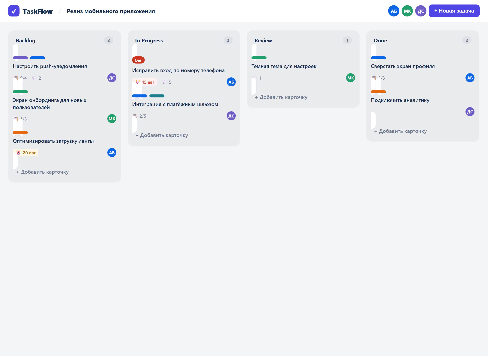
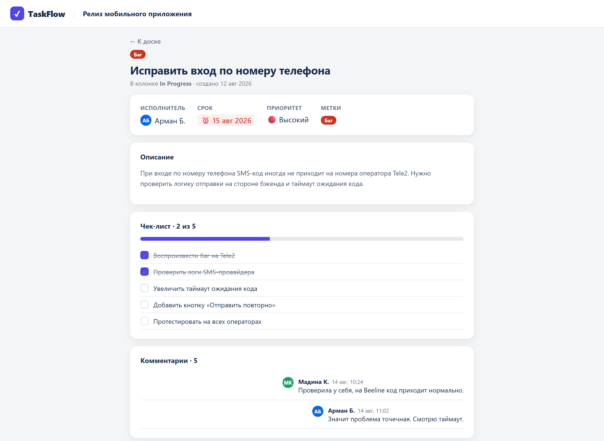
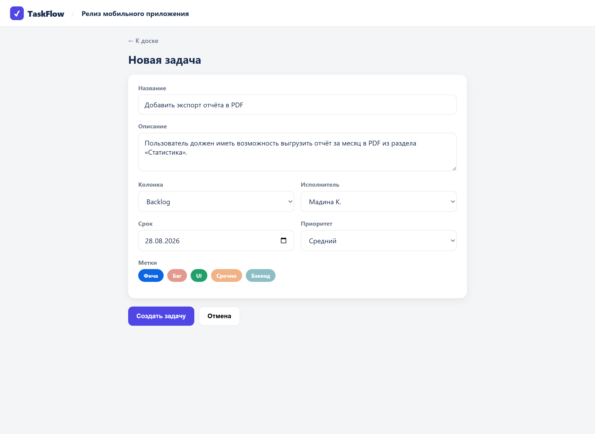

# ✔ Практика 2: Спроектируй API для доски задач

## Легенда

Ты системный аналитик в команде, которая делает **TaskFlow** (доска задач, как Trello). Дизайн готов, продакт описал поведение. **Backend строится с нуля**, контракт на тебе.

Разработчикам нужно от тебя два документа:

1. **Модель данных** — сущности и их поля.
2. **Контракт API** — endpoint под каждое действие: метод, путь, тело запроса, пример тела ответа (JSON).

Этот кейс особенный тем, что здесь пользователь не только читает данные, но и **создаёт, меняет и удаляет** карточки. Значит, встретятся не только `GET` и `POST`, но и `PATCH` и `DELETE`.

---

## Как выполнять

- Открой прототип: файл `case-b-kanban/board.html` (кликай по карточкам и кнопкам).
- Разбери каждый экран: какие данные видны, какие действия доступны.
- Заполни блоки **Сущности БД** и **Endpoints**.

> 💡 Подсказка по методам:
> `GET` — прочитать · `POST` — создать новое · `PATCH` — частично изменить существующее (например, перенести карточку в другую колонку) · `DELETE` — удалить.

---

## Требования (как работает TaskFlow)

- Доска состоит из **колонок** (Backlog, In Progress, Review, Done). Колонки идут в определённом порядке.
- В каждой колонке лежат **карточки** (задачи). Карточка знает, в какой она колонке.
- У карточки есть: название, описание, **несколько меток** (Баг, Фича, UI…), **исполнитель** (или никого), **срок** (или без срока), приоритет.
- Внутри карточки есть **чек-лист**: пункты, каждый либо выполнен, либо нет.
- Под карточкой пишут **комментарии**: кто, когда, текст.
- Пользователь может **создать** новую карточку через форму (название, описание, колонка, исполнитель, срок, приоритет, метки).
- Карточку можно **перенести** в другую колонку (например, из In Progress в Review). Меняется только колонка, остальное остаётся.
- Карточку можно **удалить**. После удаления сервер не возвращает тело, только код успеха.
- Исполнителей может не быть (карточка «Не назначен»), срока тоже может не быть.

---

## Экраны

### Экран 1. Доска


Доска это колонки, а в них карточки. Как отдать это одним ответом? Сколько уровней вложенности? На карточке видны метки, аватар исполнителя, срок, счётчик чек-листа и комментариев — где всё это в структуре данных?

### Экран 2. Карточка задачи


Одна карточка со всеми деталями: чек-лист (2 из 5 выполнено), комментарии, метки. Внизу три действия: «Переместить в Review», «Редактировать», «Удалить». Каждое действие это отдельный endpoint. Какие методы?

### Экран 3. Новая задача


Форма создания. Каким методом уходит? Что в теле запроса? Что вернёт сервер, чтобы карточка появилась на доске?

---

## Что сдать

### 1. Сущности БД

```
Board
- id: integer
- ...

Column
- ...

Card
- ...

Label / User / ChecklistItem / Comment
- ...
```

Минимум: `Board`, `Column`, `Card`, `User`, `Label`, `ChecklistItem`, `Comment`.

### 2. Endpoints

Опиши каждое действие по шаблону:

```
Действие: <что делает>
Метод + путь: PATCH /...
Request body: <если есть, JSON>
Response body: <пример JSON или «пустое, 204»>
```

Не забудь все четыре: получить доску, создать карточку, перенести карточку, удалить карточку.

---

## Чек-лист самопроверки

- [ ] Доска приходит как **вложенная структура**: колонки, внутри массив карточек?
- [ ] У карточки метки это **массив**, а чек-лист это массив объектов с полем **boolean** (выполнено)?
- [ ] Исполнитель и срок могут быть **null**?
- [ ] Создание карточки это `POST` с телом?
- [ ] Перенос в другую колонку это `PATCH` (меняем одно поле), а не `POST`?
- [ ] Удаление это `DELETE`, и ответ **204 No Content** (пустое тело)?

> Когда закончишь, сверься с файлом решения (у преподавателя).
