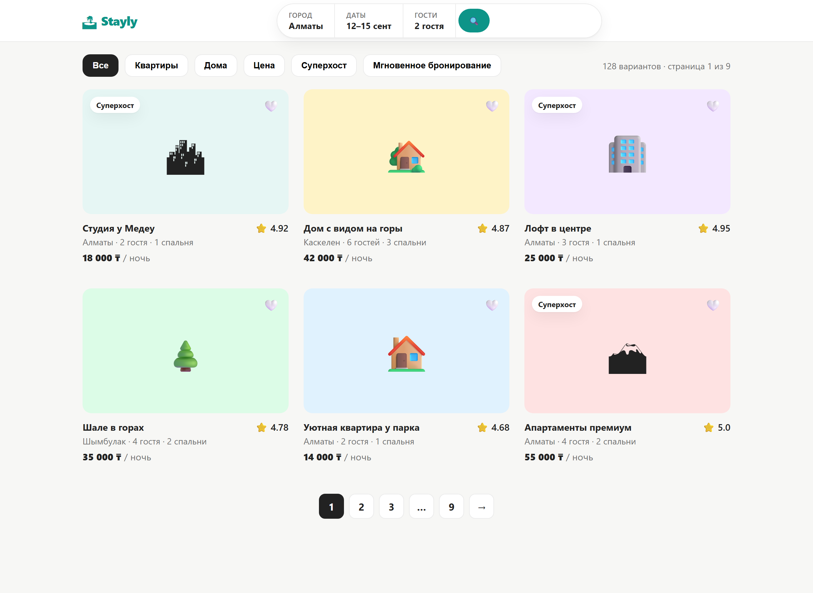
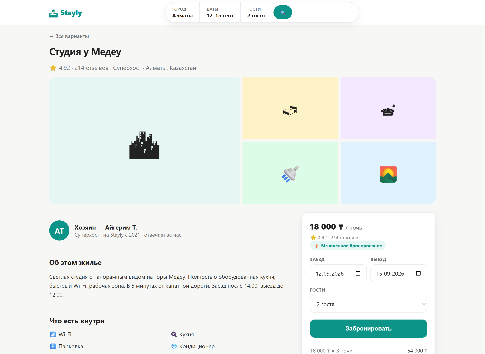
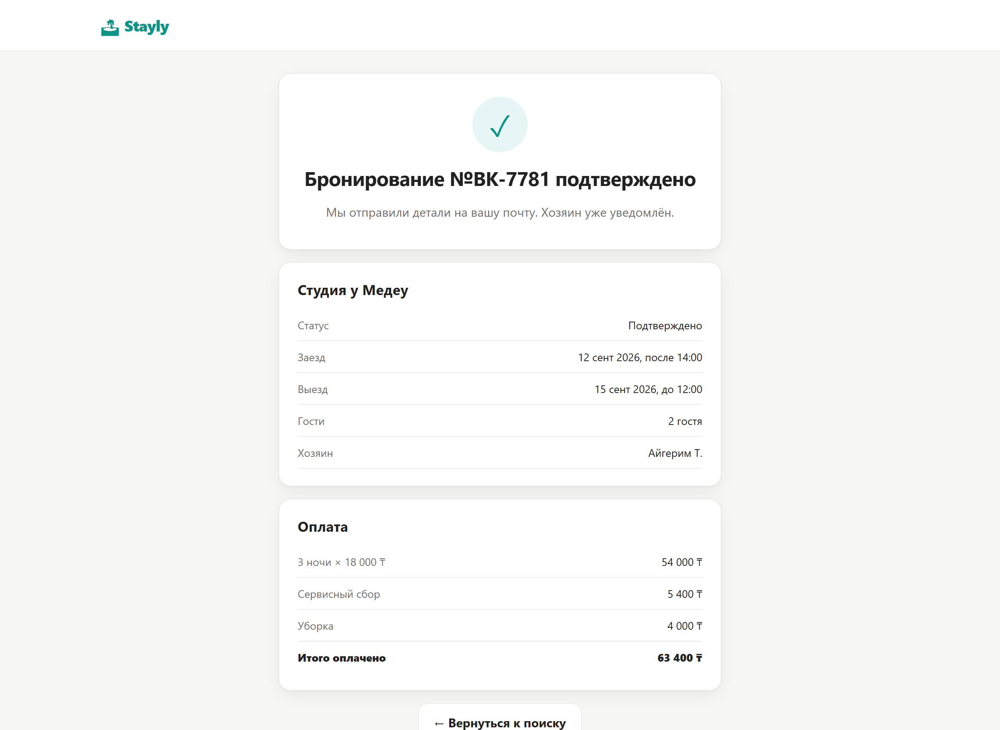

# 🏝 Практика 3: Спроектируй API для бронирования жилья

## Легенда

Ты системный аналитик в **Stayly** (аренда жилья посуточно, как Airbnb или Booking). Дизайн готов, продакт описал логику. **Backend с нуля**, контракт на тебе.

Разработчикам нужно два документа:

1. **Модель данных** — сущности и поля.
2. **Контракт API** — endpoint под каждый экран: метод, путь, тело запроса, пример ответа (JSON).

Здесь появятся две вещи, которых не было в прошлых кейсах: **фильтры и пагинация** (список не грузится весь сразу) и **массивы простых значений** (список фото, список удобств).

---

## Как выполнять

- Открой прототип: файл `case-c-booking/index.html` (кликай по карточкам, фильтрам, форме брони).
- Разбери каждый экран.
- Заполни блоки **Сущности БД** и **Endpoints**.

> 💡 Подсказка: то, что пользователь выбирает в поиске и фильтрах (город, даты, гости), едет в адресе как **query-параметры** (`?city=...&guests=2`). А раз результатов 128 и есть страницы, сервер отдаёт не голый массив, а объект-обёртку со списком и информацией о страницах.

---

## Требования (как работает Stayly)

- На главной пользователь ищет жильё: **город, даты, число гостей**, плюс фильтры (тип жилья, цена, суперхост, мгновенное бронирование).
- Результатов много (128), они разбиты на **страницы**. Показывается номер текущей страницы и общее число.
- У объявления в списке видны: фото, название, город, вместимость, число спален, рейтинг, цена за ночь, бейдж «Суперхост» (не у всех).
- На странице объявления есть: **несколько фото**, описание, **список удобств** (Wi-Fi, кухня, парковка…), информация о **хозяине** (имя, суперхост, с какого года, время ответа), **отзывы** (автор, дата, оценка, текст), рейтинг и число отзывов.
- У объявления есть флаг **мгновенного бронирования** (можно бронировать без подтверждения хозяина).
- Пользователь бронирует: выбирает **даты заезда и выезда**, число гостей, жмёт «Забронировать».
- После брони создаётся **бронирование** с номером, статусом, датами, гостями и итоговой суммой (ночи + сервисный сбор + уборка).

---

## Экраны

### Экран 1. Поиск с фильтрами


128 вариантов, страница 1 из 9. Это просто массив или что-то большее? Где хранится номер страницы и общее число? Куда уходят выбранные фильтры?

### Экран 2. Страница объявления


Здесь много «списочных» данных: галерея фото, удобства, отзывы. Какие из них массив строк, а какие массив объектов? Хозяин это отдельное поле или вложенный объект?

### Экран 3. Бронь подтверждена


Что ушло на сервер при нажатии «Забронировать» и каким методом? Что вернулось в ответ? Какой код статуса?

---

## Что сдать

### 1. Сущности БД

```
Listing
- id: integer
- ...

Host / Amenity / Review / Booking / User
- ...
```

Минимум: `Listing`, `Host`, `Amenity`, `Review`, `Booking`, `User`.

### 2. Endpoints

По шаблону на каждый экран:

```
Экран: <название>
Метод + путь: GET /...?query
Request body: <если есть, JSON>
Response body: <пример JSON>
```

---

## Чек-лист самопроверки

- [ ] Фильтры поиска у меня это **query-параметры**, а не тело запроса?
- [ ] Ответ поиска это **объект-обёртка** (`items`, `total`, `page`), а не голый массив?
- [ ] Удобства и фото это **массивы строк**, а отзывы — **массив объектов**?
- [ ] Хозяин это **вложенный объект** внутри объявления?
- [ ] Есть **boolean**-поля (суперхост, мгновенное бронирование)?
- [ ] Бронирование это `POST`, ответ **201** с `id` брони?

> Когда закончишь, сверься с файлом решения (у преподавателя).
